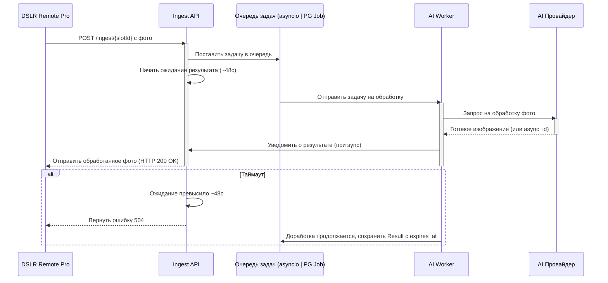

# Общее описание функционала веб сервера
Сервер представляет из себя Платформу для AI обработки фотографий. 
## Пользовательский workflow
 
 Пользователь авторизуется в веб интерфейсе платформы и попадает на Главную страницу выбора слота настроек. Выбирая соответствующий слот, пользователь попадает в Страницу-вкладку настроек обработки фотографии. 

**Процесс настройки слота:**
1.  **Выбор Провайдера:** Пользователь выбирает из списка, какую AI-платформу использовать (например, `Gemini`, `Turbotext`).
2.  **Выбор Операции:** В зависимости от выбранного провайдера, появляется второй список с доступными операциями (например, для `Gemini` это будут `Style Transfer`, `Combine Images`).
3.  **Настройка Параметров:** Интерфейс автоматически отображает поля, необходимые именно для этой операции (например, текстовый промпт, поле для загрузки стилевого изображения и т.д.).

После настройки пользователь сохраняет слот. На главной странице в списке слотов теперь отображается имя этого слота и рядом отображена ingest-ссылка. Рядом с сылкой присутствует кнопка "Копировать" для копирования ссылки. Пользователь копирует ingest-ссылку слота и вставляет ее в DSLR Remote Pro. Теперь программа отправляет `POST` c файлом на этот адрес. В теле `POST` находится обрабатываемая фотография, пароль и некоторые другие поля.


## Цель платформы
Ожидать ingest-POST на разных эндпоинтах и, согласно слоту, вызывать соответствующую AI-модель.
По получению запроса, в зависимости от того на какой входящий эндпоинт он пришел, платформа формирует исходящий запрос к соответствующей AI модели для обработки фотографии. Запрос формируется на основании данных из слота, к которому привязан входящий эндпоинт. Платформа получает тем или иным методом обработанную фотографию от AI модели. Платформа отправляет обработанную фотографию в теле ответа на пользовательский POST запрос. По истечении 60 секунд с момента получения пользовательского запроса, исходная фотография и  удаляется из временной папки сервера. Обработанные фотографии, отправленные пользователю в ответе на входящий POT запрос, удаляются спустя 3 дня с момента их сохранения во временной папке. 

# Механизм работы платформы

Платформа использует архитектуру "Асинхронного моста" для обработки запросов от DSLR Remote Pro в рамках 50‑секундного таймаута, даже если AI‑модель работает дольше. Значение таймаута (T_sync_response, по умолчанию ≤ 50 c) настраивается на странице статистики.

1. Приём запроса: Ingest API получает POST и валидирует вход (MIME/размер/EXIF и т.п.).
2. Постановка в очередь: запрос помещается в очередь без Redis:
   - MVP: in‑process asyncio.Queue (ограниченная, с back‑pressure).
   - При росте: очередь в PostgreSQL (таблица job, выборка задач через SELECT … FOR UPDATE SKIP LOCKED). Режим выбирается конфигурацией.
3. Ожидание с таймаутом: обработчик API ждёт результат не дольше ~48 c (внутреннее ожидание < T_sync_response).
4. Фоновая обработка: worker(ы) забирают задачу из asyncio.Queue или из таблицы job (PG), вызывают внешнего AI‑провайдера. Если провайдер возвращает async_id, ожидание переносится на webhook/поллинг.
5. Результат:
   - Успех (AI < 48 c): worker получает результат → API возвращает изображение клиенту (200 OK).
   - Таймаут (AI > 48 c): API возвращает 504 Gateway Timeout. Worker продолжает и по завершении сохраняет результат в Result с expires_at (например, 3 дня), чтобы его можно было забрать из UI/по GET /api/results/{job_id} (если хранение включено).

6. Ретраи и back‑pressure: ограничение параллелизма на провайдера/слот; экспоненциальные ретраи при сетевых сбоях (до N попыток); статус и счётчик попыток фиксируются в job/логах.
Если результат от провайдера не пришёл в течение T_sync_response, ingest завершается 504. 


## Временное публичное медиа-хранилище (для Turbotext)
Назначение: выдавать временные публичные ссылки на изображения, чтобы передавать их в поля url_image_target и url Turbotext.

### Краткие требования
- TTL ссылки: по умолчанию 10–15 минут (настраиваемо).
- Форматы: JPEG/PNG/WEBP (минимальный набор можно расширять).
- Размеры: лимит по размеру файла и по пикселям (конфиг).
- Хранение: локальная папка MEDIA_ROOT; автоматическая очистка просроченных файлов.
### Конфигурация (параметры)

* MEDIA_ROOT — путь для временных файлов (например, /var/app/media/tmp)
* PUBLIC_BASE_URL — базовый URL для раздачи (например, https://api.example.com/public/media)
* MEDIA_DEFAULT_TTL_SEC — время жизни ссылок (например, 900)
* MEDIA_ALLOWED_MIME — список допустимых MIME
* MEDIA_MAX_FILE_SIZE_MB — лимит размера

### Эндпоинты (минимальный набор)

- POST /api/media/register — принять файл, сохранить, вернуть id, public_url, expires_at.
- GET /public/media/{id} — отдать файл, если не истёк expires_at.
- POST /api/media/extend (опционально) — продлить expires_at для активной задачи.

### Жизненный цикл
- Ingest принял фото → зарегистрировал в медиа-хранилище → получил public_url.
- Воркер передал public_url в запрос к Turbotext.
- Turbotext скачал файл по ссылке и выполнил операцию.
- По завершении задачи файл остаётся доступным до expires_at.
- Плановая очистка регулярно удаляет просроченные файлы и записи.

# Архитектура и стек приложения
## Архитектура
**1. Архитектура проекта ориентирована на безопасность изменений кода** при генерации кода LLM моделью: тонкие фасады + pure domain + контракт-first + Spec Driven Dev
**2. Архитектура проекта должна обладать Низкой связанностью (low coupling):**
 * Каждый модуль/фасад имеет отдельную ответственность.
 * Сервисы и домен не знают про инфраструктуру напрямую — используют фасады и интерфейсы.
 * Любой слой зависит только от более внутреннего слоя.
**3. Архитектура проекта должна обладать Высокой когезией (high cohesion):**
 * Каждый класс или модуль отвечает за один аспект.
 * DTO и типы фиксируют контракты между слоями, уменьшая «размазанность» логики.

### Модели данных (PostgreSQL + Alembic)
Для хранения состояния приложения, настроек слотов и сбора статистики будет использоваться база данных PostgreSQL; схемы версионируются через Alembic (миграции)
Все временные метки храним как `TIMESTAMP WITH TIME ZONE` (UTC). Для полей со схемами и настройками допускается `JSONB`.

**Таблица `User`**

*   `id`: `INTEGER` (Primary Key)
*   `username`: `TEXT` (уникальный)
*   `hashed_password`: `TEXT`


**Таблица `Slot`**
*   `id`: `TEXT` (Primary Key, одна из 40 предустановленных статических ingest-ссылок)
*   `name`: `TEXT` (Имя, которое задает пользователь)
*   `user_id`: `INTEGER` (Foreign Key -> User)
*   `provider_id`: `TEXT` (ID провайдера из конфигурационного файла)
*   `operation_id`: `TEXT` (ID операции из конфигурационного файла)
*   `settings_json`: `TEXT` (JSON-строка с параметрами для AI-операции)
*   `last_reset_at`: `TIMESTAMP WITH TIME ZONE` (Дата последнего сброса статистики для этого слота)


**Таблица `ProcessingLog`**
*   `id`: `INTEGER` (Primary Key)
*   `slot_id`: `TEXT` (Foreign Key -> Slot)
*   `created_at`: `TIMESTAMP WITH TIME ZONE` (Время получения ingest-запроса)
*   `status`: `TEXT` (`SUCCESS`, `ERROR`, `TIMEOUT`)
*   `response_time_ms`: `INTEGER` (Время ответа в миллисекундах)
*   `cost`: `REAL` (Стоимость операции, если применимо)
*   `error_message`: `TEXT` (Сообщение об ошибке)


**Таблица `media_object`**
* id (UUID, PK)
* path (TEXT) — путь к файлу в MEDIA_ROOT
* mime (TEXT)
* size_bytes (INTEGER)
* created_at (TIMESTAMPTZ)
vexpires_at (TIMESTAMPTZ)
* job_id (UUID, опционально) — связь с задачей обработки

**Конфигурационные файлы**
Данные о Провайдерах (`Providers`) и их Операциях (`Operations`) будут храниться в статических конфигурационных файлах (например, `providers.json`), чтобы избежать усложнения схемы БД.

## Стек
*   **Бэкенд:** FastAPI
*   **База данных:** PostgreSQL
*  **Очередь задач:** MVP — in-process asyncio.Queue; при росте — очередь на PostgreSQL через таблицу Job и SELECT … FOR UPDATE SKIP LOCKED (воркеры)
*   **Фронтенд:** HTMX, VanillaJS

# API Спецификация
## Внутренний API (для Frontend)
API для взаимодействия с веб-интерфейсом будет построен на принципах REST. Аутентификация будет производиться с помощью JWT-токенов.

### Аутентификация
*   `POST /api/login`
    *   **Описание:** Вход пользователя в систему.
    *   **Тело запроса:** `{ "username": "admin", "password": "..." }`
    *   **Ответ:** `{ "access_token": "...", "token_type": "bearer" }`

### Провайдеры
*   `GET /api/providers`
    *   **Описание:** Получить список всех доступных AI-провайдеров и их операций из конфигурационного файла.
    *   **Защита:** Требует аутентификации.

### Слоты
*   `GET /api/slots`
    *   **Описание:** Получить список всех слотов.
    *   **Защита:** Требует аутентификации.
*   `POST /api/slots`
    *   **Описание:** Создать новый слот (привязать настройки к одной из свободных ingest-ссылок).
    *   **Защита:** Требует аутентификации.
*   `GET /api/slots/{slot_id}`
    *   **Описание:** Получить данные конкретного слота.
    *   **Защита:** Требует аутентификации.
*   `PUT /api/slots/{slot_id}`
    *   **Описание:** Обновить настройки слота.
    *   **Защита:** Требует аутентификации.
*   `POST /api/slots/{slot_id}/reset_stats`
    *   **Описание:** Сбросить статистику для конкретного слота.
    *   **Защита:** Требует аутентификации.

### Статистика
*   `GET /api/stats/{slot_id}`
    *   **Описание:** Получить статистику для конкретного слота.
    *   **Защита:** Требует аутентификации.
*   `GET /api/stats/global`
    *   **Описание:** Получить глобальную статистику (общее количество обработок за все время).
    *   **Защита:** Требует аутентификации.


## Внешний API: Ingest (DSLR Remote Pro)
Этот эндпоинт предназначен для приема `POST` запросов от программы DSLR Remote Pro. Будет сгенерировано 40 статических коротких ingest-ссылок, которые можно будет привязывать к слотам.

В пользовательском запросе должна быть передана исходная фотография, Глобальный пароль и, опцилнально, некоторые другие поля. 
Пример пользовательского POST запроса для DSLR программы:

```json
{
  "timestamp": "2025-09-18T17:45:12.439171+00:00",
  "client": {
    "host": "127.0.0.1",
    "port": 1417
  },
  "method": "POST",
  "url": "http://localhost:8000/echo?session=42",
  "path": "/echo",
  "query_params": {
    "session": "42"
  },
  "headers": {
    "host": "localhost:8000",
    "content-type": "multipart/form-data; boundary=------------090306000104030805010400",
    "content-length": "53205",
    "expect": "100-continue"
  },
  "cookies": {},
  "content_type": "multipart/form-data; boundary=------------090306000104030805010400",
  "is_multipart": true,
  "form_text_fields": {
    "time": "1758217512",
    "user_id": "Acer",
    "id": "CY04N068111304S2L_00000001.",
    "profile": "C:\\Users\\Acer\\Documents\\PhotoboothImages\\setup_Serg.xml",
    "status": "C:\\Users\\Acer\\Documents\\PhotoboothImages\\screenSerg\\preview.jpg",
    "hash": "7b6c683e1d3fd29c8701791c54e3c12a236f5a5b",
    "name": "DESKTOP-K968T3F",
    "model": "Windows",
    "version": "3.30.2",
    "password": "123456"
  },
  "form_files": [
    {
      "field": "fileToUpload",
      "original_filename": "IMG_0003.JPG",
      "saved_as": "\\tmp\\fastapi_echo\\uploads\\20250918T174512Z_e6bf1d6c98c843d6aa4948d07f251c17.JPG",
      "content_type": "image/jpeg",
      "size_bytes": 51977,
      "is_image_jpeg": true
    }
  ]
}
```
Ответ при успехе: бинарный image/jpeg|png (синхронно, short-poll ≤ 50 c).
В ответе на этот запрос наш сервер должен отправить фотографию, обработанную AI моделью.

## API Turbotext
для работы с моделью Турботекст будут использоваться следующие методы:
- Микс-фото
- Замена объекта
- Замена лица
Описание api находится тут https://www.turbotext.ru/photo_ai/docs/info#section-2
Все запросы отправляются на url: https://www.turbotext.ru/api_ai

### Авторизация
Идентификацию пользователя организуйте посредством Bearer Token,
Пример CURL, данные с Headers запроса:
```http
Authorization: Bearer {APIKEY}
Content-Type: application/x-www-form-urlencoded
```

### Webhook

Если вы хотите запустить серию генераций вам необходимо использовать асинхронный метод генерации, для этого создаем webhook который сможет принимать и обрабатывать результаты генераций.

При обычном методе генерации, вы создаете очередь, затем с помощью номера очереди получаете результат генерации,

в асинхронном методе геннерации, вы создаете очередь добавив в пост данные:

`webhook=https://mysite.com/webhook_example.php`

Ответ на запрос будет такой:

`{"success":true,"asyncid":N} `, где N номер очереди, при получении ответа вы получите параметр asyncid с таким же значением.

Нейро-сервер после обработки вашего запроса, отправит вам на адрес который вы указали в параметре webhook POST данные с результатом генерации,
Формат данных точно такой же как и при получении вторым запросом.

Вы получите результат генерации на ваш WEBHOOK URL в формате JSON

пример получения результата на php:
```php
$result=file_get_contents('php://input');//входящий JSON результат`
$result_array=json_decode($result,1);//Результаты в массиве
```

### Метод Микс фото
Запрос на создании очереди
```http
/api_ai/mix_images HTTP/1.1
Host: turbotext.ru
Authorization: Bearer {APIKEY}
Content-Type: application/x-www-form-urlencoded
Content-Length: 0
```
do:create_queue
content - описание для усиления эффекта
url_image_target - фото на урл которое нужно обработать
url - фото на урл откуда используем стиль 

Ответ с данными очереди в формате JSON:
`{"success":true,"queueid":{QUEUEID}}`
Здесь `{QUEUEID}` - Номер нашей очереди, далее обращаемся за получением результата использую этот массив данных.
Теперь делаем запрос на получение результата:
```http
/api_ai/mix_images HTTP/1.1
Host: turbotext.ru
Authorization: Bearer {APIKEY}
Content-Type: application/x-www-form-urlencoded
Content-Length: 0
do:get_result
queueid:{QUEUEID} 
```

## API Gemini
### Ссылки на документацию 
Image generation: https://ai.google.dev/gemini-api/docs/image-generation#image_generation_text-to-image
Image understanding: https://ai.google.dev/gemini-api/docs/image-understanding
Files API guide: https://ai.google.dev/gemini-api/docs/files
File prompting strategies: https://ai.google.dev/gemini-api/docs/files#prompt-guide
### Описание API 
Image generation with Gemini (aka Nano Banana)
Multi-Image to Image (Composition & Style Transfer): Use multiple input images to compose a new scene or transfer the style from one image to another.

#### Passing images to Gemini
You can provide images as input to Gemini using two methods:
 1.   Passing inline image data: Ideal for smaller files (total request size less than 20MB, including prompts). 
 2.   Uploading images using the File API: Recommended for larger files or for reusing images across multiple requests. 

##### Passing inline image data
You can pass inline image data in the request to `generateContent`. You can provide image data as Base64 encoded strings or by reading local files directly (depending on the language). The following example shows how to read an image from a local file and pass it to `generateContent` API for processing.
Passing inline image data example:
```python
  from google.genai import types

  with open('path/to/small-sample.jpg', 'rb') as f:
      image_bytes = f.read()

  response = client.models.generate_content(
    model='gemini-2.5-flash',
    contents=[
      types.Part.from_bytes(
        data=image_bytes,
        mime_type='image/jpeg',
      ),
      'Caption this image.'
    ]
  )

  print(response.text)
```
You can also fetch an image from a URL, convert it to bytes, and pass it to `generateContent` as shown in the following examples:
```python
from google import genai
from google.genai import types

import requests

image_path = "https://goo.gle/instrument-img"
image_bytes = requests.get(image_path).content
image = types.Part.from_bytes(
  data=image_bytes, mime_type="image/jpeg"
)

client = genai.Client()

response = client.models.generate_content(
    model="gemini-2.5-flash",
    contents=["What is this image?", image],
)

print(response.text)
```

##### Uploading images using the File API
For large files or **to be able to use the same image file repeatedly, use the Files API**. 
The Gemini family of artificial intelligence (AI) models is built to handle various types of input data, including text, images, and audio. Since these models can handle more than one type or mode of data, the Gemini models are called multimodal models or explained as having multimodal capabilities.
This guide shows you how to work with media files using the Files API. The basic operations are the same for audio files, images, videos, documents, and other supported file types.

###### Upload a file
 Always use the Files API when the total request size (including the files, text prompt, system instructions, etc.) is larger than 20 MB.
The following code uploads a file and then uses the file in a call to `generateContent`.

```python 
from google import genai
client = genai.Client()
myfile = client.files.upload(file="path/to/sample.mp3")
response = client.models.generate_content(
    model="gemini-2.5-flash", contents=["Describe this audio clip", myfile]
)
print(response.text)
```
###### Get metadata for a file
You can verify that the API successfully stored the uploaded file and get its metadata by calling `files.get`.
```python
myfile = client.files.upload(file='path/to/sample.mp3')
file_name = myfile.name
myfile = client.files.get(name=file_name)
print(myfile)

```
###### List uploaded files
You can upload multiple files using the Files API. The following code gets a list of all the files uploaded:
```python
print('My files:')
for f in client.files.list():
    print(' ', f.name)
```
###### Delete uploaded files
Files are automatically deleted after 48 hours. You can also manually delete an uploaded file:
```python
myfile = client.files.upload(file='path/to/sample.mp3')
client.files.delete(name=myfile.name)
```

###### Usage info
You can use the Files API to upload and interact with media files. The Files API lets you store up to 20 GB of files per project, with a per-file maximum size of 2 GB. Files are stored for 48 hours. During that time, you can use the API to get metadata about the files, but you can't download the files. The Files API is available at no cost in all regions where the Gemini API is available.

#### Prompting with multiple images. 

You can provide multiple images in a single prompt by including multiple image Part objects in the contents array. These can be a mix of inline data (local files or URLs) and File API references.
```python
from google import genai
from google.genai import types

client = genai.Client()

# Upload the first image
image1_path = "path/to/image1.jpg"
uploaded_file = client.files.upload(file=image1_path)

# Prepare the second image as inline data
image2_path = "path/to/image2.png"
with open(image2_path, 'rb') as f:
    img2_bytes = f.read()

# Create the prompt with text and multiple images
response = client.models.generate_content(

    model="gemini-2.5-flash",
    contents=[
        "What is different between these two images?",
        uploaded_file,  # Use the uploaded file reference
        types.Part.from_bytes(
            data=img2_bytes,
            mime_type='image/png'
        )
    ]
)
print(response.text)
```
##### Style transfer
Example of Prompt template
```
Transform the provided photograph of [subject] into the artistic style of [artist/art style]. Preserve the original composition but render it with [description of stylistic elements].
```
Example of code 
```python
from google import genai
from google.genai import types
from PIL import Image
from io import BytesIO

client = genai.Client()

# Base image prompt: "A photorealistic, high-resolution photograph of a busy city street in New York at night, with bright neon signs, yellow taxis, and tall skyscrapers."
city_image = Image.open('/path/to/your/city.png')
text_input = """Transform the provided photograph of a modern city street at night into the artistic style of Vincent van Gogh's 'Starry Night'. Preserve the original composition of buildings and cars, but render all elements with swirling, impasto brushstrokes and a dramatic palette of deep blues and bright yellows."""

# Generate an image from a text prompt
response = client.models.generate_content(
    model="gemini-2.5-flash-image-preview",
    contents=[city_image, text_input],
)

image_parts = [
    part.inline_data.data
    for part in response.candidates[0].content.parts
    if part.inline_data
]

if image_parts:
    image = Image.open(BytesIO(image_parts[0]))
    image.save('city_style_transfer.png')
    image.show()
```

##### Combining multiple images
Provide multiple images as context to create a new, composite scene. This is perfect for product mockups or creative collages.
Example of prompt:
```prompt
"Create a professional e-commerce fashion photo. Take the blue floral dress
from the first image and let the woman from the second image wear it.
Generate a realistic, full-body shot of the woman wearing the dress, with
the lighting and shadows adjusted to match the outdoor environment.
Ensure the persons's face and features remain completely unchanged. "
```
Example of code:
```python
from google import genai
from google.genai import types
from PIL import Image
from io import BytesIO

client = genai.Client()

# Base image prompts:
# 1. Dress: "A professionally shot photo of a blue floral summer dress on a plain white background, ghost mannequin style."
# 2. Model: "Full-body shot of a woman with her hair in a bun, smiling, standing against a neutral grey studio background."
dress_image = Image.open('/path/to/your/dress.png')
model_image = Image.open('/path/to/your/model.png')

text_input = """Create a professional e-commerce fashion photo. Take the blue floral dress from the first image and let the woman from the second image wear it. Generate a realistic, full-body shot of the woman wearing the dress, with the lighting and shadows adjusted to match the outdoor environment. Ensure the persons's face and features remain completely unchanged. """

# Generate an image from a text prompt
response = client.models.generate_content(
    model="gemini-2.5-flash-image-preview",
    contents=[dress_image, model_image, text_input],
)

image_parts = [
    part.inline_data.data
    for part in response.candidates[0].content.parts
    if part.inline_data
]

if image_parts:
    image = Image.open(BytesIO(image_parts[0]))
    image.save('fashion_ecommerce_shot.png')
    image.show()
```
###### High-fidelity detail preservation
To ensure critical details (like a face or logo) are preserved during an edit, describe them in great detail along with your edit request.
Example prompt:
```template
Using the provided images, place [element from image 2] onto [element from
image 1]. Ensure that the features of [element from image 1] remain
completely unchanged. The added element should [description of how the
element should integrate].
```

#### Best Practices
To elevate your results from good to great, incorporate these professional strategies into your workflow.

   * **Be Hyper-Specific:** The more detail you provide, the more control you have. Instead of "fantasy armor," describe it: "ornate elven plate armor, etched with silver leaf patterns, with a high collar and pauldrons shaped like falcon wings."
    * **Provide Context and Intent:** Explain the purpose of the image. The model's understanding of context will influence the final output. For example, "Create a logo for a high-end, minimalist skincare brand" will yield better results than just "Create a logo."
    * **Use Step-by-Step Instructions:** For complex scenes with many elements, break your prompt into steps. "First, create a background of a serene, misty forest at dawn. Then, in the foreground, add a moss-covered ancient stone altar. Finally, place a single, glowing sword on top of the altar."
    * **Use "Semantic Negative Prompts":** Instead of saying "no cars," describe the desired scene positively: "an empty, deserted street with no signs of traffic."
    * **Control the Camera:** Use photographic and cinematic language to control the composition. Terms like wide-angle shot, macro shot,

#### Supportet image formats
Gemini supports the following image format MIME types:

 *    PNG - image/png
 *    JPEG - image/jpeg
 *    WEBP - image/webp
 *    HEIC - image/heic
 *    HEIF - image/heif

#### Limitations and key technical information
##### File limit 
Gemini 2.5 Pro/Flash, 2.0 Flash, 1.5 Pro, and 1.5 Flash support a maximum of 3,600 image files per request.

##### Token calculation
Gemini 2.5 Flash/Pro: 258 tokens if both dimensions <= 384 pixels. Larger images are tiled into 768x768 pixel tiles, each costing 258 tokens.
A rough formula for calculating the number of tiles is as follows:
 *   Calculate the crop unit size which is roughly: floor(min(width, height) / 1.5).
 *   Divide each dimension by the crop unit size and multiply together to get the number of tiles.

For example, for an image of dimensions 960x540 would have a crop unit size of 360. Divide each dimension by 360 and the number of tile is 3 * 2 = 6.
##### Tips and best practices
When using a single image with text, place the text prompt after the image part in the `contents` array.


# Frontend 
Фронтэнд состоит из:
1. Страница авторизации. 
2. Главная страница.
3. Страницы-вкладки (слоты).
4. Страница статистики.
5. Страница настроек.
## Описание web страниц фронтэнда 

### Страница авторизации
Страница авторизации на сайт выполнена согласно образцу: 
```html
<!DOCTYPE html>
<html lang="ru">
<head>
  <meta charset="UTF-8" />
  <meta name="viewport" content="width=device-width, initial-scale=1" />
  <title>Вход — 3x‑ui (бирюзовые волны, шаблон)</title>
  <style>
    /* Reset: чтобы поля не вылезали за контейнер */
    *,*::before,*::after{box-sizing:border-box;}
    :root {
      /* ===== Палитра под 3x-ui светлую страницу с бирюзовыми волнами ===== */
      --bg-top: #d6f5ff;           /* светло-мятный фон вверху */
      --bg-mid: #d6f5ff;           /* мягкий градиент к середине */
      --wave-1: #c6effb;           /* дальняя волна */
      --wave-2: #b6e9f7;           /* средняя волна */
      --wave-3: #a6e3f3;           /* ближняя волна */

      --text: #10302a;             /* тёмный графитовый текст */
      --muted: #6b7f7a;            /* вторичный текст */
      --border: #e8efec;           /* светлая рамка полей */
      --card: #ffffff;             /* карточка */
      --accent: #0f866c;           /* зелёно-бирюзовая кнопка */
      --accent-press: #0c6e59;

      /* монохромные иконки */
      --icon: #7f9e98;

      --radius-xl: 22px;           /* большие скругления */
      --radius-md: 999px;          /* для пилюль */
      --shadow-xl: 0 30px 60px rgba(16, 48, 42, 0.12), 0 10px 20px rgba(16,48,42,0.06);
      --shadow-sm: 0 4px 10px rgba(0,0,0,0.05);

      /* скорости дрейфа */
      --wave-speed-1: 36s;
      --wave-speed-2: 28s;
      --wave-speed-3: 22s;

      /* размеры волн — тянуть до середины экрана и далеко за края */
      --waves-viewport-h: 50vh; /* видим только нижнюю половину экрана, а сами волны тянем на всю высоту */
      }

    /* базовая раскладка страницы */
    html, body { height: 100%; }
    body {
      margin: 0;
      font-family: Inter, system-ui, -apple-system, Segoe UI, Roboto, Ubuntu, "Helvetica Neue", Arial, sans-serif;
      color: var(--text);
      background: var(--bg-top);
      min-height: 100%;
      display: grid; place-items: center;
      overflow: hidden;
    }

    /* базовая раскладка страницы */
    html, body { height: 100%; }
    body {
      margin: 0;
      font-family: Inter, system-ui, -apple-system, Segoe UI, Roboto, Ubuntu, "Helvetica Neue", Arial, sans-serif;
      color: var(--text);
      background: var(--bg-top); /* базовый цвет */
      min-height: 100%;
      display: grid; place-items: center; /* форма по центру */
      overflow: hidden; /* волны не прокручиваются */
    }

    /* ===== Бирюзовые волны на заднем плане ===== */
    .waves-viewport { /* новый метод: видимое окно 50vh, нижний край всегда у низа экрана */
      position: fixed; left: 0; right: 0; bottom: 0; height: var(--waves-viewport-h);
      overflow: hidden; pointer-events: none; z-index: -1;
    }
    .waves { /* сами волны тянем выше окна и крепим к низу внутри viewport */
      position: absolute; left: 0; right: 0; bottom: 0; height: 150vh; /* fallback */
      height: 150dvh; /* точный dvh для мобильных */
      filter: drop-shadow(0 -8px 20px rgba(0,0,0,0.03));
    }

    .layer { position: absolute; left: 0; right: 0; bottom: 0; overflow: hidden; }
    .l1 { height: 65%; opacity: .92; }
    .l2 { height: 85%; opacity: .96; }
    .l3 { height: 100%; opacity: 1; }

    .track { position: absolute; inset: 0; width: 400%; height: 100%; will-change: transform; }

    @keyframes driftL { from { transform: translateX(0); } to { transform: translateX(-25%); } }
    @keyframes driftR { from { transform: translateX(-25%); } to { transform: translateX(0); } }

    .l1 .track { animation: driftL var(--wave-speed-1) linear infinite; }
    .l2 .track { animation: driftR var(--wave-speed-2) linear infinite; }
    .l3 .track { animation: driftL var(--wave-speed-3) linear infinite; }

    svg { display: block; width: 100%; height: 100%; }

    /* ===== Карточка входа ===== */
    .wrap { width: min(92vw, 420px); padding: 20px; margin: 0 auto; }

    .card {
      background: var(--card);
      border-radius: var(--radius-xl);
      box-shadow: var(--shadow-xl);
      padding: 28px 24px 24px;
      overflow: hidden; /* фикс: ничего не выходит за рамки карточки */
      max-width: 100%;
    }

    .title { margin: 0 0 18px; text-align: center; font-weight: 800; font-size: clamp(22px, 3.2vw, 28px); }

    form { display: grid; gap: 14px; width: 100%; }

    .field { position: relative; width: 100%; }
    .label { font-size: 13px; color: var(--muted); margin: 0 0 8px 12px; }
    .input {
      display: block;
      width: 100%;
      height: 44px;
      padding: 10px 42px;
      border-radius: var(--radius-md);
      border: 1px solid var(--border);
      background: #fff; color: var(--text);
      outline: none; box-shadow: var(--shadow-sm);
      transition: box-shadow .15s ease, border-color .15s ease;
    }
    .input::placeholder { color: #b2c3bf; }
    .input:focus { border-color: color-mix(in srgb, var(--accent) 26%, var(--border)); box-shadow: 0 0 0 4px color-mix(in srgb, var(--accent) 12%, transparent); }

    .icon { position: absolute; left: 14px; top: 50%; transform: translateY(-50%); width: 18px; height: 18px; color: var(--icon); }
    .icon svg { width: 18px; height: 18px; stroke: currentColor; fill: none; stroke-width: 1.6; opacity: .9; }
    .toggle-pass { position: absolute; right: 12px; top: 50%; transform: translateY(-50%); display: grid; place-items: center; width: 28px; height: 28px; border-radius: 50%; color: var(--icon); cursor: pointer; }
    .toggle-pass:hover { background: #f2f7f5; }
    .toggle-pass svg { width: 18px; height: 18px; stroke: currentColor; fill: none; stroke-width: 2; }

    .btn {
      margin-top: 6px; height: 46px; border-radius: var(--radius-md);
      border: none; cursor: pointer; background: var(--accent);
      color: #fff; font-weight: 600; transition: transform .05s ease, filter .15s ease, background-color .15s ease;
    }
    .btn:hover { filter: brightness(1.05); }
    .btn:active { transform: translateY(1px); background: var(--accent-press); }

    .hint { text-align: center; color: var(--muted); font-size: 12px; margin-top: 8px; }
  </style>
</head>
<body>
  <!-- Волны на заднем плане: viewport + волны на всю высоту окна -->
  <div class="waves-viewport" aria-hidden="true">
    <div class="waves">
      <div class="layer l1">
        <svg class="track" viewBox="0 0 1600 300" preserveAspectRatio="none">
          <defs>
            <path id="wave1" d="M0,200 C200,160 400,220 600,200 C800,180 1000,120 1200,160 C1400,200 1500,200 1600,170 L1600,300 L0,300 Z" />
          </defs>
          <use href="#wave1" fill="var(--wave-1)"></use>
          <use href="#wave1" fill="var(--wave-1)" transform="translate(1600,0)"></use>
          <use href="#wave1" fill="var(--wave-1)" transform="translate(3200,0)"></use>
          <use href="#wave1" fill="var(--wave-1)" transform="translate(4800,0)"></use>
        </svg>
      </div>
      <div class="layer l2">
        <svg class="track" viewBox="0 0 1600 300" preserveAspectRatio="none">
          <defs>
            <path id="wave2" d="M0,220 C220,210 400,180 640,210 C880,240 1060,210 1280,230 C1460,245 1520,240 1600,230 L1600,300 L0,300 Z" />
          </defs>
        <use href="#wave2" fill="var(--wave-2)"></use>
        <use href="#wave2" fill="var(--wave-2)" transform="translate(1600,0)"></use>
        <use href="#wave2" fill="var(--wave-2)" transform="translate(3200,0)"></use>
        <use href="#wave2" fill="var(--wave-2)" transform="translate(4800,0)"></use>
        </svg>
      </div>
      <div class="layer l3">
        <svg class="track" viewBox="0 0 1600 300" preserveAspectRatio="none">
          <defs>
            <path id="wave3" d="M0,250 C260,260 520,240 760,255 C1000,270 1220,260 1420,270 C1520,275 1560,275 1600,274 L1600,300 L0,300 Z" />
          </defs>
          <use href="#wave3" fill="var(--wave-3)"></use>
          <use href="#wave3" fill="var(--wave-3)" transform="translate(1600,0)"></use>
          <use href="#wave3" fill="var(--wave-3)" transform="translate(3200,0)"></use>
          <use href="#wave3" fill="var(--wave-3)" transform="translate(4800,0)"></use>
        </svg>
      </div>
    </div>
  </div>

  <!-- Карточка входа по центру экрана -->
  <div class="wrap">
    <main class="card" role="main" aria-label="Форма входа">
      <h1 class="title">Привет!</h1>
      <form id="loginForm" novalidate>
        <div class="field">
          <label class="label" for="username">Имя пользователя</label>
          <span class="icon" aria-hidden="true">
            <svg viewBox="0 0 24 24" xmlns="http://www.w3.org/2000/svg"><path d="M12 12a4 4 0 1 0-4-4 4 4 0 0 0 4 4"/><path d="M20 21a8 8 0 0 0-16 0"/></svg>
          </span>
          <input class="input" id="username" name="username" type="text" autocomplete="username" placeholder="Имя пользователя" required />
        </div>
        <div class="field">
          <label class="label" for="password">Пароль</label>
          <span class="icon" aria-hidden="true">
            <svg viewBox="0 0 24 24" xmlns="http://www.w3.org/2000/svg"><rect x="3" y="11" width="18" height="10" rx="2"/><path d="M7 11V7a5 5 0 0 1 10 0v4"/></svg>
          </span>
          <input class="input" id="password" name="password" type="password" autocomplete="current-password" placeholder="Пароль" required />
          <button class="toggle-pass" type="button" id="togglePass" aria-label="Показать пароль">
            <svg class="eye-open" viewBox="0 0 24 24"><path d="M1 12s4-7 11-7 11 7 11 7-4 7-11 7-11-7-11-7z"/><circle cx="12" cy="12" r="3"/></svg>
            <svg class="eye-closed" viewBox="0 0 24 24" style="display:none"><path d="M3 3l18 18"/><path d="M10.58 10.58A3 3 0 0 0 9 12a3 3 0 0 0 3 3 3 3 0 0 0 1.42-.38"/><path d="M16.24 7.76A10.94 10.94 0 0 1 23 12s-4 7-11 7a10.52 10.52 0 0 1-5.17-1.4"/><path d="M1 12s4-7 11-7a10.5 10.5 0 0 1 5.17 1.4"/></svg>
          </button>
        </div>
        <button class="btn" type="submit">Войти</button>
        <div class="hint">Шаблон. Подключите обработчик к вашему бэкенду.</div>
      </form>
    </main>
  </div>

  <script>
    // Показ/скрытие пароля (vanilla JS)
    const toggle = document.getElementById('togglePass');
    const pass = document.getElementById('password');
    toggle.addEventListener('click', ()=>{
      const t = pass.type === 'password' ? 'text' : 'password';
      pass.type = t;
      document.querySelector('.eye-open').style.display = t === 'text' ? 'none' : '';
      document.querySelector('.eye-closed').style.display = t === 'text' ? '' : 'none';
      toggle.setAttribute('aria-label', t === 'text' ? 'Скрыть пароль' : 'Показать пароль');
    });

    // Демонстрационная отправка (vanilla JS)
    document.getElementById('loginForm').addEventListener('submit', (e)=>{
      e.preventDefault();
      // Здесь подключите ваш fetch к API
      alert('OK — подключите API входа');
    });
  </script>
</body>
</html>
```

### Главная страница 
 Главная страница содержит список слотов для AI обработки фото. 
  Под слотом подразумевается Страница-вкладка, дающая возможность сохранить в БД набор пользовательских настроек, касающихся AI обработки фотографий. 
 Визуально слот из себя представляет  кликабельный текст с пользовательским названием, взятым из соответствующей Стрианицы-вкладки. Клик по слоту ведет на соответствующую Страницу-вкладку. В одной строке рядом со слотом есть поле, в котором указана ingest-ссылка и кнопка "Копировать", чтобы скопировать ссылку. Все ingest-ссылки статичные, содержат окончание с коротким именем модели и номером слота.  Каждому слоту соответствует уникальная ingest-ссылка (входящий URL) для загрузки фото на обработку. ingest-ссылка предоставляется клиенту для загрузки фотографии в соответствующий слот для последующей обработки. ingest-ссылка описана в разделе [API DSLR Remote Pro](#dslr-post). Та же самая ingest-ссылка дублируется в интерфейсе слота - на его Странице-вкладке перед кнопкой "Сохранить1".  
 Справа вверху на главной странице есть кнопки в виде иконок:  "Статистика", "Настройки", "Выйти".

### Страница статистики
Содержит список по каждому слоту:
 Имя слота | маленькая иконка Шаблонного изображения №2 (если такое есть в слоте) | сколько  AI обработок совершено через этот слот с момента последнего сброса | количество ingest-запросов | p95-время ответа | процент ошибок | цена последней AI обработки | общая потраченная сумма с момента последнего сброса | дата последнего сброса статистики | кнопка "Сброс статисики" | сколько глобально обработок совершено за все время.
Визуально рамки таблицы рисовать не надо.

### Страница настроек
Содержит:
1. Поле для ввода пароля, который будет передаваться приложению от DSLR Remote Pro в теле запроса. 
2. Поля для ввода API ключей от AI моделей.
3. Кнопка "Очистить мультимедиа кеш" По нажатию все Обработанные фотографии, обычно хранящиеся на сервере 3 дня, удаляются с сервера.
4. Кнопка "Сохранить".

### Страницы-вкладки 
Каждая Старница-вкладка представляет интерфейс для сохранения параметров соответствующего Странице слота.  Пока что делаем толькот 2 слота. После проведения успешных тестов добавим еще 40 слотов.
На Cтранице-вкладке сверху отображается имя AI модели, согласно которой будет происходить AI обработка.  У Страницы-вкладки есть форма ввода "Название". Вот это название должно отображаться на Главной странице как имя слота и должно быть кликабельным, ведя на соответствующую Страницу-вкладку. 
Каждая Страница-вкладка предоставляет интерфейс под отдельный слот, чтобы ввести параметры обработки фото для этого слота. 
 Все страницы-вкладки имеют одинаковый интерфейс и внешний вид, отличаются лишь содержанием. Страница-вкладка собирает данные для AI-обработки фото: название задачи, текстовый промпт, опциональный шаблон (изображение №2) и опционально тестовое фото для возможности провести тест AI обработки. Все пользовательские данные, введенные на Странице-вкладке (за исключением тестового фото) представляют из себя слот и сохраняются в Базе Данных сервера. 
 Страницы-вкладки нельяз удалять или создавать новые. 

Входящая Ссылка для отрпавки [пользовательского POST запроса](#dslr-post) отображается на Странице-вкладке перед кнопкой "Сохранить1".
Каждая Страница-вкладка привязана к соответствующей ingest-ссылке. На главной странице 
#### Спецификация Страницы владки
Эта спецификация не обязательна, а лишь отображает примерный сценарий страницы.  Больше внимания следует уделить [Примеру оформления Страницы-вкладки](#slot-exmpl)
##### Что происходит на странице
1. Пользователь вводит Название и Промпт к ИИ.
2. Тумблерами включает загрузку:
 * второго изображения (шаблон стиля/замены лица/фона),
 * тестового фото (для локальной проверки).
3. Для каждого слота — drag&drop/клик по зоне, валидация JPG/PNG, превью с плавным появлением, кнопка «Убрать».
4. Скрытые поля `*_status` помечают, загружен ли файл (`present/removed`).
5. **Тест1**: если загружено тест-фото — вспышка-анимация формы и тост «успех», иначе тост-ошибка.
6. **Сохранить1**: визуальный «блик» формы; реального POST нет (submit отключён).

##### Модули и логика (верхний уровень) 

* Форма `#upload-form`
Хранит все поля. Submit заблокирован (`onsubmit="return false"`), кнопка «Сохранить1» — `type="button"`. 
* Переключатели (тумблеры) 
`toggle-second` и `toggle-first` показывают/скрывают секции загрузки, меняют только отображение. 
* Загрузка изображений (два слота)
Обработчик `bindSlot(prefix)` настраивает input + drop-зону, валидацию MIME/расширения, превью через `URL.createObjectURL`, управление `*_status`. 
* Подсказки/валидации
Серые хинты, текст ошибки под слотом, тосты (успех/ошибка сети/ошибка сервера — задел на будущее). 
* Анимация формы
Один кейфрейм `@keyframes pulseForm` (opacity 1 → 0.08 → 1, 0.4s) и один класс `-pulse`; хелпер `pulse(el)` перезапускает анимацию. Привязано к «Тест1» (только при наличии фото) и «Сохранить1». 
* Доступность
role="button", aria-label, sr-only, фокус-обводки, большие зоны клика; превью и кнопка «Убрать» доступны с клавиатуры. 
* Self-tests (консольные)
Лёгкие проверки наличия узлов/атрибутов для ранней диагностики в DevTools.

##### Технологии и инструменты
* HTML + CSS (кастомные свойства, gradients, blur)
UI-оформление, фон «дышит», стекло-эффект у формы, адаптивные размеры. 
* Vanilla JS
Тумблеры, drop-зоны, превью, тосты, хелпер анимации pulse. 
* HTMX (подключён)
Сейчас не используется для POST (оставлен на будущее); есть обработчики событий HTMX и контейнер для ответа сервера. 

##### TODO на будущее (интеграция)
Включить отправку multipart/form-data через HTMX (`hx-post="/api/save"` + `hx-target` уже готовы).
Серверная валидация размеров/типов, сохранение и возврат статуса/ID.
Доп. кнопки тестов могут дергать `/api/test` и стримить прогресс.
Если нужно описание в README-формате или краткую тех-спеку для задачи/тикета — сгенерирую.

#### Пример оформления Страницы-вкладки {id="slot-exmpl"}
В данном примере отсутствует Отображение названия AI модели и отображение ingest-ссылки, однако их нужно добавить в Страницы-вкладки.
Cтраницы-вкладки с настройками слота AI редактированием изображений должны быть оформлены по следующему примеру:
```html
 <!-- (HTML + CSS + VanillaJS + HTMX) -->
<!doctype html>
<html lang="ru">
<head>
  <meta charset="utf-8" />
  <meta name="viewport" content="width=device-width, initial-scale=1" />
  <title>Слот — AI обработка — HTMX + VanillaJS</title>
  <script src="https://unpkg.com/htmx.org@1.9.12" defer></script>
  <style>
    :root{ --h-a:195; --h-b:8; --h-c:54; --s:100%; --l:93%; --text:#0f172a; --muted:#334155cc; --glass:18px; --gap:clamp(12px,2vw,18px); --pad:clamp(14px,1.8vw,22px); }
    @property --l{syntax:'<percentage>';inherits:true;initial-value:93%}
    *,*::before,*::after{box-sizing:border-box}
    body{margin:0;font-family:ui-sans-serif,system-ui,-apple-system,Segoe UI,Roboto,Inter;color:var(--text)}

    .bg{ min-height:100dvh; overflow-x:hidden; background:
      radial-gradient(120vmax 120vmax at 0% 0%,    hsl(var(--h-a) var(--s) var(--l) / .85) 0 40%, transparent 70%),
      radial-gradient(130vmax 130vmax at 0% 100%,  hsl(var(--h-c) var(--s) var(--l) / .85) 0 40%, transparent 70%),
      radial-gradient(140vmax 140vmax at 100% 50%, hsl(var(--h-b) var(--s) var(--l) / .85) 0 40%, transparent 70%),
      linear-gradient(180deg, color-mix(in oklab, white 90%, hsl(var(--h-a) var(--s) var(--l)) 10%), white);
      animation:breathe 3s ease-in-out infinite; }
    @keyframes breathe{0%,100%{--l:92%}50%{--l:95%}}

    main{ display:grid; place-items:center; padding:clamp(20px,5vmin,60px) }
    .shell{ width:min(980px,96vw); display:grid; gap:var(--gap) }

    /* ▲ Форме даём 8% непрозрачности и лёгкое стекло */
    #upload-form{ 
      background: rgba(255,255,255,0.08); /* 8% */
      border:1px solid color-mix(in oklab, white 75%, #0f172a 25% / 30%);
      border-radius: calc(var(--glass) + 6px);
      box-shadow: 0 10px 30px rgba(2,6,23,.12);
      backdrop-filter: blur(6px);
      padding: var(--gap);
      display:grid;
      gap: var(--gap);
    }

    .card{ border-radius:var(--glass); background:transparent; border:1px dashed color-mix(in oklab, white 75%, #0f172a 25% / 35%); padding:var(--pad) }

    h1{ font-size:clamp(28px,4cqi,48px); margin:0 }
    label.title{ font-weight:700; display:block; margin-bottom:8px }
    input[type="text"], input[type="password"], select, textarea{ width:100%; border-radius:14px; padding:12px 14px; border:1px solid color-mix(in oklab, white 75%, #0f172a 25% / 35%); background:transparent; outline:none }
    textarea{ resize:vertical }

    .muted-hint{ color:var(--muted); font-size:14px; margin-top:8px }

    /* Switch */
    .switch-row{ display:flex; align-items:center; gap:10px }
    .switch{ appearance:none; width:32px; height:18px; border-radius:999px; position:relative; outline:none; cursor:pointer; background:rgba(15,23,42,.12); transition:background .18s ease }
    .switch::after{ content:""; position:absolute; top:2px; left:2px; width:14px; height:14px; border-radius:50%; background:#fff; box-shadow:0 1px 3px rgba(2,6,23,.18); transition:transform .18s ease }
    .switch:checked{ background:color-mix(in oklab, hsl(var(--h-a) var(--s) var(--l)), #0f172a 20%) }
    .switch:checked::after{ transform:translateX(14px) }
    .switch-label{ user-select:none; color:#0f172acc; font-weight:600 }

    .uploads{ display:none; margin-top:10px; gap:var(--gap); }
    .uploads.show{ display:grid }

    /* Upload / drop-zone */
    .drop{ position:relative; display:grid; place-items:center; gap:8px; padding:18px; text-align:center; border-radius:calc(var(--glass) - 2px);
      outline:2px dashed color-mix(in oklab, hsl(var(--h-a) var(--s) var(--l)) 70%, #0f172a 30% / 40%);
      outline-offset:-8px; cursor:pointer; min-height:160px }
    .drop.large{ aspect-ratio:16/10; padding:0; border-radius:calc(var(--glass) - 6px); border:1px solid color-mix(in oklab, white 75%, #0f172a 25% / 35%); overflow:hidden; max-width: min(100%, 800px); margin-inline:auto; }
    .drop:focus-visible{ outline:3px solid #fff; outline-offset:-6px; }
    .drop.dragging{ outline-color:#fff; background:rgba(255,255,255,.08) }
    .drop input[type=file]{ position:absolute; inset:0; opacity:0; cursor:pointer; z-index:1 }
    .remove-btn{ position:absolute; top:10px; right:10px; z-index:2; border:none; border-radius:12px; padding:8px 10px; font-weight:600; cursor:pointer; background:color-mix(in oklab, white 85%, #000 15% / 20%); backdrop-filter:blur(6px); color:#0f172a; box-shadow:0 2px 10px rgba(2,6,23,.12); opacity:0; transition:opacity .18s ease,transform .18s ease }
    .drop.has-image:hover .remove-btn, .drop.has-image:focus-within .remove-btn{ opacity:1 }

    /* Превью: мягкое появление ~500 мс */
    .drop .drop-preview{ position:absolute; inset:0; width:100%; height:100%; object-fit:cover; display:none; opacity:0; z-index:1; transition:opacity .5s ease }
    .drop.has-image .drop-preview{ display:block }
    .drop.has-image .placeholder{ position:relative; z-index:0; display:grid; gap:6px; place-items:center; padding:18px; color:var(--muted); outline:1px solid color-mix(in oklab, #0f172a 20%, white 80% / 45%); outline-offset:-6px; border-radius:calc(var(--glass) - 10px); }

    .placeholder{ position:relative; z-index:0; display:grid; gap:6px; place-items:center; padding:18px; color:var(--muted) }
    .error{ margin-top:8px; font-size:14px; color:#b91c1c }

    .grid-2{ display:grid; grid-template-columns:1fr 1fr; gap:var(--gap) }

    .btns{ display:flex; gap:12px; justify-content:flex-end; flex-wrap:wrap }
    .btn{ border:1px solid color-mix(in oklab, white 75%, #0f172a 25% / 35%); background:transparent; border-radius:12px; padding:10px 16px; font-weight:700; cursor:pointer }
    .btn:hover{ background:rgba(255,255,255,.35) }

    .inline{ display:flex; gap:10px; align-items:center }
    .inline input[type="text"]{ flex:1 }

    /* Кнопки внутри выпадаемых секций */
    .uploads-actions{ display:flex; justify-content:flex-start; }
    .uploads-actions .btn{ margin-top:8px; }

    /* Всплывающее сообщение (toast) для ошибок сервера */
    .toast{ position:fixed; right:16px; top:16px; display:grid; gap:8px; z-index:9999 }
    .toast-item{ min-width:260px; max-width:min(92vw,420px); padding:12px 14px; border-radius:12px; box-shadow:0 8px 28px rgba(2,6,23,.25); color:#0f172a; backdrop-filter:blur(6px); border:1px solid rgba(15,23,42,.12); background:rgba(255,255,255,.96); opacity:0; transform:translateY(-6px); transition:opacity .25s ease, transform .25s ease }
    .toast-item.show{ opacity:1; transform:translateY(0) }
    .toast-item.error{ border-color:#fecaca; background:rgba(254,226,226,.96) }
    .toast-item.success{ border-color:#bbf7d0; background:rgba(220,252,231,.96) }

    /* Только для скринридеров */
    .sr-only{ position:absolute; width:1px; height:1px; padding:0; margin:-1px; overflow:hidden; clip:rect(0,0,0,0); white-space:nowrap; border:0 }

    /* Минимальная универсальная анимация формы: лёгкий пульс */
    @keyframes pulseForm { 0% { opacity: 1 } 50% { opacity: .08 } 100% { opacity: 1 } }
    #upload-form.-pulse { animation: pulseForm .4s ease }
  </style>
</head>
<body>
  <div class="bg">
    <main>
      <div class="shell">
        <!-- 1. Заголовок -->
        <div class="card"><h1>Слот — AI обработка</h1></div>

        <!-- Форма. Отправку на backend не выполняем здесь -->
        <form id="upload-form" onsubmit="return false;">
          <!-- 2. Название слота -->
          <div class="card">
            <label class="title" for="title">Название слота</label>
            <input id="title" name="title" type="text" placeholder="Например: Подстановка лица на шаблон" />
          </div>

          <!-- 3. Провайдер → Операция -->
          <div class="card">
            <div class="grid-2">
              <div>
                <label class="title" for="provider">Провайдер</label>
                <select id="provider" name="provider" aria-label="Выбор AI-провайдера">
                  <option value="" selected disabled>— выберите —</option>
                  <option value="gemini">Gemini</option>
                  <option value="turbotext">Turbotext</option>
                </select>
              </div>
              <div>
                <label class="title" for="operation">Операция</label>
                <select id="operation" name="operation" aria-label="Выбор операции" disabled>
                  <option value="" selected disabled>— выберите провайдера —</option>
                </select>
              </div>
            </div>
            <p id="op-req" class="muted-hint" style="display:none"></p>
          </div>

          <!-- 4. Параметры операции (только промпт) -->
          <div class="card" id="params-card">
            <label class="title" for="long">Параметры операции</label>
            <textarea id="long" name="long" rows="6" placeholder="Промпт к ИИ…"></textarea>
            <p class="muted-hint">Опишите желаемую обработку. Если операция использует шаблонное изображение, называйте его как «Изображение №2».</p>
          </div>

          <!-- 5. Тумблер + Second_image -->
          <div class="card" data-block="second-wrap-card">
            <div class="switch-row">
              <input id="toggle-second" class="switch" type="checkbox" />
              <label class="switch-label" for="toggle-second">Добавить второе изображение</label>
            </div>
            <div id="second-wrap" class="uploads">
              <label class="drop large" id="drop-second" tabindex="0" role="button" aria-label="Загрузка изображения-шаблона">
                <span class="sr-only">Нажмите или перетащите файл (JPG/PNG) сюда</span>
                <button type="button" class="remove-btn" data-action="remove" data-for="Second_image">Убрать</button>
                
                <div class="placeholder">
                  <strong>Изображение — Шаблон стиля</strong>
                  <small>Кликните или перетащите JPG/PNG</small>
                </div>
                <input id="input-second" name="Second_image" type="file" accept="image/jpeg,image/png" />
                <input type="hidden" name="Second_image_status" id="Second_image_status" value="removed" />
              </label>
              <div id="error-second" class="error" style="display:none"></div>
            </div>
          </div>

          <!-- 6. Тумблер + First_image -->
          <div class="card" data-block="first-wrap-card">
            <div class="switch-row">
              <input id="toggle-first" class="switch" type="checkbox" />
              <label class="switch-label" for="toggle-first">Протестировать AI обработку</label>
            </div>
            <p id="hint-first" class="muted-hint" style="display:none">Добавьте фотографию, которую нужно обработать</p>

            <div id="first-wrap" class="uploads">
              <label class="drop large" id="drop-first" tabindex="0" role="button" aria-label="Загрузка тестового изображения">
                <span class="sr-only">Нажмите или перетащите файл (JPG/PNG) сюда</span>
                <button type="button" class="remove-btn" data-action="remove" data-for="First_image">Убрать</button>
                
                <div class="placeholder">
                  <strong>Фото для тестов</strong>
                  <small>Кликните или перетащите JPG/PNG</small>
                </div>
                <input id="input-first" name="First_image" type="file" accept="image/jpeg,image/png" />
                <input type="hidden" name="First_image_status" id="First_image_status" value="removed" />
              </label>
              <div id="error-first" class="error" style="display:none"></div>
              <div class="uploads-actions">
                <button id="btn-test1" type="button" class="btn">Тест1</button>
              </div>
            </div>
          </div>

          <!-- 7. Кнопки + ingest-ссылка -->
          <div class="card">
            <div class="grid-2" style="align-items:end">
              <div>
                <label class="title" for="ingest-url">Ingest-ссылка слота</label>
                <div class="inline">
                  <input id="ingest-url" type="text" readonly placeholder="Появится после сохранения" />
                  <button id="btn-copy" type="button" class="btn" disabled>Копировать</button>
                </div>
                <p class="muted-hint">Эту ссылку нужно вставить в DSLR Remote Pro для POST-загрузки.</p>
              </div>
              <div class="btns">
                <button type="button" class="btn" id="btn-save1">Сохранить слот</button>
              </div>
            </div>
            <p id="server-response" style="color:var(--muted);margin-top:8px"></p>
          </div>
        </form>
      </div>
    </main>
  </div>

  <!-- Toast контейнер -->
  <div class="toast" id="toast" aria-live="polite" aria-atomic="true"></div>

  <script>
    (function(){
      'use strict';
      // --- Конфиг провайдеров/операций и требований к полям ---
      const CONFIG = {
        gemini: {
          label: 'Gemini',
          operations: {
            style_transfer: { label: 'Style Transfer', needs: { prompt:true, second:true, first:false } },
            combine_images: { label: 'Combine Images', needs: { prompt:false, second:true, first:true } }
          }
        },
        turbotext: {
          label: 'Turbotext',
          operations: {
            enhance: { label: 'Enhance', needs: { prompt:true, second:false, first:true } },
            background_remove: { label: 'Background Remove', needs: { prompt:false, second:false, first:true } }
          }
        }
      };

      // --- Helpers ---
      const $ = (id) => document.getElementById(id);
      const byId = $; // alias
      const setStatus = (name, present) => { const el = $(`${name}_status`); if (el) el.value = present ? 'present' : 'removed'; };
      const isValid = (f) => {
        if (!f) return false;
        const t = (f.type || '').toLowerCase();
        if (t === 'image/jpeg' || t === 'image/png' || t === 'image/jpg') return true;
        const name = (f.name || '').toLowerCase();
        return /(\.jpe?g|\.png)$/.test(name);
      };
      const show = (el) => el && el.classList.add('show');
      const hide = (el) => el && el.classList.remove('show');
      const pulse = (el)=>{ if(!el) return; el.classList.remove('-pulse'); void el.offsetWidth; el.classList.add('-pulse'); };

      // --- Toast ---
      function toast(msg, type){
        const box = byId('toast');
        if(!box) return;
        const item = document.createElement('div');
        item.className = 'toast-item ' + (type || '');
        item.textContent = msg;
        box.appendChild(item);
        requestAnimationFrame(() => item.classList.add('show'));
        setTimeout(() => { item.classList.remove('show'); setTimeout(() => item.remove(), 300); }, 4200);
      }
      window.toast = toast;

      // --- Toggles ---
      function bindToggle(toggleId, panelId){
        const t = byId(toggleId); const panel = byId(panelId);
        if(!t || !panel) return;
        const apply = () => t.checked ? show(panel) : hide(panel);
        t.addEventListener('change', apply);
        apply();
      }
      bindToggle('toggle-second','second-wrap');
      bindToggle('toggle-first','first-wrap');

      // Подсказка под тумблером «Протестировать AI обработку»
      (function(){
        const t = document.getElementById('toggle-first');
        const hint = document.getElementById('hint-first');
        if(!t || !hint) return;
        const apply = () => { hint.style.display = t.checked ? '' : 'none'; };
        t.addEventListener('change', apply);
        apply();
      })();

      // --- Upload slots + drop-zone & fade-in ---
      function bindSlot(prefix){
        const input = byId(`input-${prefix}`);
        const preview = byId(`preview-${prefix}`);
        const drop = byId(`drop-${prefix}`);
        const err = byId(`error-${prefix}`);
        const panel = drop ? drop.closest('.uploads') : null;
        const hiddenName = prefix === 'second' ? 'Second_image' : 'First_image';
        let url = null;

        function setErr(msg){ if(!err) return; err.textContent = msg || ''; err.style.display = msg ? 'block' : 'none'; }
        function clear(){
          if(url){ URL.revokeObjectURL(url); url = null; }
          if(preview){
            preview.style.opacity = '0';
            preview.addEventListener('transitionend', function hideOnFade(e){
              if(e.propertyName === 'opacity'){
                preview.style.display = 'none';
                preview.removeEventListener('transitionend', hideOnFade);
              }
            });
          }
          if(drop){ drop.classList.remove('has-image'); }
          setStatus(hiddenName,false);
        }
        function onFile(file){
          if(!file) return;
          if(!isValid(file)){
            setErr('Неверный формат. Разрешены только JPG и PNG.');
            if(input) input.value='';
            clear();
            return;
          }
          setErr('');
          if(url){ URL.revokeObjectURL(url); }
          url = URL.createObjectURL(file);
          if(panel) panel.classList.add('show');
          drop.classList.add('has-image');
          preview.src = url;
          preview.style.display='block';
          preview.style.opacity='0';
          requestAnimationFrame(()=>{ preview.style.opacity='1'; });
          setStatus(hiddenName,true);
        }

        if(input){ input.addEventListener('change', ()=> onFile(input.files && input.files[0])); }

        if(drop){ drop.addEventListener('click', (e)=>{
          const t = e.target;
          if(t && t.getAttribute && t.getAttribute('data-action')==='remove'){
            e.preventDefault(); e.stopPropagation();
            if(input) input.value='';
            clear();
          }
        }); }

        if(drop){
          const on = (ev,fn)=> drop.addEventListener(ev,fn);
          on('dragover', (e)=>{ e.preventDefault(); drop.classList.add('dragging'); });
          on('dragenter', (e)=>{ e.preventDefault(); drop.classList.add('dragging'); });
          on('dragleave', ()=> drop.classList.remove('dragging'));
          on('drop', (e)=>{
            e.preventDefault(); drop.classList.remove('dragging');
            const file = e.dataTransfer && e.dataTransfer.files && e.dataTransfer.files[0];
            if(file){
              onFile(file);
              if(input){
                const dt = new DataTransfer();
                dt.items.add(file);
                input.files = dt.files;
              }
            }
          });
        }
      } // end bindSlot
      bindSlot('second');
      bindSlot('first');

      // --- Provider → Operation → Required fields ---
      const providerSel = byId('provider');
      const operationSel = byId('operation');
      const reqHint = byId('op-req');

      function resetOperation(){
        operationSel.innerHTML = '<option value="" disabled selected>— выберите операцию —</option>';
        operationSel.disabled = true;
        reqHint.style.display = 'none';
      }

      function applyNeeds(needs){
        // needs: {prompt, second, first}
        // Prompt field visibility
        const promptArea = byId('long').closest('.card');
        if(promptArea){
          // оставляем карту, но если prompt не нужен — просто подсказкой укажем, что он опционален
          const lbl = promptArea.querySelector('label.title');
          if(lbl){ lbl.textContent = needs.prompt ? 'Параметры операции' : 'Параметры операции (промпт опционален)'; }
        }
        // Images toggles: автопоказ только если нужно — без блокировки ручного выключения
        const tFirst = byId('toggle-first');
        const tSecond = byId('toggle-second');
        if(tFirst){ tFirst.checked = needs.first || tFirst.checked; tFirst.dispatchEvent(new Event('change')); }
        if(tSecond){ tSecond.checked = needs.second || tSecond.checked; tSecond.dispatchEvent(new Event('change')); }

        // Compose human-readable requirements
        const req = [];
        if(needs.first) req.push('нужно «Фото для тестов»');
        if(needs.second) req.push('нужно «Изображение — Шаблон стиля»');
        if(needs.prompt) req.push('нужен текстовый промпт');
        reqHint.textContent = req.length ? ('Для выбранной операции: ' + req.join('; ') + '.') : 'Для выбранной операции специальных требований нет.';
        reqHint.style.display = '';
      }

      providerSel.addEventListener('change', ()=>{
        const prov = providerSel.value;
        resetOperation();
        if(!prov || !CONFIG[prov]) return;
        const ops = CONFIG[prov].operations;
        const frag = document.createDocumentFragment();
        Object.entries(ops).forEach(([key, meta])=>{
          const opt = document.createElement('option');
          opt.value = key; opt.textContent = meta.label;
          frag.appendChild(opt);
        });
        operationSel.appendChild(frag);
        operationSel.disabled = false;
      });

      operationSel.addEventListener('change', ()=>{
        const prov = providerSel.value; const op = operationSel.value;
        if(!prov || !op || !CONFIG[prov] || !CONFIG[prov].operations[op]) return;
        applyNeeds(CONFIG[prov].operations[op].needs);
      });

      // --- Кнопка «Тест1» ---
      (function(){
        const b = document.getElementById('btn-test1');
        if(!b) return;
        b.addEventListener('click', function(){
          const st = document.getElementById('First_image_status');
          if(!st || st.value !== 'present'){
            return toast('Загрузите тестовое фото перед запуском «Тест1»', 'error');
          }
          pulse(document.getElementById('upload-form'));
          toast('Нажата кнопка «Тест1»', 'success');
        });
      })();

      // --- Генерация ingest-ссылки (клиентская заглушка) ---
      function generateIngestURL(){
        // Имитация backend-выдачи: обычно приходит от сервера.
        const base = 'https://api.example.com/ingest/';
        const slug = 'slot-' + Math.random().toString(36).slice(2, 10);
        return base + slug;
      }

      // --- Кнопка «Копировать» ---
      (function(){
        const btn = byId('btn-copy');
        btn.addEventListener('click', async ()=>{
          const inp = byId('ingest-url');
          if(!inp.value){ return toast('Нет ссылки для копирования', 'error'); }
          try{
            await navigator.clipboard.writeText(inp.value);
            toast('Ссылка скопирована', 'success');
          }catch(e){
            inp.select(); document.execCommand('copy');
            toast('Ссылка скопирована', 'success');
          }
        });
      })();

      // --- Кнопка «Сохранить слот» — валидация и выдача ingest URL ---
      (function(){
        const save = document.getElementById('btn-save1');
        if(!save) return;
        save.addEventListener('click', function(){
          const form = document.getElementById('upload-form');
          const title = (byId('title').value || '').trim();
          const prov = byId('provider').value;
          const op = byId('operation').value;
          if(!title){ toast('Заполните название слота', 'error'); return pulse(form); }
          if(!prov){ toast('Выберите провайдера', 'error'); return pulse(form); }
          if(!op){ toast('Выберите операцию', 'error'); return pulse(form); }

          // Проверка обязательных полей по needs
          const needs = CONFIG[prov]?.operations?.[op]?.needs || { };
          if(needs.first && byId('First_image_status').value !== 'present'){
            toast('Для этой операции требуется «Фото для тестов»', 'error'); return pulse(form);
          }
          if(needs.second && byId('Second_image_status').value !== 'present'){
            toast('Для этой операции требуется «Изображение — Шаблон стиля»', 'error'); return pulse(form);
          }
          if(needs.prompt && !(byId('long').value || '').trim()){
            toast('Добавьте текстовый промпт для операции', 'error'); return pulse(form);
          }

          // Имитация успешного сохранения слота и выдачи ingest URL от бэкенда
          const url = generateIngestURL();
          const ingestInp = byId('ingest-url');
          const copyBtn = byId('btn-copy');
          ingestInp.value = url; copyBtn.disabled = false;
          pulse(form);
          toast('Слот сохранён. Ingest-ссылка готова.', 'success');
          byId('server-response').textContent = 'Слот «' + title + '» сохранён локально (демо). В реальном режиме URL приходит с сервера.';
        });
      })();

      // --- Self tests ---
      try{
        console.assert(byId('toggle-second') && byId('second-wrap'), 'Second toggle/panel exist');
        console.assert(byId('toggle-first') && byId('first-wrap'), 'First toggle/panel exist');
        console.assert(byId('Second_image_status').value === 'removed', 'Second_image_status default removed');
        console.assert(byId('First_image_status').value === 'removed', 'First_image_status default removed');
        console.assert(byId('input-second').getAttribute('accept').includes('image/jpeg'), 'input-second accepts jpeg');
        console.assert(byId('input-second').getAttribute('accept').includes('image/png'), 'input-second accepts png');
      }catch(e){ console.warn('[Self-test]', e); }

    })();
  </script>
</body>
</html>

```

