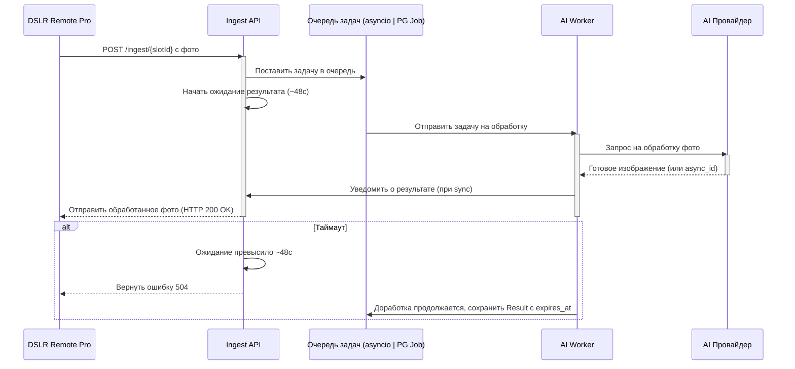

# Общее описание функционала веб сервера
Сервер представляет из себя Платформу для AI обработки фотографий. 
## Пользовательский workflow
 
 Пользователь авторизуется в веб интерфейсе платформы и попадает на Главную страницу выбора слота настроек. Выбирая соответствующий слот, пользователь попадает в Страницу-вкладку настроек обработки фотографии. 

**Процесс настройки слота:**
1.  **Выбор Провайдера:** Пользователь выбирает из списка, какую AI-платформу использовать (например, `Gemini`, `Turbotext`).
2.  **Выбор Операции:** В зависимости от выбранного провайдера, появляется второй список с доступными операциями (например, для `Gemini` это будут `Style Transfer`, `Combine Images`).
3.  **Настройка Параметров:** Интерфейс автоматически отображает поля, необходимые именно для этой операции (например, текстовый промпт, поле для загрузки стилевого изображения и т.д.).

После настройки пользователь сохраняет слот. На главной странице в списке слотов теперь отображается имя этого слота и рядом отображена ingest-ссылка. Рядом с сылкой присутствует кнопка "Копировать" для копирования ссылки. Пользователь копирует ingest-ссылку слота и вставляет ее в DSLR Remote Pro. Теперь программа отправляет `POST` c файлом на этот адрес. В теле `POST` находится обрабатываемая фотография, пароль и некоторые другие поля.


## Цель платформы
Ожидать ingest-POST на разных эндпоинтах и, согласно слоту, вызывать соответствующую AI-модель.
По получению запроса, в зависимости от того на какой входящий эндпоинт он пришел, платформа формирует исходящий запрос к соответствующей AI модели для обработки фотографии. Запрос формируется на основании данных из слота, к которому привязан входящий эндпоинт. Платформа получает тем или иным методом обработанную фотографию от AI модели. Платформа отправляет обработанную фотографию в теле ответа на пользовательский POST запрос. По истечении 60 секунд с момента получения пользовательского запроса, исходная фотография и  удаляется из временной папки сервера. Обработанные фотографии, отправленные пользователю в ответе на входящий POT запрос, удаляются спустя 3 дня с момента их сохранения во временной папке.

### Провайдер Gemini (image generation & editing)

- Поддерживаемые сценарии — генерация изображений, редактирование «edit-with-prompt», multi-image fusion и стилизация на модели `gemini-2.5-flash-image`.
- Все запросы выполняются методом `models.generateContent` с передачей текста и изображений через `contents.parts` (`text`, `inline_data`, `file_data`). Для крупных файлов используется Files API (`file_uri`), который хранит до 2 ГБ на файл и 20 ГБ на проект в течение 48 часов.
- Лимиты Gemini, обязательные к соблюдению: Files API принимает изображения только `image/png`, `image/jpeg`, `image/webp`, `image/heic`, `image/heif`; каждый файл ≤ 2 ГБ, суммарное хранилище проекта ≤ 20 ГБ, файлы удаляются спустя 48 ч; базовые квоты модели `gemini-2.5-flash-image` — 500 запросов в минуту, 2 000 запросов в день и 500 000 токенов в минуту (Tier 2). UI и валидация должны учитывать эти ограничения.

# Механизм работы платформы

Платформа использует архитектуру "Асинхронного моста" для обработки запросов от DSLR Remote Pro в рамках 50‑секундного таймаута, даже если AI‑модель работает дольше. Значение таймаута (T_sync_response, по умолчанию ≤ 50 c) настраивается на странице статистики.

1. Приём запроса: Ingest API получает POST и валидирует вход (MIME/размер/EXIF и т.п.).
2. Постановка в очередь: запрос помещается в очередь без Redis:
   - MVP: in‑process asyncio.Queue (ограниченная, с back‑pressure).
   - При росте: очередь в PostgreSQL (таблица job, выборка задач через SELECT … FOR UPDATE SKIP LOCKED). Режим выбирается конфигурацией.
3. Ожидание с таймаутом: обработчик API ждёт результат не дольше ~48 c (внутреннее ожидание < T_sync_response).
4. Фоновая обработка: worker(ы) забирают задачу из asyncio.Queue или из таблицы job (PG), вызывают внешнего AI‑провайдера. Если провайдер возвращает async_id, ожидание переносится на webhook/поллинг.
5. Результат:
   - Успех (AI < 48 c): worker получает результат → API возвращает изображение клиенту (200 OK).
   - Таймаут (AI > 48 c): API возвращает 504 Gateway Timeout. Worker продолжает и по завершении сохраняет результат в 

6. Ретраи и back‑pressure: ограничение параллелизма на провайдера/слот; экспоненциальные ретраи при сетевых сбоях (до N попыток); статус и счётчик попыток фиксируются в job/логах.
Если результат от провайдера не пришёл в течение T_sync_response, ingest завершается 504. 


## Временное публичное медиа-хранилище (для Turbotext)
Назначение: выдавать временные публичные ссылки на изображения, чтобы передавать их в поля url_image_target и url Turbotext.

### Краткие требования
- TTL ссылки: по умолчанию 10–15 минут (настраиваемо).
- Форматы: JPEG/PNG/WEBP (минимальный набор можно расширять).
- Размеры: лимит по размеру файла и по пикселям (конфиг).
- Хранение: локальная папка MEDIA_ROOT; автоматическая очистка просроченных файлов.
### Конфигурация (параметры)

* MEDIA_ROOT — путь для временных файлов (например, /var/app/media/tmp)
* PUBLIC_BASE_URL — базовый URL для раздачи (например, https://api.example.com/public/media)
* MEDIA_DEFAULT_TTL_SEC — время жизни ссылок (например, 900)
* MEDIA_ALLOWED_MIME — список допустимых MIME
* MEDIA_MAX_FILE_SIZE_MB — лимит размера

### Эндпоинты (минимальный набор)

- POST /api/media/register — принять файл, сохранить, вернуть id, public_url, expires_at.
- GET /public/media/{id} — отдать файл, если не истёк expires_at.
- POST /api/media/extend (опционально) — продлить expires_at для активной задачи.

### Жизненный цикл
- Ingest принял фото → зарегистрировал в медиа-хранилище → получил public_url.
- Воркер передал public_url в запрос к Turbotext.
- Turbotext скачал файл по ссылке и выполнил операцию.
- По завершении задачи файл остаётся доступным до expires_at.
- Плановая очистка регулярно удаляет просроченные файлы и записи.

# Архитектура и стек приложения
## Архитектура
**1. Архитектура проекта ориентирована на безопасность изменений кода** при генерации кода LLM моделью: тонкие фасады + pure domain + контракт-first + Spec Driven Dev
**2. Архитектура проекта должна обладать Низкой связанностью (low coupling):**
 * Каждый модуль/фасад имеет отдельную ответственность.
 * Сервисы и домен не знают про инфраструктуру напрямую — используют фасады и интерфейсы.
 * Любой слой зависит только от более внутреннего слоя.
**3. Архитектура проекта должна обладать Высокой когезией (high cohesion):**
 * Каждый класс или модуль отвечает за один аспект.
 * DTO и типы фиксируют контракты между слоями, уменьшая «размазанность» логики.

### Модели данных (PostgreSQL + Alembic)
Для хранения состояния приложения, настроек слотов и сбора статистики будет использоваться база данных PostgreSQL; схемы версионируются через Alembic (миграции)
Все временные метки храним как `TIMESTAMP WITH TIME ZONE` (UTC). Для полей со схемами и настройками допускается `JSONB`.

**Таблица `User`**

*   `id`: `INTEGER` (Primary Key)
*   `username`: `TEXT` (уникальный; в боевой конфигурации допустимы только два предустановленных значения — `serg` и `igor`)
*   `hashed_password`: `TEXT` (хэш статически сгенерированного случайного пароля)

> Управление пользователями выполняется только на этапе деплоя. В приложении отсутствуют эндпоинты и UI для создания, удаления или
> изменения учётных записей. Единственный способ заменить пароль — перегенерировать секреты и перезапустить сервис.


**Таблица `Slot`**
*   `id`: `TEXT` (Primary Key, одна из 40 предустановленных статических ingest-ссылок)
*   `name`: `TEXT` (Имя, которое задает пользователь)
*   `user_id`: `INTEGER` (Foreign Key -> User)
*   `provider_id`: `TEXT` (ID провайдера из конфигурационного файла)
*   `operation_id`: `TEXT` (ID операции из конфигурационного файла)
*   `settings_json`: `TEXT` (JSON-строка с параметрами для AI-операции)
*   `last_reset_at`: `TIMESTAMP WITH TIME ZONE` (Дата последнего сброса статистики для этого слота)

> Всего доступно 40 слотов с фиксированными идентификаторами (`slot-001` … `slot-040`). Они подготавливаются миграцией БД для
> каждого пользователя при инициализации сервиса и не удаляются. Повторная настройка выполняется поверх той же записи: `id`
> остаётся неизменным, а ingest-URL, связанный с `id`, сохраняется на всём сроке жизни. Если пользователь сбрасывает настройки,
> фронтенд отображает слот как свободный, но его `id` продолжает принадлежать тому же пользователю.


**Таблица `ProcessingLog`**
*   `id`: `INTEGER` (Primary Key)
*   `slot_id`: `TEXT` (Foreign Key -> Slot)
*   `created_at`: `TIMESTAMP WITH TIME ZONE` (Время получения ingest-запроса)
*   `status`: `TEXT` (`SUCCESS`, `ERROR`, `TIMEOUT`)
*   `response_time_ms`: `INTEGER` (Время ответа в миллисекундах)
*   `cost`: `REAL` (Стоимость операции, если применимо)
*   `error_message`: `TEXT` (Сообщение об ошибке)


**Таблица `media_object`**
* id (UUID, PK)
* path (TEXT) — путь к файлу в MEDIA_ROOT
* mime (TEXT)
* size_bytes (INTEGER)
* created_at (TIMESTAMPTZ)
* expires_at (TIMESTAMPTZ)
* job_id (UUID, опционально) — связь с задачей обработки

Поле `expires_at` задаёт срок жизни временной ссылки на медиа-файл: оно заполняется при вызове `POST /api/media/register`,
используется проверкой доступа в `GET /public/media/{id}`, может продлеваться эндпоинтом `POST /api/media/extend`, а также
определяет, когда воркер и плановая очистка должны удалить просроченные файлы.

**Конфигурационные файлы**
Данные о Провайдерах (`Providers`) и их Операциях (`Operations`) будут храниться в статических конфигурационных файлах (например, `providers.json`), чтобы избежать усложнения схемы БД.

### Схема конфигурации провайдеров и параметров слота

Конфигурация разделена на два слоя:

1. **`configs/providers.json`** — статический каталог провайдеров и поддерживаемых операций.
2. **`Slot.settings_json`** — сериализованное представление параметров операции, которые пользователь выбрал при настройке слота.

#### Формат `configs/providers.json`

```json
{
  "providers": [
    {
      "id": "gemini",
      "title": "Gemini",
      "ingest": {
        "max_parallel_jobs": 4,
        "timeout_sec": 48,
        "allowed_mime": ["image/jpeg", "image/png"],
        "max_file_size_mb": 20
      },
      "operations": [
        "style_transfer",
        "combine_images",
        "change_image"
      ]
    },
    {
      "id": "turbotext",
      "title": "TurboText",
      "ingest": {
        "max_parallel_jobs": 2,
        "timeout_sec": 48,
        "allowed_mime": ["image/jpeg", "image/png"],
        "max_file_size_mb": 15,
        "requires_public_media": true
      },
      "operations": [
        "style_transfer",
        "change_image"
      ]
    }
  ],
  "operations": {
    "style_transfer": {
      "title": "Style Transfer",
      "description": "Перенос художественного стиля с эталонного изображения на целевое.",
      "required_settings": ["reference_media_id"],
      "provider_overrides": {
        "gemini": { "endpoint": "/v1beta/models/gemini-image:transferStyle" },
        "turbotext": { "endpoint": "/v1/style-transfer" }
      },
      "settings_schema": {
        "type": "object",
        "required": ["reference_media_id"],
        "properties": {
          "prompt": { "type": "string", "maxLength": 2000 },
          "reference_media_id": { "type": "string", "format": "uuid" },
          "style_strength": { "type": "number", "minimum": 0, "maximum": 1, "default": 0.65 },
          "output": {
            "type": "object",
            "properties": {
              "format": { "type": "string", "enum": ["jpeg", "png", "webp"], "default": "jpeg" },
              "max_side_px": { "type": "integer", "minimum": 256, "maximum": 4096, "default": 2048 }
            }
          }
        },
        "additionalProperties": false
      }
    },
    "combine_images": {
      "title": "Combine Images",
      "description": "Композиция нескольких изображений: склейка, коллажи, face-swap.",
      "required_settings": ["base_media_id", "overlay_media_id"],
      "provider_overrides": {
        "gemini": { "endpoint": "/v1beta/models/gemini-image:compose" }
      },
      "settings_schema": {
        "type": "object",
        "required": ["base_media_id", "overlay_media_id"],
        "properties": {
          "prompt": { "type": "string", "maxLength": 2000 },
          "base_media_id": { "type": "string", "format": "uuid" },
          "overlay_media_id": { "type": "string", "format": "uuid" },
          "blend_mode": { "type": "string", "enum": ["alpha", "seamless", "face_swap"], "default": "seamless" },
          "alignment": {
            "type": "object",
            "properties": {
              "face_landmarks": { "type": "boolean", "default": true },
              "scale": { "type": "number", "minimum": 0.1, "maximum": 4, "default": 1 }
            }
          },
          "output": {
            "type": "object",
            "properties": {
              "format": { "type": "string", "enum": ["jpeg", "png"], "default": "jpeg" },
              "quality": { "type": "integer", "minimum": 1, "maximum": 100, "default": 92 }
            }
          }
        },
        "additionalProperties": false
      }
    },
    "change_image": {
      "title": "Change Image",
      "description": "Локальное редактирование исходного изображения по текстовому описанию.",
      "required_settings": ["prompt"],
      "provider_overrides": {
        "gemini": {
          "endpoint": "/v1beta/models/gemini-image:edit",
          "media_parts": [
            { "id": "ingest_media", "from": "ingest_request" }
          ]
        },
        "turbotext": {
          "endpoint": "/v1/image/change",
          "media_parts": [
            { "id": "ingest_media", "from": "ingest_request" }
          ]
        }
      },
      "settings_schema": {
        "type": "object",
        "required": ["prompt"],
        "properties": {
          "prompt": { "type": "string", "maxLength": 2000 },
          "guidance_scale": { "type": "number", "minimum": 0, "maximum": 20, "default": 7.5 },
          "output": {
            "type": "object",
            "properties": {
              "format": { "type": "string", "enum": ["jpeg", "png", "webp"], "default": "png" },
              "quality": { "type": "integer", "minimum": 1, "maximum": 100, "default": 100 }
            }
          }
        },
        "additionalProperties": false
      }
    }
  }
}
```

Ключи `provider_overrides` фиксируют различия в интеграции: URL конечной точки, допустимые параметры, ограничения таймаута. Для операций редактирования `media_parts` описывает, какие бинарные данные подставляются в запрос провайдера: для `change_image` базовый `ingest_media` приходит вместе с ingest‑POST и не хранится в слоте. Общие свойства `settings_schema` описывают обязательные поля, которые должны быть валидированы на бэкенде при сохранении слота.

Для удобства клиентских интеграций обязательные поля операций дополнительно продублированы в массиве `required_settings`.

#### Маппинг `Slot`

* `provider_id` — значение поля `providers[].id`.
* `operation_id` — одно из значений `operations` (на уровне провайдера).
* `settings_json` — JSON-объект, удовлетворяющий `settings_schema` соответствующей операции. На бэкенде хранится сериализованный JSON, в котором бинарные файлы заменены на идентификаторы медиа (`media_object.id`).

Пример значения `settings_json` для слота Gemini c операцией `combine_images`:

```json
{
  "prompt": "Сменить фон на корпоративный стиль",
  "base_media_id": "b7a09f84-7560-4a7b-9303-2b41a6d359f3",
  "overlay_media_id": "3ad89908-0df1-4f1e-b3e9-586eea730d21",
  "blend_mode": "face_swap",
  "alignment": { "face_landmarks": true, "scale": 1.1 },
  "output": { "format": "jpeg", "quality": 90 }
}
```

Пример значения `settings_json` для слота Gemini c операцией `change_image` (исходное фото приходит во входящем ingest‑POST, в конфигурации остаются только параметры генерации):

```json
{
  "prompt": "Осветлить лицо и пригладить фон",
  "guidance_scale": 6.5,
  "output": { "format": "png", "quality": 95 }
}
```

На UI параметры собираются на основании `needs` (промпт, первое/второе изображение) и валидируются против схемы операции. При сохранении:

1. Файлы загружаются во временное хранилище (`media_object`), что возвращает `media_id`.
2. Бэкенд формирует объект по схеме, подставляя `media_id` вместо бинарных данных.
3. Получившийся JSON сериализуется и сохраняется в `Slot.settings_json`.

## Стек
*   **Бэкенд:** FastAPI
*   **База данных:** PostgreSQL
*  **Очередь задач:** MVP — in-process asyncio.Queue; при росте — очередь на PostgreSQL через таблицу Job и SELECT … FOR UPDATE SKIP LOCKED (воркеры)
*   **Фронтенд:** HTMX, VanillaJS

# API Спецификация
## Внутренний API (для Frontend)
API для взаимодействия с веб-интерфейсом построен на принципах REST. Все защищённые эндпоинты требуют передачи заголовка `Authorization: Bearer <JWT>`; токен действует 60 минут с момента выдачи и должен быть обновлён повторным вызовом `/api/login` после истечения срока. Ответы об ошибках имеют единый формат:

```json
{
  "error": {
    "code": "<machine_readable_code>",
    "message": "Человекочитаемое описание проблемы",
    "details": { "field": "optional context" }
  }
}
```

Общие коды состояния: `400` — ошибка валидации, `401` — неавторизовано/истёкший токен, `403` — недостаточно прав, `404` — ресурс не найден, `409` — конфликт (например, слот уже существует), `422` — семантическая ошибка тела запроса, `500` — внутренняя ошибка сервера.

### Аутентификация
**`POST /api/login`**

* **Назначение:** Вход пользователя и получение JWT.
* **Аутентификация:** не требуется.
* **Тело запроса:**
  ```json
  {
    "username": "admin",
    "password": "secret"
  }
  ```
* **Успешный ответ (`200 OK`):**
  ```json
  {
    "access_token": "<jwt>",
    "token_type": "bearer",
    "expires_in_sec": 3600
  }
  ```
* **Ошибки:** `400` (некорректное тело), `401` (неверные учётные данные), `429` (слишком частые попытки).

#### Статические пользователи и секреты
- В веб-интерфейсе доступны только две учётные записи: `serg` и `igor`. Их случайные пароли генерируются в процессе деплоя и
  сохраняются в файле `secrets/runtime_credentials.json`, который добавлен в `.gitignore` и не версионируется.
- JWT выдаётся только для указанных предустановленных пользователей; сценарии регистрации, восстановления доступа и смены пароля
  намеренно отсутствуют.
- Ingest-эндпоинты дополнительно защищены отдельным случайным паролем, который хранится в том же файле `secrets/runtime_credentials.json`
  и передаётся в теле POST-запроса вместе с фотографией.
- Ротация паролей выполняется операторами путём пересоздания файла секретов и перезапуска сервиса; автоматизированных сценариев не предусмотрено.

### Провайдеры
**`GET /api/providers`**

* **Назначение:** Получить конфигурацию всех доступных AI‑провайдеров и их операций.
* **Аутентификация:** требуется `Authorization: Bearer <JWT>`.
* **Параметры запроса:** отсутствуют; пагинация не применяется из-за ограниченного числа записей.
* **Успешный ответ (`200 OK`):**
  ```json
  {
    "providers": [
      {
        "id": "gemini",
        "name": "Gemini",
        "operations": [
          { "id": "style_transfer", "name": "Style Transfer" }
        ]
      }
    ]
  }
  ```
* **Ошибки:** стандартные (`401`, `403`, `500`).

### Слоты
**`GET /api/slots`**

* **Назначение:** Получить список всех 40 преднастроенных слотов текущего пользователя и их актуальные настройки.
* **Аутентификация:** требуется `Authorization: Bearer <JWT>`.
* **Пагинация:** не применяется (возвращается ровно 40 записей); фронтенд может выполнять клиентскую пагинацию/фильтрацию.
* **Фильтрация:** query-параметры `provider_id`, `operation_id`, `search` опциональны и используются для сокращения набора возвращаемых слотов.
* **Успешный ответ (`200 OK`):**
  ```json
  {
    "data": [
      {
        "id": "slot-001",
        "name": "Fashion Studio",
        "provider_id": "gemini",
        "operation_id": "style_transfer",
        "settings_json": {
          "prompt": "Передай стиль глянцевого журнала",
          "reference_media_id": "0a403f97-312f-4fc5-9f01-7de121c9a9d7",
          "output": {
            "format": "jpeg",
            "max_side_px": 2048
          }
        },
        "ingest_url": "https://api.example.com/ingest/slot-001",
        "is_configured": true,
        "last_reset_at": "2024-04-22T09:15:00Z"
      }
    ],
    "meta": {
      "total": 40
    }
  }
  ```
* **Ошибки:** `400` (некорректные параметры фильтрации), стандартные ошибки авторизации/доступа.
* **Примечание:** создание и удаление слотов недоступны — пользователь редактирует только предзагруженные идентификаторы.

**`GET /api/slots/{slot_id}`**

* **Назначение:** Получить данные конкретного слота.
* **Аутентификация:** требуется `Authorization: Bearer <JWT>`.
* **Параметры:** `slot_id` (path).
* **Успешный ответ (`200 OK`):**
  ```json
  {
    "id": "slot-001",
    "name": "Fashion Studio",
    "provider_id": "gemini",
    "operation_id": "style_transfer",
    "settings_json": {
      "prompt": "Передай стиль глянцевого журнала",
      "reference_media_id": "0a403f97-312f-4fc5-9f01-7de121c9a9d7",
      "output": {
        "format": "jpeg",
        "max_side_px": 2048
      }
    },
    "last_reset_at": "2024-04-22T09:15:00Z"
  }
  ```
* **Ошибки:** `404` (слот не найден), стандартные ошибки авторизации.

**`PUT /api/slots/{slot_id}`**

* **Назначение:** Обновить настройки одного из статических слотов.
* **Аутентификация:** требуется `Authorization: Bearer <JWT>`.
* **Тело запроса:**
  ```json
  {
    "name": "Fashion Studio",
    "provider_id": "gemini",
    "operation_id": "combine_images",
    "settings_json": {
      "prompt": "Скомбинировать исходник со стилевым",
      "base_media_id": "b7a09f84-7560-4a7b-9303-2b41a6d359f3",
      "overlay_media_id": "3ad89908-0df1-4f1e-b3e9-586eea730d21",
      "alignment": {"face_landmarks": true},
      "output": {"format": "jpeg", "quality": 92}
    }
  }
  ```
* **Успешный ответ (`200 OK`):**
  ```json
  {
    "id": "slot-001",
    "updated_at": "2024-04-22T11:30:00Z"
  }
  ```
* **Ошибки:** `400`/`422` (ошибка валидации), `404` (слот не найден), `409` (слот занят фоновой операцией/конфликт версий), стандартные ошибки авторизации.

**`POST /api/slots/{slot_id}/reset_stats`**

* **Назначение:** Обнулить статистику выбранного слота.
* **Аутентификация:** требуется `Authorization: Bearer <JWT>`.
* **Тело запроса:** отсутствует (передавайте пустой JSON `{}` для совместимости).
* **Успешный ответ:** `204 No Content`.
* **Ошибки:** `404` (слот не найден), `409` (выполняется сброс), стандартные ошибки авторизации.

### Статистика
**`GET /api/stats/{slot_id}`**

* **Назначение:** Получить детальную статистику по слоту.
* **Аутентификация:** требуется `Authorization: Bearer <JWT>`.
* **Параметры:**
  * Path: `slot_id`.
  * Query: `from` и `to` (ISO8601, ограничение диапазона — не более 31 дня), `group_by` (`hour`, `day`, `week`, дефолт `day`).
* **Сортировка:** группировки возвращаются в хронологическом порядке по возрастанию.
* **Пагинация:** не применяется (результат ограничен диапазоном дат).
* **Успешный ответ (`200 OK`):**
  ```json
  {
    "slot_id": "slot-001",
    "range": { "from": "2024-04-01", "to": "2024-04-07", "group_by": "day" },
    "metrics": [
      { "period_start": "2024-04-01", "success": 12, "errors": 1, "avg_response_ms": 2100, "cost": 4.35 }
    ]
  }
  ```
* **Ошибки:** `400` (некорректный диапазон), `404` (слот не найден), стандартные ошибки авторизации.

**`GET /api/stats/global`**

* **Назначение:** Получить агрегированную статистику по всем слотам пользователя.
* **Аутентификация:** требуется `Authorization: Bearer <JWT>`.
* **Параметры:**
  * Query: `from`/`to` (ISO8601, максимум 90 дней), `group_by` (`day`, `week`, `month`, дефолт `week`).
  * Пагинация списка записей: `page` (>=1, дефолт 1), `page_size` (1–50, дефолт 10).
  * Сортировка: `sort_by` (`period_start`, `success`, `errors`, `cost`) и `sort_order` (`asc`/`desc`, дефолт `desc`).
  * Фильтры: `provider_id`, `slot_id` (опционально ограничивают агрегаты).
* **Успешный ответ (`200 OK`):**
  ```json
  {
    "data": [
      {
        "period_start": "2024-04-01",
        "period_end": "2024-04-07",
        "success": 84,
        "errors": 6,
        "avg_response_ms": 1980,
        "cost": 31.8
      }
    ],
    "meta": {
      "page": 1,
      "page_size": 10,
      "total": 12
    }
  }
  ```
* **Ошибки:** `400` (некорректные параметры фильтров/пагинации), стандартные ошибки авторизации.


## Внешний API: Ingest (DSLR Remote Pro)
Этот эндпоинт предназначен для приема `POST` запросов от программы DSLR Remote Pro. Будет сгенерировано 40 статических коротких ingest-ссылок, которые можно будет привязывать к слотам.

В пользовательском запросе должна быть передана исходная фотография, Глобальный пароль и, опцилнально, некоторые другие поля. 
Пример пользовательского POST запроса для DSLR программы:

```json
{
  "timestamp": "2025-09-18T17:45:12.439171+00:00",
  "client": {
    "host": "127.0.0.1",
    "port": 1417
  },
  "method": "POST",
  "url": "http://localhost:8000/echo?session=42",
  "path": "/echo",
  "query_params": {
    "session": "42"
  },
  "headers": {
    "host": "localhost:8000",
    "content-type": "multipart/form-data; boundary=------------090306000104030805010400",
    "content-length": "53205",
    "expect": "100-continue"
  },
  "cookies": {},
  "content_type": "multipart/form-data; boundary=------------090306000104030805010400",
  "is_multipart": true,
  "form_text_fields": {
    "time": "1758217512",
    "user_id": "Acer",
    "id": "CY04N068111304S2L_00000001.",
    "profile": "C:\\Users\\Acer\\Documents\\PhotoboothImages\\setup_Serg.xml",
    "status": "C:\\Users\\Acer\\Documents\\PhotoboothImages\\screenSerg\\preview.jpg",
    "hash": "7b6c683e1d3fd29c8701791c54e3c12a236f5a5b",
    "name": "DESKTOP-K968T3F",
    "model": "Windows",
    "version": "3.30.2",
    "password": "123456"
  },
  "form_files": [
    {
      "field": "fileToUpload",
      "original_filename": "IMG_0003.JPG",
      "saved_as": "\\tmp\\fastapi_echo\\uploads\\20250918T174512Z_e6bf1d6c98c843d6aa4948d07f251c17.JPG",
      "content_type": "image/jpeg",
      "size_bytes": 51977,
      "is_image_jpeg": true
    }
  ]
}
```
Ответ при успехе: бинарный image/jpeg|png (синхронно, short-poll ≤ 50 c).
В ответе на этот запрос наш сервер должен отправить фотографию, обработанную AI моделью.

## API Turbotext
для работы с моделью Турботекст будут использоваться следующие методы:
- Микс-фото
- Замена объекта
- Замена лица
Описание api находится тут https://www.turbotext.ru/photo_ai/docs/info#section-2
Все запросы отправляются на url: https://www.turbotext.ru/api_ai

### Авторизация
Идентификацию пользователя организуйте посредством Bearer Token,
Пример CURL, данные с Headers запроса:
```http
Authorization: Bearer {APIKEY}
Content-Type: application/x-www-form-urlencoded
```

### Webhook

Если вы хотите запустить серию генераций вам необходимо использовать асинхронный метод генерации, для этого создаем webhook который сможет принимать и обрабатывать результаты генераций.

При обычном методе генерации, вы создаете очередь, затем с помощью номера очереди получаете результат генерации,

в асинхронном методе геннерации, вы создаете очередь добавив в пост данные:

`webhook=https://mysite.com/webhook_example.php`

Ответ на запрос будет такой:

`{"success":true,"asyncid":N} `, где N номер очереди, при получении ответа вы получите параметр asyncid с таким же значением.

Нейро-сервер после обработки вашего запроса, отправит вам на адрес который вы указали в параметре webhook POST данные с результатом генерации,
Формат данных точно такой же как и при получении вторым запросом.

Вы получите результат генерации на ваш WEBHOOK URL в формате JSON

пример получения результата на php:
```php
$result=file_get_contents('php://input');//входящий JSON результат`
$result_array=json_decode($result,1);//Результаты в массиве
```

### Метод Микс фото
Запрос на создании очереди
```http
/api_ai/mix_images HTTP/1.1
Host: turbotext.ru
Authorization: Bearer {APIKEY}
Content-Type: application/x-www-form-urlencoded
Content-Length: 0
```
do:create_queue
content - описание для усиления эффекта
url_image_target - фото на урл которое нужно обработать
url - фото на урл откуда используем стиль 

Ответ с данными очереди в формате JSON:
`{"success":true,"queueid":{QUEUEID}}`
Здесь `{QUEUEID}` - Номер нашей очереди, далее обращаемся за получением результата использую этот массив данных.
Теперь делаем запрос на получение результата:
```http
/api_ai/mix_images HTTP/1.1
Host: turbotext.ru
Authorization: Bearer {APIKEY}
Content-Type: application/x-www-form-urlencoded
Content-Length: 0
do:get_result
queueid:{QUEUEID} 
```

## API Gemini
### Ссылки на документацию 
Image generation: https://ai.google.dev/gemini-api/docs/image-generation#image_generation_text-to-image
Image understanding: https://ai.google.dev/gemini-api/docs/image-understanding
Files API guide: https://ai.google.dev/gemini-api/docs/files
File prompting strategies: https://ai.google.dev/gemini-api/docs/files#prompt-guide
### Описание API 
Image generation with Gemini (aka Nano Banana)
Multi-Image to Image (Composition & Style Transfer): Use multiple input images to compose a new scene or transfer the style from one image to another.

#### Passing images to Gemini
You can provide images as input to Gemini using two methods:
 1.   Passing inline image data: Ideal for smaller files (total request size less than 20MB, including prompts). 
 2.   Uploading images using the File API: Recommended for larger files or for reusing images across multiple requests. 

##### Passing inline image data
You can pass inline image data in the request to `generateContent`. You can provide image data as Base64 encoded strings or by reading local files directly (depending on the language). The following example shows how to read an image from a local file and pass it to `generateContent` API for processing.
Passing inline image data example:
```python
  from google.genai import types

  with open('path/to/small-sample.jpg', 'rb') as f:
      image_bytes = f.read()

  response = client.models.generate_content(
    model='gemini-2.5-flash',
    contents=[
      types.Part.from_bytes(
        data=image_bytes,
        mime_type='image/jpeg',
      ),
      'Caption this image.'
    ]
  )

  print(response.text)
```
You can also fetch an image from a URL, convert it to bytes, and pass it to `generateContent` as shown in the following examples:
```python
from google import genai
from google.genai import types

import requests

image_path = "https://goo.gle/instrument-img"
image_bytes = requests.get(image_path).content
image = types.Part.from_bytes(
  data=image_bytes, mime_type="image/jpeg"
)

client = genai.Client()

response = client.models.generate_content(
    model="gemini-2.5-flash",
    contents=["What is this image?", image],
)

print(response.text)
```

##### Uploading images using the File API
For large files or **to be able to use the same image file repeatedly, use the Files API**. 
The Gemini family of artificial intelligence (AI) models is built to handle various types of input data, including text, images, and audio. Since these models can handle more than one type or mode of data, the Gemini models are called multimodal models or explained as having multimodal capabilities.
This guide shows you how to work with media files using the Files API. The basic operations are the same for audio files, images, videos, documents, and other supported file types.

###### Upload a file
 Always use the Files API when the total request size (including the files, text prompt, system instructions, etc.) is larger than 20 MB.
The following code uploads a file and then uses the file in a call to `generateContent`.

```python 
from google import genai
client = genai.Client()
myfile = client.files.upload(file="path/to/sample.mp3")
response = client.models.generate_content(
    model="gemini-2.5-flash", contents=["Describe this audio clip", myfile]
)
print(response.text)
```
###### Get metadata for a file
You can verify that the API successfully stored the uploaded file and get its metadata by calling `files.get`.
```python
myfile = client.files.upload(file='path/to/sample.mp3')
file_name = myfile.name
myfile = client.files.get(name=file_name)
print(myfile)

```
###### List uploaded files
You can upload multiple files using the Files API. The following code gets a list of all the files uploaded:
```python
print('My files:')
for f in client.files.list():
    print(' ', f.name)
```
###### Delete uploaded files
Files are automatically deleted after 48 hours. You can also manually delete an uploaded file:
```python
myfile = client.files.upload(file='path/to/sample.mp3')
client.files.delete(name=myfile.name)
```

###### Usage info
You can use the Files API to upload and interact with media files. The Files API lets you store up to 20 GB of files per project, with a per-file maximum size of 2 GB. Files are stored for 48 hours. During that time, you can use the API to get metadata about the files, but you can't download the files. The Files API is available at no cost in all regions where the Gemini API is available.

#### Prompting with multiple images. 

You can provide multiple images in a single prompt by including multiple image Part objects in the contents array. These can be a mix of inline data (local files or URLs) and File API references.
```python
from google import genai
from google.genai import types

client = genai.Client()

# Upload the first image
image1_path = "path/to/image1.jpg"
uploaded_file = client.files.upload(file=image1_path)

# Prepare the second image as inline data
image2_path = "path/to/image2.png"
with open(image2_path, 'rb') as f:
    img2_bytes = f.read()

# Create the prompt with text and multiple images
response = client.models.generate_content(

    model="gemini-2.5-flash",
    contents=[
        "What is different between these two images?",
        uploaded_file,  # Use the uploaded file reference
        types.Part.from_bytes(
            data=img2_bytes,
            mime_type='image/png'
        )
    ]
)
print(response.text)
```
##### Style transfer
Example of Prompt template
```
Transform the provided photograph of [subject] into the artistic style of [artist/art style]. Preserve the original composition but render it with [description of stylistic elements].
```
Example of code 
```python
from google import genai
from google.genai import types
from PIL import Image
from io import BytesIO

client = genai.Client()

# Base image prompt: "A photorealistic, high-resolution photograph of a busy city street in New York at night, with bright neon signs, yellow taxis, and tall skyscrapers."
city_image = Image.open('/path/to/your/city.png')
text_input = """Transform the provided photograph of a modern city street at night into the artistic style of Vincent van Gogh's 'Starry Night'. Preserve the original composition of buildings and cars, but render all elements with swirling, impasto brushstrokes and a dramatic palette of deep blues and bright yellows."""

# Generate an image from a text prompt
response = client.models.generate_content(
    model="gemini-2.5-flash-image-preview",
    contents=[city_image, text_input],
)

image_parts = [
    part.inline_data.data
    for part in response.candidates[0].content.parts
    if part.inline_data
]

if image_parts:
    image = Image.open(BytesIO(image_parts[0]))
    image.save('city_style_transfer.png')
    image.show()
```

##### Combining multiple images
Provide multiple images as context to create a new, composite scene. This is perfect for product mockups or creative collages.
Example of prompt:
```prompt
"Create a professional e-commerce fashion photo. Take the blue floral dress
from the first image and let the woman from the second image wear it.
Generate a realistic, full-body shot of the woman wearing the dress, with
the lighting and shadows adjusted to match the outdoor environment.
Ensure the persons's face and features remain completely unchanged. "
```
Example of code:
```python
from google import genai
from google.genai import types
from PIL import Image
from io import BytesIO

client = genai.Client()

# Base image prompts:
# 1. Dress: "A professionally shot photo of a blue floral summer dress on a plain white background, ghost mannequin style."
# 2. Model: "Full-body shot of a woman with her hair in a bun, smiling, standing against a neutral grey studio background."
dress_image = Image.open('/path/to/your/dress.png')
model_image = Image.open('/path/to/your/model.png')

text_input = """Create a professional e-commerce fashion photo. Take the blue floral dress from the first image and let the woman from the second image wear it. Generate a realistic, full-body shot of the woman wearing the dress, with the lighting and shadows adjusted to match the outdoor environment. Ensure the persons's face and features remain completely unchanged. """

# Generate an image from a text prompt
response = client.models.generate_content(
    model="gemini-2.5-flash-image-preview",
    contents=[dress_image, model_image, text_input],
)

image_parts = [
    part.inline_data.data
    for part in response.candidates[0].content.parts
    if part.inline_data
]

if image_parts:
    image = Image.open(BytesIO(image_parts[0]))
    image.save('fashion_ecommerce_shot.png')
    image.show()
```
###### High-fidelity detail preservation
To ensure critical details (like a face or logo) are preserved during an edit, describe them in great detail along with your edit request.
Example prompt:
```template
Using the provided images, place [element from image 2] onto [element from
image 1]. Ensure that the features of [element from image 1] remain
completely unchanged. The added element should [description of how the
element should integrate].
```

#### Best Practices
To elevate your results from good to great, incorporate these professional strategies into your workflow.

   * **Be Hyper-Specific:** The more detail you provide, the more control you have. Instead of "fantasy armor," describe it: "ornate elven plate armor, etched with silver leaf patterns, with a high collar and pauldrons shaped like falcon wings."
    * **Provide Context and Intent:** Explain the purpose of the image. The model's understanding of context will influence the final output. For example, "Create a logo for a high-end, minimalist skincare brand" will yield better results than just "Create a logo."
    * **Use Step-by-Step Instructions:** For complex scenes with many elements, break your prompt into steps. "First, create a background of a serene, misty forest at dawn. Then, in the foreground, add a moss-covered ancient stone altar. Finally, place a single, glowing sword on top of the altar."
    * **Use "Semantic Negative Prompts":** Instead of saying "no cars," describe the desired scene positively: "an empty, deserted street with no signs of traffic."
    * **Control the Camera:** Use photographic and cinematic language to control the composition. Terms like wide-angle shot, macro shot,

#### Supportet image formats
Gemini supports the following image format MIME types:

 *    PNG - image/png
 *    JPEG - image/jpeg
 *    WEBP - image/webp
 *    HEIC - image/heic
 *    HEIF - image/heif

#### Limitations and key technical information
##### File limit 
Gemini 2.5 Pro/Flash, 2.0 Flash, 1.5 Pro, and 1.5 Flash support a maximum of 3,600 image files per request.

##### Token calculation
Gemini 2.5 Flash/Pro: 258 tokens if both dimensions <= 384 pixels. Larger images are tiled into 768x768 pixel tiles, each costing 258 tokens.
A rough formula for calculating the number of tiles is as follows:
 *   Calculate the crop unit size which is roughly: floor(min(width, height) / 1.5).
 *   Divide each dimension by the crop unit size and multiply together to get the number of tiles.

For example, for an image of dimensions 960x540 would have a crop unit size of 360. Divide each dimension by 360 and the number of tile is 3 * 2 = 6.
##### Tips and best practices
When using a single image with text, place the text prompt after the image part in the `contents` array.


# Frontend 
Фронтэнд состоит из:
1. Страница авторизации. 
2. Главная страница.
3. Страницы-вкладки (слоты).
4. Страница статистики.
5. Страница настроек.
## Описание web страниц фронтэнда 

### Страница авторизации
Страница авторизации на сайт выполнена согласно образцу: 
Полный шаблон см. в файле [`frontend-examples/login-page.html`](./frontend-examples/login-page.html).

### Главная страница 
 Главная страница содержит список слотов для AI обработки фото. 
  Под слотом подразумевается Страница-вкладка, дающая возможность сохранить в БД набор пользовательских настроек, касающихся AI обработки фотографий. 
 Визуально слот из себя представляет  кликабельный текст с пользовательским названием, взятым из соответствующей Стрианицы-вкладки. Клик по слоту ведет на соответствующую Страницу-вкладку. В одной строке рядом со слотом есть поле, в котором указана ingest-ссылка и кнопка "Копировать", чтобы скопировать ссылку. Все ingest-ссылки статичные, содержат окончание с коротким именем модели и номером слота.  Каждому слоту соответствует уникальная ingest-ссылка (входящий URL) для загрузки фото на обработку. ingest-ссылка предоставляется клиенту для загрузки фотографии в соответствующий слот для последующей обработки. ingest-ссылка описана в разделе [API DSLR Remote Pro](#dslr-post). Та же самая ingest-ссылка дублируется в интерфейсе слота - на его Странице-вкладке перед кнопкой "Сохранить1".  
 Справа вверху на главной странице есть кнопки в виде иконок:  "Статистика", "Настройки", "Выйти".

### Страница статистики
Содержит список по каждому слоту:
 Имя слота | маленькая иконка Шаблонного изображения №2 (если такое есть в слоте) | сколько  AI обработок совершено через этот слот с момента последнего сброса | количество ingest-запросов | p95-время ответа | процент ошибок | цена последней AI обработки | общая потраченная сумма с момента последнего сброса | дата последнего сброса статистики | кнопка "Сброс статисики" | сколько глобально обработок совершено за все время.
Визуально рамки таблицы рисовать не надо.

### Страница настроек
Содержит:
1. Поле для ввода пароля, который будет передаваться приложению от DSLR Remote Pro в теле запроса. 
2. Поля для ввода API ключей от AI моделей.
3. Кнопка "Очистить мультимедиа кеш" По нажатию все Обработанные фотографии, обычно хранящиеся на сервере 3 дня, удаляются с сервера.
4. Кнопка "Сохранить".

### Страницы-вкладки 
Каждая Старница-вкладка представляет интерфейс для сохранения параметров соответствующего Странице слота.  Пока что делаем толькот 2 слота. После проведения успешных тестов добавим еще 40 слотов.
На Cтранице-вкладке сверху отображается имя AI модели, согласно которой будет происходить AI обработка.  У Страницы-вкладки есть форма ввода "Название". Вот это название должно отображаться на Главной странице как имя слота и должно быть кликабельным, ведя на соответствующую Страницу-вкладку. 
Каждая Страница-вкладка предоставляет интерфейс под отдельный слот, чтобы ввести параметры обработки фото для этого слота. 
 Все страницы-вкладки имеют одинаковый интерфейс и внешний вид, отличаются лишь содержанием. Страница-вкладка собирает данные для AI-обработки фото: название задачи, текстовый промпт, опциональный шаблон (изображение №2) и опционально тестовое фото для возможности провести тест AI обработки. Все пользовательские данные, введенные на Странице-вкладке (за исключением тестового фото) представляют из себя слот и сохраняются в Базе Данных сервера. 
 Страницы-вкладки нельяз удалять или создавать новые. 

Входящая Ссылка для отрпавки [пользовательского POST запроса](#dslr-post) отображается на Странице-вкладке перед кнопкой "Сохранить1".
Каждая Страница-вкладка привязана к соответствующей ingest-ссылке. На главной странице 
#### Спецификация Страницы владки
Эта спецификация не обязательна, а лишь отображает примерный сценарий страницы.  Больше внимания следует уделить [Примеру оформления Страницы-вкладки](#slot-exmpl)
##### Что происходит на странице
1. Пользователь вводит Название и Промпт к ИИ.
2. Тумблерами включает загрузку:
 * второго изображения (шаблон стиля/замены лица/фона),
 * тестового фото (для локальной проверки).
3. Для каждого слота — drag&drop/клик по зоне, валидация JPG/PNG, превью с плавным появлением, кнопка «Убрать».
4. Скрытые поля `*_status` помечают, загружен ли файл (`present/removed`).
5. **Тест1**: если загружено тест-фото — вспышка-анимация формы и тост «успех», иначе тост-ошибка.
6. **Сохранить1**: визуальный «блик» формы; реального POST нет (submit отключён).

##### Модули и логика (верхний уровень) 

* Форма `#upload-form`
Хранит все поля. Submit заблокирован (`onsubmit="return false"`), кнопка «Сохранить1» — `type="button"`. 
* Переключатели (тумблеры) 
`toggle-second` и `toggle-first` показывают/скрывают секции загрузки, меняют только отображение. 
* Загрузка изображений (два слота)
Обработчик `bindSlot(prefix)` настраивает input + drop-зону, валидацию MIME/расширения, превью через `URL.createObjectURL`, управление `*_status`. 
* Подсказки/валидации
Серые хинты, текст ошибки под слотом, тосты (успех/ошибка сети/ошибка сервера — задел на будущее). 
* Анимация формы
Один кейфрейм `@keyframes pulseForm` (opacity 1 → 0.08 → 1, 0.4s) и один класс `-pulse`; хелпер `pulse(el)` перезапускает анимацию. Привязано к «Тест1» (только при наличии фото) и «Сохранить1». 
* Доступность
role="button", aria-label, sr-only, фокус-обводки, большие зоны клика; превью и кнопка «Убрать» доступны с клавиатуры. 
* Self-tests (консольные)
Лёгкие проверки наличия узлов/атрибутов для ранней диагностики в DevTools.

##### Технологии и инструменты
* HTML + CSS (кастомные свойства, gradients, blur)
UI-оформление, фон «дышит», стекло-эффект у формы, адаптивные размеры. 
* Vanilla JS
Тумблеры, drop-зоны, превью, тосты, хелпер анимации pulse. 
* HTMX (подключён)
Сейчас не используется для POST (оставлен на будущее); есть обработчики событий HTMX и контейнер для ответа сервера. 

##### TODO на будущее (интеграция)
Включить отправку multipart/form-data через HTMX (`hx-post="/api/save"` + `hx-target` уже готовы).
Серверная валидация размеров/типов, сохранение и возврат статуса/ID.
Доп. кнопки тестов могут дергать `/api/test` и стримить прогресс.
Если нужно описание в README-формате или краткую тех-спеку для задачи/тикета — сгенерирую.

#### Пример оформления Страницы-вкладки {id="slot-exmpl"}
В данном примере отсутствует Отображение названия AI модели и отображение ingest-ссылки, однако их нужно добавить в Страницы-вкладки.
Cтраницы-вкладки с настройками слота AI редактированием изображений должны быть оформлены по следующему примеру:
Полный пример интерфейса приведён в файле [`frontend-examples/slot-page.html`](./frontend-examples/slot-page.html).

