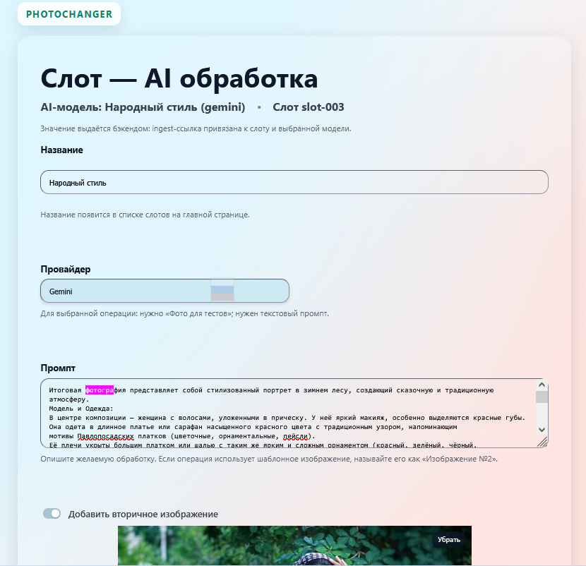

# PhotoChanger — синхронная AI-обработка фото (15 слотов)

Веб приложение (Монолит FastAPI), которое принимает на вход  изображения через UI интерфейс или снимки с DSLR Remote Pro, вызывает провайдеров (Gemini, Turbotext) в пределах `T_sync_response` (10–60 с) и возвращает результат программе, дублируя итоговое изображение в UI. Есть 15 слотов с индивидуальными настройками Промпта и шаблонного изображения ( при необходимости), чтобы провайдер мог слепить из двух одно.  



## Быстрый старт (локально)
```bash
python -m venv .venv
.venv/Scripts/activate
pip install -r requirements.txt
uvicorn src.app.main:app --reload --host 0.0.0.0 --port 8000
```
- Админ-дэшборд: `http://127.0.0.1:8000/ui/static/admin/dashboard.html`
- Статистика: `http://127.0.0.1:8000/ui/stats`
- Страницы слотов: `http://127.0.0.1:8000/ui/static/slots/slot-001.html` … `slot-015.html`


## Конфигурация (env)
- `DATABASE_URL` — PostgreSQL
- `MEDIA_ROOT` — каталог медиа, по умолчанию `./media`
- `RESULT_TTL_HOURS` (72), `TEMP_TTL_SECONDS` (`T_sync_response`)
- `JWT_SIGNING_KEY`, `ADMIN_CREDENTIALS_PATH` (см. `secrets/runtime_credentials.json`)
- `PUBLIC_MEDIA_BASE_URL` — обязателен для Turbotext (HTTP/HTTPS внешний базовый URL)
- Провайдеры: `GEMINI_API_KEY`, `TURBOTEXT_API_KEY`


## Развёртывание (коротко)
- См. `docs/runbooks/init_deploy.md` (Alma/RHEL + Docker Compose, миграции, cron).
- Обновление prod: `git pull` → `docker compose build app` → `docker compose up -d app` → `docker compose exec app alembic upgrade head` → смоук `/metrics`.

## Документация и артефакты
- **Контракты:** `spec/contracts/openapi.yaml`, версия `spec/contracts/VERSION.json`
- **Архитектура:** `docs/ARCHITECTURE.md`, ADR `spec/adr/ADR-0001.md`
- **Use cases / PRD:** `spec/docs/use-cases.md`, `docs/PRD.md`
- **Runbooks:** `docs/runbooks/init_deploy.md`, `docs/runbooks/cron_cleanup.md`, `docs/runbooks/stats_ui_local.md`
- **UI макеты:** `frontend/admin`, `frontend/slots`, `frontend/stats`, публичная галерея `frontend/public`


## Особенности и ограничения
- Это KISS монолит без очередей и фоновых воркеров; долгие задачи >60 с не поддерживаются (ADR-0001).
- Временный доступ к публичной галерее хранится в памяти процесса — при рестарте нужно включать заново.
- Публичные результаты очищаются cron-скриптом и лениво при запросах.
