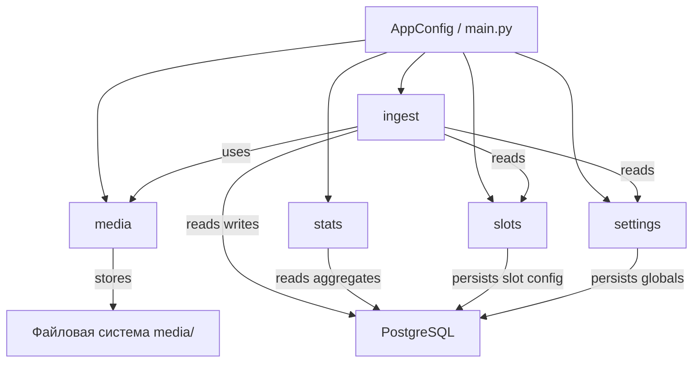
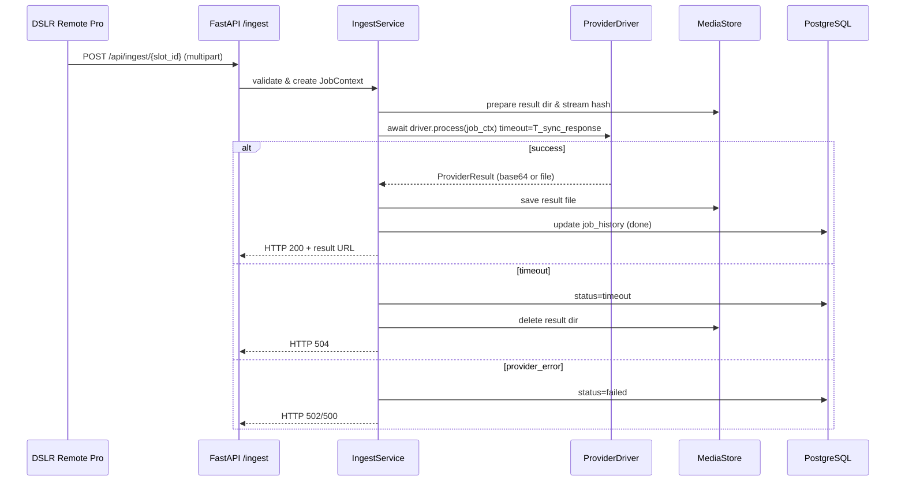
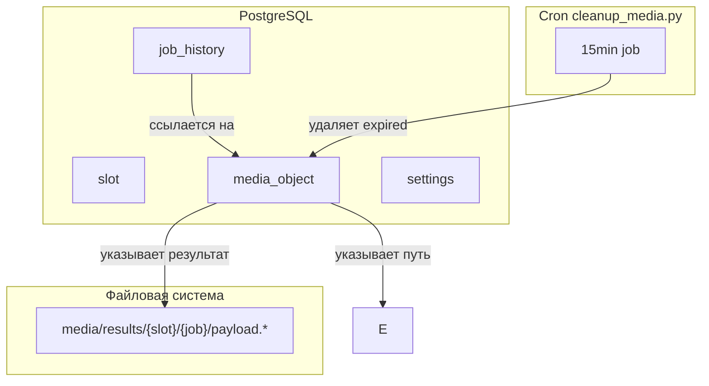
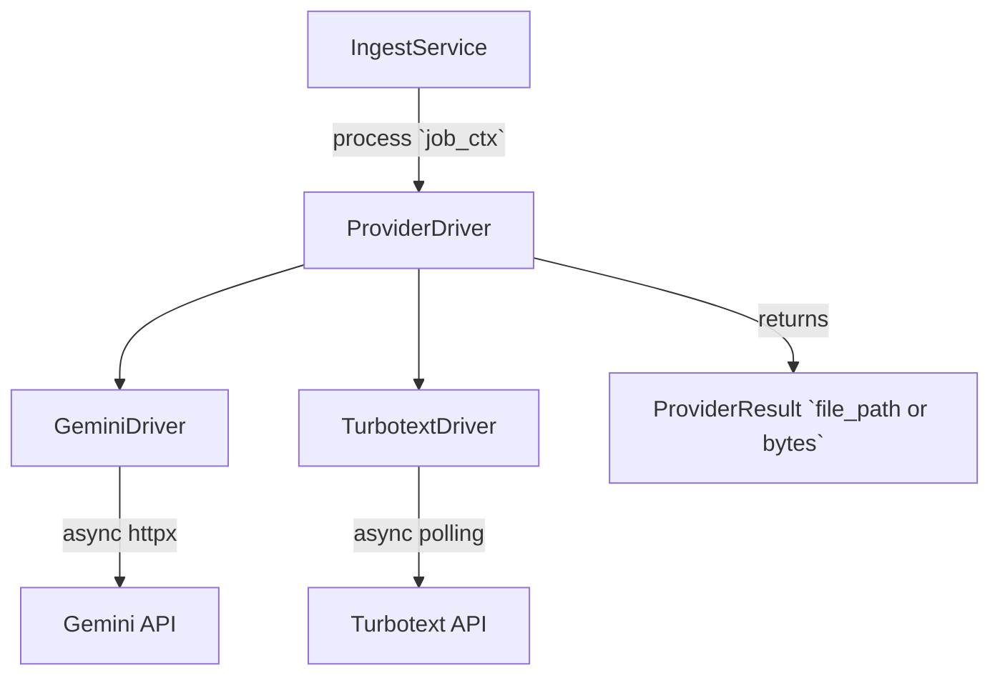
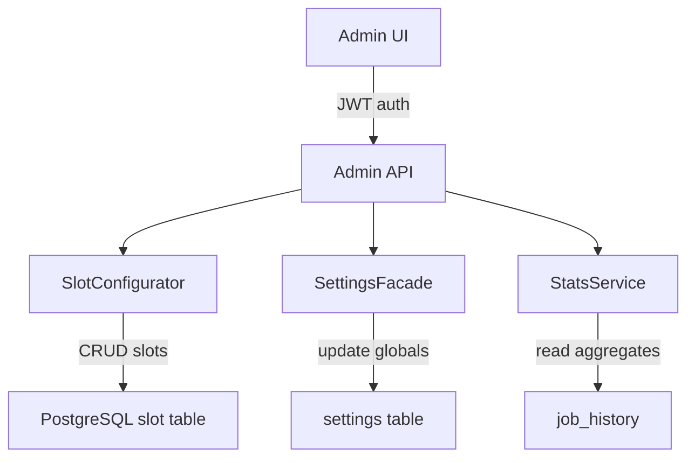

# PhotoChanger KISS Architecture (Revised)

## 0. Общие архитектурные принципы
- **Минимум компонентов.** Один процесс FastAPI, один PostgreSQL-инстанс, локальное файловое хранилище. В проекте нет очередей, отдельных воркеров и контейнеров зависимостей.
- **Вертикальные модули.** Код разбит по срезам `ingest`, `media`, `slots`, `settings`, `stats`. Каждый модуль содержит HTTP-роуты, сервисы, инфраструктурный слой и тесты, что упрощает локальное понимание поведения.
- **Явное связывание зависимостей.** В `app/main.py` формируется `AppConfig`, создаются экземпляры сервисов модулей, и они напрямую прокидываются в роуты через `Depends`. Для тестов используется та же функция построения конфигурации с передачей фейковых адаптеров.
- **Простые контракты.** Публичные фасады имеют подробные docstring с описанием входов/выходов, README модулей фиксируют границы ответственности, чтобы LLM-помощникам было проще ориентироваться.

## 1. Диаграммы проекта 

### Общая структура системы 

```mermaid
graph TD
    A["DSLR Remote Pro"] -->|POST /api/ingest/&#123;slot_id&#125;| B["FastAPI App"]
    B --> C["IngestService"]
    C --> D["ProviderDriver • Gemini, Turbotext"]
    C --> E["UploadBuffer (memory)"]
    C --> F["ResultStore"]
    C --> G["PostgreSQL • job_history, slot, media_object, settings"]
    F --> H["Public API • /public/results/&#123;job_id&#125;"]
    B --> I["Admin UI / API • slots, settings, stats"]
```


### Модульная структура



### Поток обработки ingest-запроса



### Хранилища и очистка



### Провайдеры и адаптеры



### Взаимодействие с админ-панелью




## 2. Модульная структура

### 2.1 ingest
- **Endpoints.** `POST /api/ingest/{slot_id}` принимает multipart-запросы с файлом, `GET /api/jobs/{job_id}` возвращает текущее состояние обработки.
- **Сервис `IngestService`.**
    - Валидирует запрос (размер по лимиту слота и глобальному капу, MIME из заголовка части, пароль слота), пересчитывает checksum изображения и сверяет её с полем `hash`. Поток читается порционно, контрольный размер и хэш фиксируются в `JobContext`.
    - Инициализирует каталог результата `media/results/{slot_id}/{job_id}/`, создаёт `job_history(status='pending')` и запись `media_object`, сохраняет `sync_deadline = started_at + T_sync_response`.
    - Определяет провайдера по настройкам слота и вызывает его драйвер внутри `asyncio.wait_for` с таймаутом `T_sync_response`. Если драйвер не укладывается, выбрасывается `asyncio.TimeoutError`, и сервис фиксирует таймаут в `job_history`.
    - Обрабатывает результат провайдера: сохраняет финальный файл и превью в `ResultStore`, записывает метаданные, формирует итоговый HTTP-ответ 200 с публичной ссылкой.
    - При таймауте или ошибке: обновляет статус в `job_history`, удаляет каталог результата целиком, возвращает 504 либо 5xx.
- **Инфраструктура.** Драйверы провайдеров (`GeminiDriver`, `TurbotextDriver`) реализуют интерфейс `ProviderDriver.process(job_ctx)` и отвечают за все сетевые вызовы. Таймауты контролируются на уровне `httpx.AsyncClient`, а `IngestService` дополнительно ограничивает длительность вызова через `asyncio.wait_for`.
- **Состояние задач.** Все факты обработки (`job_history`) фиксируются в PostgreSQL. Незавершённые запросы не восстанавливаются после рестарта, что отражено в SLO.

### 2.2 media
- **Хранилища.** `ResultStore` работает поверх локальной файловой системы и организует для каждого `job_id` каталог `media/results/{slot_id}/{job_id}/` с файлами `payload.{ext}` и `preview.webp`. Потоковое буферизование реализуется через in-memory upload buffer (spooled файлы), но на диске остаются только результаты.
- **Жизненный цикл файлов.** Для каждого файла в таблицу `media_object` заносится `expires_at`. Сервисы проверяют TTL при чтении и удаляют просроченные файлы «лениво»: если `expires_at` в прошлом, файл удаляется сразу после обращения, запись помечается очищенной.
  `sync_deadline` вычисляется при создании `JobContext` как `started_at + T_sync_response` и не пересчитывается далее; `result_expires_at = started_at + T_result_retention (72 ч)`.
- **Фоновая очистка.** Вместо встроенного планировщика используется внешний cron-скрипт (`scripts/cleanup_media.py`). Он запускается системно раз в 15 минут, читает просроченные записи из БД и удаляет соответствующие файлы. FastAPI-процесс не содержит бесконечных циклов очистки.

### 2.3 slots
- **Данные.** Таблица `slot` хранит 15 статических конфигураций: идентификаторы провайдеров, шаблоны, лимиты размера.
- **Сервис `SlotConfigurator`.** Отвечает за CRUD настроек, проверяет уникальность идентификаторов, сопоставляет слоты с драйверами провайдеров. Предоставляет вспомогательные методы для генерации ingest-URL.

### 2.4 settings
- **Сервис `SettingsFacade`.** Управляет глобальными параметрами (`T_sync_response`, TTL результатов, пароли ingest, список админов).
- **Хранение секретов.** Чувствительные значения (пароли, токены провайдеров) хранятся вне БД в `.env`/переменных окружения. В таблице `settings` остаются только публичные параметры и ссылки на ключи. UI позволяет обновлять несекретные поля, а обновление секретов выполняется операционными процедурами.

### 2.5 stats
- **Отчёты.** `StatsService` читает агрегаты из `job_history` и `slot`: количество успешных/ошибочных запусков, последние результаты, распределение по провайдерам.
- **API.** REST-эндпоинты для UI возвращают агрегаты без дополнительного кэширования, упор на простоту.

## 3. Поток обработки ingest-запроса
1. Клиент DSLR Remote Pro отправляет `POST /api/ingest/{slot_id}` с файлом и токеном.
2. `IngestController` получает `IngestService` через `Depends`, создаёт `JobContext`, фиксирует каталоги результата и дедлайн `sync_deadline = now + T_sync_response`.
3. Сервис выбирает нужный `ProviderDriver` и вызывает его через `await asyncio.wait_for(driver.process(job_ctx), timeout=T_sync_response)`.
4. **Успешный сценарий:**
   - Драйвер возвращает `ProviderResult` до истечения таймаута.
   - Сервис сохраняет результат в `ResultStore`, обновляет `job_history` (`status='done'`, `result_path`, `result_expires_at = now + 72h`).
   - Возвращается 200 с ссылкой вида `/public/results/{job_id}`.
5. **Таймаут:**
   - `asyncio.TimeoutError` фиксируется как `status='timeout'` и `failure_reason='provider_timeout'`.
   - Временные файлы удаляются, клиент получает 504. Поздний ответ провайдера игнорируется, потому что корутина отменена `wait_for`.
6. **Ошибка провайдера:**
   - Драйвер пробрасывает исключение, сервис пишет `status='failed'`, сохраняет стек-трейс в лог, возвращает 502/500.
7. Клиент может опросить `GET /api/jobs/{job_id}` для получения статуса в течение заданного TTL.

## 4. Данные и хранение
- **PostgreSQL:**
  - `slot` — конфигурации слотов.
  - `job_history` — история всех запусков, статусы, тайминги, ссылки на файлы, TTL.
  - `media_object` — учёт файлов (тип, путь, `expires_at`, признак очистки).
  - `settings` — глобальные параметры (без секретов) с версиями.
- **Файловая система:**
- `media/results/{slot_id}/{job_id}/payload.{ext}` — готовые результаты, срок жизни = 72 часа.
- `media/results/{slot_id}/{job_id}/preview.webp` — превью для UI, синхронизировано по TTL с результатом.
- **Очистка:**
  - Сервисы проверяют TTL при каждом доступе и удаляют просроченные файлы на лету.
  - Системный cron (`scripts/cleanup_media.py`) выполняет бэч-очистку просроченных файлов и обновляет флаги `media_object.cleaned_at`.

## 5. Провайдеры
- **Интерфейс `ProviderDriver`.** Метод `process(job_ctx)` принимает информацию о слоте, временном файле и целевых ограничениях, возвращает `ProviderResult` с путём к локальному файлу или байтовым содержимым.
- **Реализации:**
  - `GeminiDriver` — асинхронный HTTP-клиент с трансформацией форматов. Управляет собственными таймаутами, повторов нет.
  - `TurbotextDriver` — асинхронный клиент с polling внутри одной корутины (ограничен `asyncio.wait_for`).
- **Конфигурация.** Список доступных драйверов фиксируется в `AppConfig`. Для тестов можно подменить словарь `provider_drivers` на заглушки.

## 6. Административный UI и API
- **UI.** HTMX/Vanilla страницы  в `frontend/`, обращаются к REST-API модулей. UI не организует сложных параллельных операций.
- **API.** Админ-маршруты используют тот же механизм `Depends` и сервисы модулей. Авторизация базируется на stateless токенах из `.env`.

## 7. Наблюдаемость и операционные аспекты
- **Логи.** `structlog` фиксирует события ingest, исключения провайдеров, время обработки, таймауты и факты очистки.
- **Метрики.** Prometheus-эндпоинт публикует p95 времени обработки, долю 504, размер `media/results`.
- **Health-check.** `GET /healthz` проверяет подключение к БД, наличие путей файловой системы и доступность провайдерских конечных точек через лёгкие ping-запросы.

## 8. Структура исходников
Исходники организованы вертикальными модулями вокруг доменов, что соответствует KISS-подходу и упрощает тестирование.

```
src/
  app/
    main.py                # точка входа FastAPI
    config.py              # AppConfig, пути media, лимиты ingest
    dependencies.py        # включение роутеров, прокидывание AppConfig
    ingest/
      ingest_api.py        # POST /api/ingest/{slot_id}
      ingest_service.py    # IngestService и оркестрация
      validation.py        # проверка размера/MIME и checksum
      ingest_models.py     # JobContext, UploadValidationResult
      ingest_schemas.py    # Pydantic-схемы ошибок/ответов
    media/
      media_service.py     # ResultStore и управление каталогами media/results
      media_cleanup.py     # функции для cron очистки
      media_models.py      # MediaObject и TTL
    slots/
      slots_api.py         # CRUD для статических слотов
      slots_service.py
      slots_repository.py
      slots_models.py
    settings/
      settings_api.py
      settings_service.py
      settings_repository.py
    stats/
      stats_api.py
      stats_service.py
    providers/
      providers_base.py
      providers_factory.py
      providers_gemini.py
      providers_turbotext.py
    repositories/
      repositories_slot.py
      repositories_job_history.py
      repositories_media_object.py
      repositories_stats.py
    db/
      models.py
      session.py
scripts/
  cleanup_media.py         # cron-скрипт удаления просроченных результатов
```

Blueprint `spec/docs/blueprints/ingest-validation.md` синхронизирован с `ingest/validation.py` и задаёт контракты для проверки media payload.

## 9. Тестовая стратегия
- **Unit-тесты.** Для сервисов модулей (ingest/media/slots/settings/stats) с использованием фейковых драйверов и временных каталогов.
- **Интеграционные тесты.** FastAPI-приложение с in-memory PostgreSQL (через `pytest-postgresql`) и временными директориями. Проверяются успешный ingest, таймауты и ошибки провайдеров.
- **Контрактные тесты провайдеров.** Мок-серверы Gemini/Turbotext, проверка поведения `ProviderDriver` при разных ответах и таймаутах.
- **Скрипт очистки.** Отдельный тест покрывает `scripts/cleanup_media.py`, проверяя удаление просроченных записей и устойчивость к отсутствующим файлам.
