# PhotoChanger Platform — Iteration 2 Delivery Brief

## 0. Системный контекст и границы

### 0.1 Назначение и позиция системы
PhotoChanger — это HTTP-платформа синхронной AI-обработки фотографий, развёрнутая как самостоятельный сервер, взаимодействующий с DSLR Remote Pro и внешними AI-провайдерами.  
Система реализует ingest-интерфейс, хранение медиа, адаптацию вызовов провайдеров и публикацию результатов через временные публичные ссылки (TTL 72 ч).

> Фокус продукта — обработка фотографий людей. Любые преобразования должны сохранять лица и основные характеристики персонажей; изменяются только фон, стиль или окружение. Для провайдера Gemini используется один универсальный метод (`prompt + ingest фото + опциональные референсы`), что отражено в слотовой схеме настроек.

### 0.2 Состав внутри системной границы
- **Ingest API** — принимает `POST` от DSLR Remote Pro, валидирует вход и инициирует обработку.
- **Адаптеры провайдеров** — драйверы Gemini, Turbotext и др., вызываемые через `asyncio.wait_for`.
- **Media-хранилище** — каталог `media/results` с TTL-очисткой и cron-скриптом; входные файлы буферизуются в памяти (spooled upload).
- **Admin API/UI** — управление слотами, шаблонными медиа, параметрами и статистикой.
- **Auth-сервис** — выдача JWT для статических админов (`serg`, `igor`).
- **Public API** — выдача результатов и галерей по временным ссылкам.

### 0.3 Внешние акторы
| Актор | Роль / взаимодействие |
|-------|------------------------|
| **DSLR Remote Pro** | Отправляет `POST /api/ingest/{slot_id}` с фото и паролем. |
| **Администратор** | Настраивает слоты, пароли, шаблонные медиа, наблюдает статистику. |
| **AI-провайдеры** | Внешние API (Gemini, Turbotext), выполняющие обработку. |
| **Мониторинг / логирование** | Получает метрики и алерты из `/metrics` и syslog. |
| **Пользователи публичных ссылок** | Загружают результаты по `GET /public/results/{job_id}` (TTL 72 ч). |

### 0.4 Границы и интеграции
**Внутри границ:** всё, что обеспечивает ingest, хранение, адаптацию провайдеров, выдачу и очистку результатов.  
**Вне границ:** DSLR Remote Pro, сторонние AI-провайдеры, инфраструктура TLS и внешнее файловое хранилище (если подключено).  

**Интеграции и зависимости:**
- Локальная или облачная файловая система для `MEDIA_ROOT`.
- Интернет-доступ для AI-вызовов и публикации публичных ссылок.
- TLS-сертификаты для HTTPS (Ingest, Public API).
- Cron-окружение для `scripts/cleanup_media.py`.

### 0.5 Контекстная диаграмма

```mermaid
graph TD
    DSLR["DSLR Remote Pro"] -->|POST /api/ingest/&#123;slot_id&#125;| API["PhotoChanger • FastAPI"]
    Admin["Admin UI / API"] -->|JWT login / CRUD slots| API
    API -->|process| Provider["AI Provider • Gemini, Turbotext"]
    API -->|read/write| Media["MEDIA_ROOT • temp/results"]
    API -->|GET /public/results/&#123;job_id&#125;| Public["Public clients"]
    API -->|/metrics, syslog| Monitor["Monitoring / Logging"]


```


## 1. Обзор продукта
- **Назначение.** PhotoChanger обрабатывает фотографии, поступающие из DSLR Remote Pro, через выбранных AI-провайдеров (Gemini, Turbotext) и гарантирует ответ в пределах окна ожидания 10–60 секунд.
- **Ценность.** Администраторы студии получают управляемые слоты и прозрачную статистику, а операторы — быстрый результат без ручного контакта с техподдержкой.
- **KPI итерации.**
  - ≥ 95 % ingest-запросов завершаются HTTP 200 в пределах `T_sync_response`.
  - ≤ 5 % запросов завершается 504 (таймаут провайдера).
  - Итоговые файлы доступны 72 часа, после чего автоматически удаляются.

## 2. Стейкхолдеры и роли
| Роль | Ответственность | Основные интерфейсы |
|------|-----------------|---------------------|
| **Администраторы** (предсозданные аккаунты `serg`, `igor`) | Настройка 15 слотов, управление глобальными параметрами, мониторинг статистики, ручная очистка медиа | Админ UI, REST API `/api/admin/*`, cron-скрипты |
| **Операторы DSLR Remote Pro** | Отправка фотографий на обработку, скачивание результатов | Публичные ingest-ссылки, страница слота с галереей |
| **AI-провайдеры** (Gemini, Turbotext) | Предоставление сервиса обработки | Внешние HTTP API через драйверы |
| **Ops-команда** | Деплой, управление секретами, мониторинг, реагирование на инциденты | CI/CD, `.env`, Prometheus, cron |

## 3. Цели и границы итерации
### В зоне ответственности
- Поддержка 15 статических слотов с настройкой провайдера, шаблонов, лимитов размера и ingest-пароля.
- Синхронная обработка ingest-запросов без очередей и фоновых воркеров.
- Управление временным и постоянным хранением медиа с TTL и ручной очисткой.
- Статистика по слотам и глобально (активные задачи, доля ошибок, последние результаты).
- Health-check, базовая наблюдаемость (логи, метрики, алерты).
- Документация контрактов (`spec/contracts/*`) и UI/SDD сценариев (`spec/docs/*`).

### Вне итерации (не реализовывать)
- Подключение новых провайдеров сверх Gemini/Turbotext.
- Расширенная RBAC, self-service админов, SSO.
- Очереди задач, фоновые воркеры, распределённое хранилище.
- Долгосрочное архивирование результатов > 72 часов.
- Критические ошибки (500/504 > 10 % за 15 минут) приводят к алерту ops-команды.


## 4. Ключевые требования
### Функциональные
1. Ingest-endpoint `POST /api/ingest/{slot_id}` принимает multipart-файл + метаданные, проверяет пароль слота и возвращает результат или таймаут.
2. `GET /api/jobs/{job_id}` позволяет оператору отслеживать статус в течение TTL.
3. Админ UI обеспечивает CRUD настроек слотов, обновление глобальных параметров (`T_sync_response`, TTL, пароли ingest), просмотр статистики и галереи результатов.
4. Галерея слота отображает последние N (по умолчанию 10) результатов с превью и ссылкой на скачивание.
5. Публичные ссылки `/public/results/{job_id}` действуют 72 часа и возвращают `410 Gone` после истечения срока.
6. Cron-скрипт `scripts/cleanup_media.py` удаляет просроченные файлы и помечает записи в БД.

### Нефункциональные
- Среднее время ответа успешного ingest ≤ 5 секунд при размере файла до 20 МБ.
- Таймаут провайдера ограничен `T_sync_response`; при превышении фиксируется статус `timeout` без повторов.
- Логи и метрики доступны в течение 30 дней.
- Ограничения нагрузки:
  - Конкурентность per-slot ≤ N и per-provider ≤ M задаются в глобальных настройках (`settings`). Слоты содержат только семантическую конфигурацию провайдера.
- Идемпотентность:
  - Поддержка Idempotency-Key; дубликаты по хэшу файла возвращают ранее выданный job_id.

## 5. Пользовательские сценарии
### Администратор
1. Авторизуется (JWT, статические аккаунты из `secrets/runtime_credentials.json`).
2. Просматривает список слотов (ID, провайдер, статус, шаблон, лимит размера).
3. Редактирует слот: меняет провайдера, параметры, ingest-пароль, шаблоны.
4. Получает ingest-URL и передаёт операторам.
5. Загружает тестовое фото из UI слота для быстрой проверки конфигурации (фото проходит тот же конвейер, что и ingest, но без DSLR Remote Pro).
6. Открывает страницу статистики: фильтр по слотам, метрики успехов/ошибок, последние результаты.
7. Запускает ручную очистку медиа при необходимости.

### Оператор DSLR Remote Pro
1. Копирует ingest-URL.
2. Отправляет изображение через `POST /api/ingest/{slot_id}` с паролем.
3. Получает ответ: 200 (результат + публичная ссылка) или 504/5xx с объяснением.
4. Скачивает результат или повторяет запрос при необходимости.
5. Открывает публичную страницу слота для просмотра истории результатов.

### Ops-команда
1. Настраивает `.env` (секреты провайдеров, JWT-подпись, настройки БД).
2. Деплоит приложение (Docker/VM) и запускает cron каждые 15 минут.
3. Настраивает мониторинг Prometheus и алерты.
4. Ротирует секреты провайдеров по регламенту.

## 6. Архитектура и компоненты
### Высокоуровневый контур
```
DSLR Remote Pro -> FastAPI (ingest) -> Provider drivers (Gemini/Turbotext)
                                   -> PostgreSQL (slots, job_history, media_object)
                                   -> File system (media/results)
                                   -> Admin UI / Public gallery
```
### Общая структура системы 

```mermaid 
graph TD
    A["DSLR Remote Pro"] -->|POST /api/ingest/&#123;slot_id&#125;| B["FastAPI App"]
    B --> C["IngestService"]
    C --> D["ProviderDriver • Gemini, Turbotext"]
    C --> E["UploadBuffer (memory)"]
    C --> F["ResultStore"]
    C --> G["PostgreSQL • job_history, slot, media_object, settings"]
    F --> H["Public API • /public/results/&#123;job_id&#125;"]
    B --> I["Admin UI / API • slots, settings, stats"]
```


### Приложение FastAPI
- Один процесс, uvicorn workers = 1–2 (горизонтальное масштабирование не требуется на этой итерации).
- Конфигурация через `AppConfig` в `app/main.py`, зависимости передаются через `Depends` без контейнера внедрения.
- Вертикальные модули: `ingest`, `media`, `slots`, `settings`, `stats` (каждый со своими сервисами, схемами, тестами, README).
- `IngestService` валидирует запросы, потоково считывает файл через in-memory upload buffer, захватывает семафоры, вызывает драйвер провайдера внутри `asyncio.wait_for(..., timeout=T_sync_response)` и сохраняет результат в `ResultStore`. Незавершённые задачи не восстанавливаются после рестарта — статус фиксируется в `job_history`.
- `MediaService` и связанные фасады проверяют TTL на чтении и удаляют просроченные файлы лениво, чтобы придерживаться KISS-подхода без фоновых воркеров.
- `StatsService` агрегирует метрики по слотам и по системе из таблиц `job_history` и `slot`, отдаёт REST-ответы без дополнительного кэширования.

### Поток обработки ingest-запроса
1. Оператор отправляет `POST /api/ingest/{slot_id}` с multipart-файлом, паролем и метаданными.
2. Контроллер создаёт `JobContext`, валидирует размер/MIME, пересчитывает checksum изображения и сверяет её с полем `hash`, фиксирует каталог результата `media/results/{slot_id}/{job_id}` и дедлайн `sync_deadline = started_at + T_sync_response`.
3. Сервис подбирает `ProviderDriver` по настройкам слота и вызывает `driver.process(job_ctx)` в `asyncio.wait_for` с таймаутом `T_sync_response`.
4. При успешном ответе драйвера файл переносится в `ResultStore`, запись `job_history` обновляется статусом `done`, `result_expires_at = now + 72h`, формируется ссылка `/public/results/{job_id}`.
5. Если `asyncio.TimeoutError` или исключение провайдера, сервис фиксирует `status='timeout'/'failed'`, удаляет каталог результата (payload + preview) и возвращает 504 или 5xx.
6. Клиент может опрашивать `GET /api/jobs/{job_id}` до истечения TTL; поздние ответы провайдера игнорируются, потому что корутина отменяется `wait_for`.

### Тестовая обработка из Admin UI
- Эндпоинт `POST /api/slots/{slot_id}/test-run` (только для авторизованных администраторов) принимает файл `test_image` (`UploadFile`).
- Контроллер переиспользует `IngestService`:
  1. вызывает `prepare_job(slot_id)` (job_history фиксирует задачу как обычную, `job.metadata["source"]="ui_test"`),
  2. прогоняет `validate_upload` без проверки ingest-пароля,
  3. формирует `JobContext` и передаёт его в `process`.
- Результат возвращается в том же формате, что и ingest: бинарный ответ + публичная ссылка `/public/results/{job_id}`. В логах и статистике добавляется метка `source=ui_test`, чтобы отделять тестовые прогонки от боевых (при необходимости — через отдельное поле в `job_history`).
- UI слота показывает кнопку «Протестировать конфигурацию», загружает фото через этот эндпоинт и отображает превью ответа, не затрагивая DSLR Remote Pro.

### Хранилища
- **PostgreSQL** (миграции в `alembic/`):
  - `slot(id, provider_id, display_name, provider, operation, settings_json, is_active, version, updated_at, updated_by, size_limit_mb*)`.
    - `settings_json` — JSON-конфигурация слота. Каждый драйвер имеет собственную JSON Schema (раздел 5.2), поэтому добавление параметров (`gemini.prompt`, `turbotext.mask_id`, и т.п.) не требует миграций БД и не раздувает таблицу десятками nullable-колонок.
    - `size_limit_mb*` — временное поле для обратной совместимости с ранними версиями ingest-валидации; целевое состояние — перенести лимиты и конкурентность в глобальные `settings`.
  - `slot_template_media(id, slot_id, media_kind, media_object_id)` — привязка шаблонных медиа к слотам с указанием роли (`style`, `base`, `overlay` и т.п.).
  - `job_history(job_id, slot_id, status, provider_id, started_at, finished_at, duration_ms, failure_reason, result_path, result_expires_at)`.
  - `media_object(id, job_id, slot_id, type, path, expires_at, cleaned_at)`.
  - `settings(key, value, version, updated_at, updated_by)`.
- **Файловая система**:
  - `media/results/{slot_id}/{job_id}/payload.{ext}` (TTL = 72 часа).
  - `media/results/{slot_id}/{job_id}/preview.webp` (TTL совпадает с результатом).
- TTL контролируется в сервисах: при обращении к записи с `expires_at < now` файл удаляется и помечается очищенным в БД; планировщик не используется.

### Провайдеры

- Общий интерфейс `ProviderDriver.process(job_ctx) -> ProviderResult`; реализации отвечают за сетевые вызовы и конвертацию форматов.
- Таймауты HTTP-клиентов задаются в драйверах, `IngestService` дополнительно ограничивает длительность вызова через `asyncio.wait_for`.
- Настройка доступных драйверов и ключей провайдеров через `AppConfig` и `.env`.
 
 #### Gemini провайдер
- **`gemini`** — универсальный метод `prompt + ingest фото + опциональные референсы`.
- `GeminiDriver` — асинхронный HTTP-клиент на `httpx.AsyncClient`, соблюдает ограничения сервиса по форматам/размерам, добавляет ingest-фото и шаблонные медиа в `inline_data` и возвращает байтовые данные результата.
- Документация по провайдеру в `spec/docs/providers/gemini.md`

#### Turbotext провайдер
- **`turbotext`** — предоставляет собственные сценарии (`style_transfer`, `image_edit`, `identity_transfer`), т.к. контракт провайдера жёстко задаёт режимы.
- `TurbotextDriver` — асинхронный клиент с polling внутри одной корутины, ограниченный `asyncio.wait_for` на уровне сервиса; повторных попыток нет.
- Для передачи изображений провайдеру PhotoChanger выдаёт временные ссылки вида `/public/provider-media/{media_id}` (ingest и шаблонные файлы). Ссылки действуют до истечения `T_sync_response`, далее cron удаляет файлы и эндпоинт возвращает `410 Gone`.
- Документация по провайдеру в `spec/docs/providers/turbotext.md`


## 7. API
### Ingest API
####  Ingest DSLR Remote Pro
Этот эндпоинт предназначен для приёма `POST` запросов от программы DSLR Remote Pro. Будет сгенерировано 15 статических коротких ingest-ссылок, которые можно привязывать к слотам.

##### POST /ingest/{slotId}
- **Метод и путь:** `POST /ingest/{slotId}`.
- **Назначение:** принять фотографию и метаданные от DSLR Remote Pro для дальнейшей обработки в соответствии с конфигурацией слота.
- **Авторизация:** глобальный пароль, передаваемый в теле (поле `password`). Сравнивается с хешем, сохранённым в записи `app_settings` `"ingest.dslr_password"`. Одно и то же значение используется для всех ingest-слотов.
- **slotId:** статический идентификатор ingest-слота (предзаданные значения `slot-001` … `slot-015`). 

###### Тело запроса
- **Тип:** `multipart/form-data`.
- **Обязательные поля:**
  - `password` — строка.
  - `hash` — строка (hex). Хэш содержимого изображения, используемый для валидации неизменности payload.
  - `fileToUpload` — бинарный файл изображения. Поддерживаемые форматы: JPEG, PNG, WEBP. Лимит размера конфигурируемый (значение по умолчанию ≤ 15 МБ, чтобы соответствовать ограничениям провайдера).
- **Опциональные текстовые поля:** `time`, `user_id`, `id`, `profile`, `status`, `name`, `model`, `version` и другие возможные поля DSLR Remote Pro. 
- **Неизвестные поля:** любые дополнительные ключи допустимы, система не ограничивает их список и не пытается валидировать содержимое, но они не должны подменять обязательный `hash`.

###### Ответы
- **200 OK** — успешная обработка. Тело содержит бинарное изображение; фактический `Content-Type` обязан принадлежать перечню, зафиксированному в пункте&nbsp;5 «[Возврат бинарного тела в ingest](#ingest-binary-return)», и перечисляется в контракте и во всех проверках. Заголовки ответа: `Content-Type` (конкретное значение из списка поддерживаемых MIME), `Content-Length`, `Cache-Control: no-store`. Ответ возвращается синхронно, время ожидания ≤ 48–50 с. При превышении лимита ожидания клиент получит 504.
- **Ошибки:**
  - `400 Bad Request` — отсутствует обязательное поле (`password` или `fileToUpload`), передан неподдерживаемый тип данных в поле формы или нарушен формат `multipart/form-data`.
  - `401 Unauthorized` — пароль не совпал с глобальным ingest-паролем.
  - `413 Payload Too Large` — размер файла превысил установленный лимит.
  - `415 Unsupported Media Type` — MIME-тип файла вне списка поддерживаемых.
  - `429 Too Many Requests` — очередь задач для данного слота достигла лимита параллельных обработок.
  - `500 Internal Server Error` — внутренняя ошибка платформы.
  - `503 Service Unavailable` — адаптер провайдера недоступен или вернул временную ошибку.
  - `504 Gateway Timeout` — обработка не завершена в пределах синхронного окна ожидания (`failure_reason = 'timeout'`, воркер и очередь получают сигнал отмены).


###### Ограничения и валидация
- Лимит размера файла конфигурируется (по умолчанию ≤ 15 МБ, согласовано с минимальным лимитом провайдеров). Превышение приводит к 413.
- Поддерживаемые MIME: `image/jpeg`, `image/png`, `image/webp`. Остальные значения вызывают 415.
  Для всех слотов UI и сервер отклоняют любые другие форматы до обращения к провайдеру.


###### Пример сырых полей от DSLR Remote Pro (для справки)
В пользовательском запросе должна быть передана исходная фотография, глобальный пароль и, опционально, некоторые другие поля. Пример пользовательского POST запроса для DSLR программы:

```json
{
  "timestamp": "2025-09-18T17:45:12.439171+00:00",
  "client": {
    "host": "127.0.0.1",
    "port": 1417
  },
  "method": "POST",
  "url": "http://localhost:8000/echo?session=42",
  "path": "/echo",
  "query_params": {
    "session": "42"
  },
  "headers": {
    "host": "localhost:8000",
    "content-type": "multipart/form-data; boundary=------------090306000104030805010400",
    "content-length": "53205",
    "expect": "100-continue"
  },
  "cookies": {},
  "content_type": "multipart/form-data; boundary=------------090306000104030805010400",
  "is_multipart": true,
  "form_text_fields": {
    "time": "1758217512",
    "user_id": "Acer",
    "id": "CY04N068111304S2L_00000001.",
    "profile": "C:\\Users\\Acer\\Documents\\PhotoboothImages\\setup_Serg.xml",
    "status": "C:\\Users\\Acer\\Documents\\PhotoboothImages\\screenSerg\\preview.jpg",
    "hash": "7b6c683e1d3fd29c8701791c54e3c12a236f5a5b",
    "name": "DESKTOP-K968T3F",
    "model": "Windows",
    "version": "3.30.2",
    "password": "123456"
  },
  "form_files": [
    {
      "field": "fileToUpload",
      "original_filename": "IMG_0003.JPG",
      "saved_as": "\\tmp\\fastapi_echo\\uploads\\20250918T174512Z_e6bf1d6c98c843d6aa4948d07f251c17.JPG",
      "content_type": "image/jpeg",
      "size_bytes": 51977,
      "is_image_jpeg": true
    }
  ]
}
```
Ответ при успехе: бинарный `image/jpeg`|`image/png`|`image/webp` (синхронно, short-poll ≤ `T_sync_response`; см. пункт&nbsp;5).
В ответе на этот запрос наш сервер должен отправить фотографию, обработанную AI моделью.

###### Пункт 5. Возврат бинарного тела в ingest {#ingest-binary-return}
- **Назначение требования:** обеспечить однозначный контракт на синхронный возврат результата AI-обработки.
- **Список MIME-типов:** `image/jpeg`, `image/png`, `image/webp`.


### Внутренний API-слой и контракты
#### Основные публичные эндпоинты
| Method & Path | Назначение | Ключевые статусы |
|---------------|------------|------------------|
| `POST /api/ingest/{slot_id}` | Приём файла, запуск обработки | 200 (успех), 400 (валидация), 401 (неверный пароль), 404 (слот не найден), 504 (таймаут провайдера), 5xx (ошибка провайдера) |
| `GET /api/jobs/{job_id}` | Проверка статуса обработки | 200 (объект статуса), 404 (job не найден/истёк TTL) |
| `GET /public/slots/{slot_id}` | Публичная галерея результатов | 200, 404 |
| `GET /public/results/{job_id}` | Скачивание результата | 200 (файл, `Content-Disposition: attachment`), 404 (`{"status":"error","failure_reason":"result_not_found"}`), 410 (`{"status":"error","failure_reason":"result_expired"}`) |


#### Админ-API
- `POST /api/login` — получение JWT.
- `GET /api/slots` — список слотов (id, имя, провайдер, активность, версия, `updated_at`).
- `GET /api/slots/{slot_id}` — полная конфигурация слота (лимиты, `sync_response_seconds`, provider settings, `template_media`, `recent_results`).
- `PUT /api/slots/{slot_id}` — обновление конфигурации (см. пример ниже).
- `POST /api/slots/{slot_id}/cleanup` — ручная очистка устаревших медиа для выбранного слота.
- `GET /api/settings` — глобальные параметры (`sync_response_seconds`, `result_ttl_hours`, статус API-ключей, дата ротации пароля).
- `PUT /api/settings` — обновление глобальных параметров (новый ingest-пароль, таймаут, TTL, provider API-ключи).
- `GET /api/stats/overview` — статистика (глобальные агрегаты + состояние слотов).

Пример запроса `PUT /api/slots/slot-001`:
```json
{
  "display_name": "Slot 1 (Gemini)",
  "provider": "gemini",
  "operation": "image_edit",
  "is_active": true,
  "size_limit_mb": 20,
  "sync_response_seconds": 48,
  "settings": {
    "prompt": "Studio portrait",
    "safety": "standard"
  },
  "template_media": [
    { "media_kind": "background", "media_object_id": "8b6f0fa6b5b0459fb887c249f2eb5b21" }
  ]
}
```

Ответ `GET /api/settings`:
```json
{
  "sync_response_seconds": 48,
  "result_ttl_hours": 72,
  "ingest_password_rotated_at": "2025-11-05T18:00:00Z",
  "ingest_password_rotated_by": "serg",
  "provider_keys": {
    "gemini": { "configured": true, "updated_at": "2025-11-01T10:00:00Z" },
    "turbotext": { "configured": false, "updated_at": null }
  }
}
```

Полные схемы и примеры ответов зафиксированы в `spec/contracts/openapi.yaml`. Любые изменения контрактов требуют обновления спецификаций и SemVer в `spec/contracts/VERSION.json`.

### API Turbotext
для работы с моделью Турботекст будут использоваться следующие методы:
- Микс-фото
- Замена объекта
- Замена лица

Подробная документация по провайдеру в `spec/contracts/providers/turbotext.md`
Онлайн описание api находится тут https://www.turbotext.ru/photo_ai/docs/info#section-2
Все запросы отправляются на url: https://www.turbotext.ru/api_ai

#### Авторизация
Идентификацию пользователя организуйте посредством Bearer Token,
Пример CURL, данные с Headers запроса:
```http
Authorization: Bearer {APIKEY}
Content-Type: application/x-www-form-urlencoded
```

#### Метод Микс фото
Запрос на создании очереди
```http
/api_ai/mix_images HTTP/1.1
Host: turbotext.ru
Authorization: Bearer {APIKEY}
Content-Type: application/x-www-form-urlencoded
Content-Length: 0
```
do:create_queue
content - описание для усиления эффекта
url_image_target - фото на урл которое нужно обработать
url - фото на урл откуда используем стиль 

Ответ с данными очереди в формате JSON:
`{"success":true,"queueid":{QUEUEID}}`
Здесь `{QUEUEID}` - Номер нашей очереди, далее обращаемся за получением результата использую этот массив данных.
Теперь делаем запрос на получение результата:
```http
/api_ai/mix_images HTTP/1.1
Host: turbotext.ru
Authorization: Bearer {APIKEY}
Content-Type: application/x-www-form-urlencoded
Content-Length: 0
do:get_result
queueid:{QUEUEID} 
```

### API Gemini 

> Статус: Составлено по официальной документации Gemini API (октябрь 2024+). Охватывает генерацию изображений, редактирование по текстовому промпту, multi‑image fusion/композицию и работу с Files API. Адаптировано под PhotoChanger.

 

#### Поддерживаемые модели и сценарии

| Модель                   | Основные сценарии                                                                                         | Примечания                                                                              |
| ------------------------ | --------------------------------------------------------------------------------------------------------- | --------------------------------------------------------------------------------------- |
| `gemini-2.5-flash-image` | Текст→изображение, редактирование «edit‑with‑prompt», **multi‑image fusion** (композиция и перенос стиля) | Базовая модель для генерации изображений в публичном Gemini API. Возвращает PNG inline. |

> Названия вариантов могут обновляться. Сверяй актуальные имена моделей в официальной документации.

 

#### Базовый метод вызова

**REST (text→image):**

```http
POST https://generativelanguage.googleapis.com/v1beta/models/gemini-2.5-flash-image:generateContent
x-goog-api-key: <GEMINI_API_KEY>
Content-Type: application/json

{
  "contents": [
    { "role": "user", "parts": [ { "text": "Create a high-key studio portrait of a violinist" } ] }
  ]
}
```

Ответ содержит массив кандидатов; готовое изображение приходит как base64 PNG в `candidates[0].content.parts[n].inline_data.data`.

**Структура `contents/parts`:**

* `text` — текстовый промпт.
* `inline_data` — `{ mime_type, data=<base64> }` — для небольших изображений.
* `file_data` — `{ mime_type, file_uri="files/…" }` — ссылка на файл из Files API.

> Для **multi‑image** добавляй несколько `inline_data`/`file_data`. Для "edit‑with‑prompt": исходное изображение + текст‑правки.

 

#### Передача изображений

PhotoChanger использует только inline-передачу (`inline_data`). Суммарный размер запроса (файл + метаданные) ограничен **20 MB**. Files API и resumable upload в текущей итерации **не поддерживаются**; задачи, требующие загрузки больших файлов или повторного использования медиа, считаются вне scope.


#### Лимиты и форматы

**Поддерживаемые входные MIME:** `image/png`, `image/jpeg`, `image/webp`.

**Rate limits (примерные из таблиц):** модель `gemini-2.5-flash-image` — до ~**500 RPM**, **500 000 TPM**, **2 000 RPD** (Tier 2). Фактические лимиты зависят от тарифа (Free/Paid) и апгрейда в AI Studio.

**Токенизация/тайлинг (понимание/генерация):** большие изображения автоматически режутся на тайлы до **768×768**. Для rough‑оценки числа тайлов: при обеих сторонах ≤ 384 px — ~258 токенов; выше — деление на тайлы (см. гайды по image understanding). Это влияет на TPM/стоимость.


#### Ошибки и коды

`400 INVALID_ARGUMENT` (неподдерживаемый MIME/лимиты), `403 PERMISSION_DENIED` (ключ/права), `404 NOT_FOUND` (file_uri), `409 FAILED_PRECONDITION` (файл ещё `PROCESSING`), `429 RESOURCE_EXHAUSTED` (квоты), `500/503` (сервисные сбои). Тело содержит `error.code`, `error.status`, `error.message`, возможны `details[]`.

 

#### Аутентификация и квоты

* **API‑ключ**: заголовок `x-goog-api-key` (предпочтительно для сервер‑сайд) или URL‑параметр `key`.
* **OAuth2/Service Accounts**: применимы в Vertex AI; в публичном Gemini API обычно не требуются.
* **Апгрейд квот**: через AI Studio (Upgrade/Request limits).

 

#### Сценарии и примеры

##### Multi‑image fusion (композиция/перенос стиля)

```json
{
  "model": "gemini-2.5-flash-image",
  "contents": [
    {
      "role": "user",
      "parts": [
        {"file_data": {"mime_type": "image/png", "file_uri": "files/hero_pose"}},
        {"file_data": {"mime_type": "image/png", "file_uri": "files/fantasy_background"}},
        {"text": "Compose a cinematic poster where the hero stands in the fantasy scene, matching the lighting."}
      ]
    }
  ]
}
```

##### Python (`google-generativeai`) — multi‑image

```python
import base64, os
import google.generativeai as genai

genai.configure(api_key=os.environ["GEMINI_API_KEY"])
model = genai.GenerativeModel("gemini-2.5-flash-image")

response = model.generate_content([
    {
        "role": "user",
        "parts": [
            {"text": "Combine the landscape and character into a matte painting"},
            {"inline_data": {"mime_type": "image/png", "data": "$BASE64_IMAGE"}},
            {"inline_data": {"mime_type": "image/png", "data": "$BASE64_IMAGE"}}
        ],
    }
])

        {"text": "Reimagine this room in Scandinavian minimalism"},


image_base64 = response.candidates[0].content.parts[0].inline_data["data"]
image_bytes = base64.b64decode(image_base64)
```

##### REST — inline изображение

```bash
BASE64_IMAGE=$(base64 -w 0 source.png)

curl \
  -H "x-goog-api-key: $GEMINI_API_KEY" \
  -H "Content-Type: application/json" \
  -X POST "https://generativelanguage.googleapis.com/v1beta/models/gemini-2.5-flash-image:generateContent" \
  -d @- <<JSON
{
  "contents": [
    {
      "role": "user",
      "parts": [
        {"text": "Reimagine this room in Scandinavian minimalism"},
        {"inline_data": {"mime_type": "image/png", "data": "$BASE64_IMAGE"}}
      ]
    }
  ]
}
JSON
```

#### Best practices  (кратко)

* **Будь гипер‑конкретным**: описывай стиль/свет/композицию (фото‑/кино‑термины: wide‑angle, macro, DOF, rim‑light и т.п.).
* **Давай контекст и намерение**: укажи назначение изображения (e‑commerce, плакат, логотип и т.д.).
* **Пошаговые инструкции**: сложные сцены расписывай шагами.
* **Semantic negative prompts**: формулируй желаемую сцену позитивно.
* **Порядок частей**: при одном изображении и тексте — располагай **сначала изображение, затем текст** в `contents` (для понимания).

 
#### Ограничения/нюансы

* Маски для точного инпейнтинга/аутпейнтинга не поддерживаются.
* Прямая загрузка байтов из Files API недоступна (только метаданные).
* Генерация возвращает PNG; явных параметров ширины/высоты нет (влияет промпт и содержимое).


#### Интеграция с PhotoChanger

* В `IngestService` результат принимается как base64 → сохраняется файл `MEDIA_ROOT/results/<job_id>.png` (или по MIME), обновляются `job_history`/`media_object` и `result_expires_at = now + 72h`.
* Синхронный ответ: держать `Job.result_inline_base64` только до отдачи HTTP 200, затем **обнулять**.
* Для крупных входов всегда использовать **Files API**; inline — только до ~20 MB (включая текст).
* Соблюдать таймаут `T_sync_response` и оборачивать вызов драйвера в `asyncio.wait_for`.
* Коды сбоев нормализовать: `timeout`, `provider_5xx`, `bad_response`, `quota`, `network`.


## 8. UI и UX

- **Технология.** Cтатические страницы (можно HTMX + Vanilla JS) в `frontend/`, взаимодействуют с REST API.
- **UI-правила:**
  - Все критические действия подтверждаются модалками.
  - Формы валидируются до отправки (формат файла, лимит размера, обязательные поля).
  - Состояния загрузки/ошибок отображаются явно; ошибки из API показываются локализованными сообщениями.

### Страницы

####  Авторизация 

Страница авторизации на сайт выполнена согласно образцу:  `/spec/docs/ui/frontend-examples/login-page.html`.

####  Дашборд слотов 
Дашборд слотов: таблица 15 слотов, индикаторы провайдера, статус активности, кнопки «Редактировать»/«Скопировать ссылку». 
 Страница служит списком всех доступных слотов AI-обработки. Полный HTML-шаблон приведён в файле  `/spec/docs/ui/frontend-examples/main-page.html`.
* Верхняя панель (header) фиксируется при прокрутке и содержит логотип/название платформы и три иконки-действия: «Статистика», «Настройки», «Выйти».
* Основная область отображает заголовок «Слоты AI-обработки» и кнопку «Новый слот» (доступно только пользователям с правами редактирования).
* Список слотов представлен карточками/строками. Каждая строка включает:
  * кликабельное название слота, ведущее на соответствующую Страницу-вкладку;
  * краткие метаданные (последняя обработка, провайдер, состояние очереди);
  * поле с ingest-ссылкой слота и кнопку «Копировать», использующую буфер обмена браузера;
  * статусную «пилюлю» (например, «Активен», «Задержка») и быстрые действия, такие как «Сбросить статистику» или «Открыть лог».
* ingest-ссылки статичны, содержат короткое имя модели и номер слота (`/ingest/slot-00X`). Ссылки соответствуют разделу [API DSLR Remote Pro](#dslr-post) и дублируются на странице слота перед кнопкой «Сохранить».
* Внизу списка показывается пустое состояние с подсказкой, если слоты ещё не настроены.


#### Страница слота
Каждая страница слота представляет интерфейс управления конкретным слотом и работает с тем же набором полей, что и запись в таблице `Slot`. Для MVP необходимо поддержать 15 страниц-слотов — по одной на каждый слот из глобального пула, созданного миграцией и сопоставленного фиксированной ingest-ссылке (`slot-001` … `slot-015`). Дополнительные страницы не появляются и не удаляются: как и слоты в БД, они переиспользуются при повторной настройке.
На странице слота сверху отображается название AI-модели для выбранного слота и поле ввода «Название». Значение этого поля становится кликабельным именем слота на главной странице (Дашборд слотов) и ведёт обратно на соответствующую страницу слота.
Форма на странице слота собирает данные для AI-обработки: название задачи, текстовый промпт, опциональный шаблон (изображение №2) и опционально тестовое фото для локальной проверки. Все пользовательские данные, кроме тестового фото, сохраняются в слоте в базе данных. Интерфейс и внешний вид каждой страницы слота идентичен, отличается только содержимое полей.
Перед кнопкой «Сохранить» отображается привязанная ingest-ссылка — та же, что создаётся миграциями и видна на главной странице (Дашборд слотов).
##### Спецификация Страницы владки
Эта спецификация не обязательна, а лишь отображает примерный сценарий страницы.  Больше внимания следует уделить Примеру оформления Страницы-вкладки `/spec/docs/ui/frontend-examples/login-page.html`.

###### Что происходит на странице
1. Пользователь вводит Название и Промпт к ИИ.
2. Тумблерами включает загрузку:
 * второго изображения (шаблон стиля/замены лица/фона),
 * тестового фото (для локальной проверки).
3. Для шаблонного изображения (№2) — drag&drop/клик по зоне с валидацией JPG/PNG: успешная загрузка вызывает `POST /api/template-media/register`,
   сохраняет `template_media_id` и обновляет превью; кнопка «Убрать» триггерит `DELETE /api/template-media/{id}` и очищает привязку.
   Когда выбран провайдер Turbotext (или любой с `requires_public_media=true`), фронтенд предлагает только JPEG/PNG/WEBP и подсвечивает
   ошибку при попытке выбрать другой формат.
4. Для тестового фото и прочих временных вложений — загрузка через `POST /api/media/register`, хранение `media_object.id`, превью и очистка по TTL.
5. Скрытые поля `*_status` помечают, загружен ли файл (`present/removed`).
6. **Тест1**: если загружено тест-фото — вспышка-анимация формы и тост «успех», иначе тост-ошибка.
7. **Сохранить1**: визуальный «блик» формы; реального POST нет (submit отключён).

###### Модули и логика (верхний уровень) 

* Форма `#upload-form`
Хранит все поля. Submit заблокирован (`onsubmit="return false"`), кнопка «Сохранить1» — `type="button"`. 
* Переключатели (тумблеры) 
`toggle-second` и `toggle-first` показывают/скрывают секции загрузки, меняют только отображение. 
* Загрузка изображений (два слота)
Обработчик `bindSlot(prefix)` настраивает input + drop-зону, валидацию MIME/расширения, превью через `URL.createObjectURL`, управление `*_status`. 
* Подсказки/валидации
Серые хинты, текст ошибки под слотом, тосты (успех/ошибка сети/ошибка сервера — задел на будущее). 
* Анимация формы
Один кейфрейм `@keyframes pulseForm` (opacity 1 → 0.08 → 1, 0.4s) и один класс `-pulse`; хелпер `pulse(el)` перезапускает анимацию. Привязано к «Тест1» (только при наличии фото) и «Сохранить1». 
* Доступность
role="button", aria-label, sr-only, фокус-обводки, большие зоны клика; превью и кнопка «Убрать» доступны с клавиатуры. 
* Self-tests (консольные)
Лёгкие проверки наличия узлов/атрибутов для ранней диагностики в DevTools.

###### Технологии и инструменты
* HTML + CSS (кастомные свойства, gradients, blur)
UI-оформление, фон «дышит», стекло-эффект у формы, адаптивные размеры. 
* Vanilla JS
Тумблеры, drop-зоны, превью, тосты, хелпер анимации pulse. 
* HTMX (подключён)
Сейчас не используется для POST (оставлен на будущее); есть обработчики событий HTMX и контейнер для ответа сервера. 

###### TODO на будущее (интеграция)
Включить отправку multipart/form-data через HTMX (`hx-post="/api/save"` + `hx-target` уже готовы).
Серверная валидация размеров/типов, сохранение и возврат статуса/ID.
Доп. кнопки тестов могут дергать `/api/test` и стримить прогресс.
Если нужно описание в README-формате или краткую тех-спеку для задачи/тикета — сгенерирую.

##### Пример оформления Страницы-вкладки {id="slot-exmpl"}
В данном примере отсутствует Отображение названия AI модели и отображение ingest-ссылки, однако их нужно добавить в Страницы-вкладки.
Cтраницы-вкладки с настройками слота AI редактированием изображений должны быть оформлены по следующему примеру:
Полный пример интерфейса приведён в файле [`frontend-examples/slot-page.html`](./frontend-examples/slot-page.html).


####  Страница настроек 
  
1. Поле для ввода пароля, который будет передаваться приложению от DSLR Remote Pro в теле запроса.
2. Элемент управления (слайдер) для настройки таймаута синхронного ожидания `T_sync_response` (диапазон 10–60 секунд, по умолчанию 48).
3. Поля для ввода API ключей от AI моделей.
4. Кнопка "Очистить мультимедиа кеш" запускает фоновую очистку просроченных объектов (`media_object` с истекшим TTL) и каталогов результатов, которые больше не упомянуты в `Job.result_file_path`; актуальные результаты остаются на месте, `template_media` не затрагиваются.
   * В интерфейсе рядом с кнопкой показан серый хинт: «Удаляются только устаревшие результаты; последний обработанный файл останется доступным».
   * После клика кнопка показывает состояние `loading` и тост «Очистка запланирована: будут удалены только устаревшие результаты», чтобы не обещать мгновенного удаления.
5. Палитры и стиль страницы можно оформить частично по примеру шаблона страницы Дашборда `/spec/docs/ui/frontend-examples/main-page.html`

####  Страница статистики

Отображает таблицу по всем слотам и служебный блок с глобальными агрегатами. Все данные приходят одним ответом `GET /api/stats/overview`:

```json
{
  "window_minutes": 60,
  "system": {
    "jobs_total": 15234,
    "jobs_last_window": 248,
    "timeouts_last_window": 3,
    "provider_errors_last_window": 1,
    "storage_usage_mb": 912.4
  },
  "slots": [
    {
      "slot_id": "slot-001",
      "display_name": "Slot 1 (Gemini)",
      "is_active": true,
      "jobs_last_window": 22,
      "timeouts_last_window": 1,
      "provider_errors_last_window": 0,
      "last_success_at": "2025-11-06T00:55:31Z",
      "last_error_reason": null
    }
  ]
}
```

- **window_minutes** — ширина временного окна для агрегатов (по умолчанию 60 минут).
- **system** — глобальные counters (total и за окно).
- **slots** — состояние каждого слота (активность, количество job, ошибки, последние события).

- **Имя слота** — `display_name` (если пусто, используется `slot_id`).
- **Всего задач за окно** — `jobs_last_window`.
- **Ошибки по таймаутам** — `timeouts_last_window`.
- **Ошибки провайдера** — `provider_errors_last_window`.
- **Последний успешный запуск** — `last_success_at`.
- **Последняя ошибка** — `last_error_reason` (может быть `null`).
- **Текущее состояние** — derived из `is_active` + наличия ошибок (например, метка «активен/остановлен»).

Кнопка «Сброс статистики» остаётся локальной (очищает UI/кэш), но отдельного API ресета в этой фазе не планируется.

В правом верхнем углу страницы дополнительно выводится количество глобальных обработок за окно — `system.jobs_last_window` из `GET /api/stats/overview`.
Визуально рамки таблицы рисовать не нужно. Палитры и стиль страницы можно оформить частично по примеру шаблона страницы Дашборда `/spec/docs/ui/frontend-examples/main-page.html`


## 9. Безопасность и соответствие

- JWT авторизация админов, хэши паролей в `secrets/runtime_credentials.json`.
- Пароли ingest хранятся как bcrypt-хэши в таблице `slot`.
- Секреты провайдеров и JWT-подпись загружаются из `.env`/переменных окружения; файл `.env` не коммитится.
- Логи не содержат персональных данных и бинарных payload.
- Ограничение размера загрузки: по умолчанию 20 МБ (конфигурируется).
- Throttling логина: блокировка после 10 неудачных попыток на 15 минут.
- Успешные входы логируются как  `auth.login.success` без раскрытия пароля 
- Ошибки авторизации фиксируются как `auth.login.failure` с полями `username`, `reason` (`invalid_credentials`, `throttled`). Для расследований хранится отметка времени и IP,

## 10. Операции и DevOps
- **Развёртывание:** Docker-контейнер с FastAPI, `uvicorn`, Python ≥ 3.11. PostgreSQL 15, общий том для `media/`.
- **Конфигурация окружения:**
  - `DATABASE_URL`
  - `MEDIA_ROOT`
  - `RESULT_TTL_HOURS` (72)
  - `TEMP_TTL_SECONDS` (`T_sync_response`)
  - `JWT_SIGNING_KEY`
  - `GEMINI_API_KEY`, `TURBOTEXT_API_KEY`
  - `PUBLIC_MEDIA_BASE_URL` (используется драйверами для генерации временных ссылок `/public/provider-media/{media_id}`)
- **Миграции:** `alembic upgrade head` при деплое.
- **Cron-очистка:** `python scripts/cleanup_media.py` каждые 15 минут; логирование результатов в syslog.
- **Мониторинг:**
  - `GET /metrics` (Prometheus) — p95 времени ingest, доля 504, объём каталогов `media/*`.
  - Алертинг через Prometheus Alertmanager (пороговые значения KPI).
- **Наблюдаемость:** структурированные логи через `structlog` (ingest-ивенты, ошибки провайдеров, очистка медиа), `GET /healthz` проверяет подключение к PostgreSQL, наличие путей файловой системы и доступность конечных точек провайдеров через лёгкие ping-запросы.
- **Бэкапы:** ежедневный dump PostgreSQL, снапшоты файлов `media/results` (необязательно, учитывая TTL, но минимум на время релиза).

## 11. Тестирование и качество
- Unit-тесты для сервисов модулей и драйверов провайдеров (pytest, фейковые адаптеры).
- Интеграционные тесты FastAPI с временными каталогами и PostgreSQL (pytest-postgresql).
- Контрактные тесты провайдеров с мок-серверами (Gemini, Turbotext).
- Тесты скриптов (`scripts/cleanup_media.py`).
- UI-тесты smoke уровня (Playwright или Cypress) на сценарии логина, редактирования слота, просмотра статистики.
- Обязательный прогон линтеров/форматтеров (`ruff`, `black`, `mypy`) перед релизом.

## 12. План поставки и контрольные точки
| Этап | Содержание | Проверка |
|------|------------|----------|
| **E1. Аналитика и дизайн** | Уточнение требований, согласование API/датамодели, обновление ADR/контрактов | Подписанный бриф, ADR при необходимости |
| **E2. Бэкенд** | Реализация модулей `ingest`, `media`, `slots`, `settings`, `stats`, драйверов провайдеров | Unit + интеграционные тесты, покрытие KPI таймаутов |
| **E3. UI** | Разработка админ-интерфейса и публичной галереи | UI smoke-тесты, UX-ревью |
| **E4. Ops** | Сборка Docker-образа, настройка БД, cron, мониторинга | Успешный деплой на staging, проход health-check |
| **E5. Приёмка** | Совместные проверки SLA, таймаутов, очистки, security чеклист | Подписанный акт приёмки |

## 13. Критерии приёмки
- Контракты API соответствуют `spec/contracts/openapi.yaml`, SemVer обновлён.
- Интеграционный тест «успешный ingest» завершается < `T_sync_response` с получением результата и публикацией ссылки.
- Сценарий таймаута провайдера возвращает 504, статус `timeout` записан в `job_history`.
- Cron-очистка удаляет просроченные файлы и помечает `media_object.cleaned_at`.
- Галерея слота отображает последние 10 результатов и корректно скрывает просроченные записи.
- Логин админа, редактирование слота, обновление настроек проходят с JWT-проверкой и валидацией прав.
- Health-check `GET /healthz` проверяет PostgreSQL, наличие директорий медиа, доступность провайдеров.

## 14. Риски и смягчающие меры
| Риск | Вероятность | Влияние | Митигирующая мера |
|------|-------------|---------|-------------------|
| Нестабильность провайдеров (долгие ответы) | Средняя | Высокое (рост 504) | Чёткие таймауты, логирование, алерты, возможность быстрого переключения слота на другого провайдера |
| Заполнение диска `media/` | Средняя | Среднее | Мониторинг размера каталогов, cron-очистка, ручной запуск очистки из UI |
| Потеря секретов провайдеров | Низкая | Высокое | Секреты вне репозитория, ротация, ограничение прав доступа |
| Ошибки конфигурации слотов | Средняя | Среднее | Валидация UI/API, шаблоны конфигураций, журнал изменений |
| Человеческий фактор в Ops | Низкая | Среднее | Чеклисты деплоя, автоматизация через CI/CD |

## 15. Будущие шаги (post-iteration roadmap)
- Добавление новых провайдеров (Midjourney, Stable Diffusion) через тот же интерфейс драйверов.
- Расширенный RBAC (динамические роли, аудиты изменений).
- Геораспределённое хранение результатов и CDN.
- Асинхронная очередь для долгих задач (> 60 секунд) с повторными попытками.

## 16. Ссылки и артефакты
- Архитектурные решения: `spec/adr/` (см. индекс в `.memory/DECISIONS.md`).
- Контракты API и модели: `spec/contracts/openapi.yaml`, `spec/contracts/VERSION.json`.
- SDD документы и UI user-flow: `spec/docs/*`.
- История задач и решений: `.memory/TASKS.md`, `.memory/WORKLOG.md`, `.memory/ASKS.md`.

Документ одобрен тимлидом и служит основой для разработки итерации 2. Любые изменения требуют согласования и обновления брифа.
