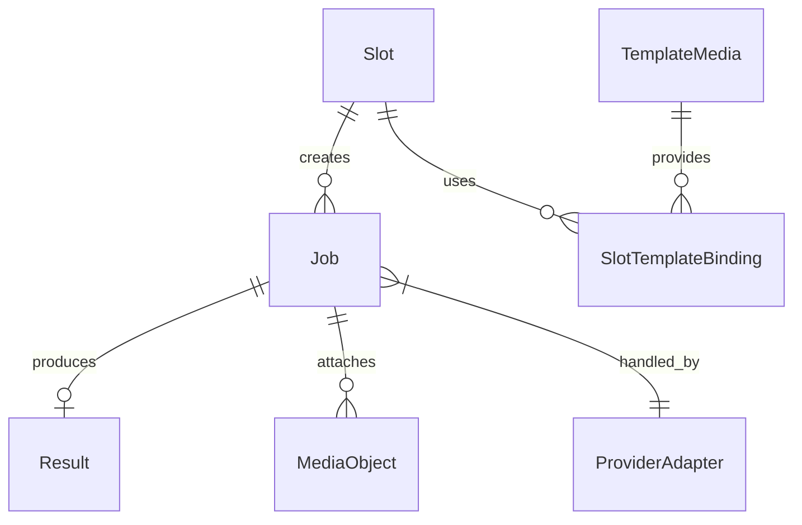

# Доменная модель PhotoChanger

## Основные сущности

### Slot
- `id` (`UUID`/`string`) — идентификатор и часть ingest-URL.
- `name` — отображается в UI, помогает операторам выбирать слот.
- `provider` — ключ провайдера (`gemini`, `turbotext`, ...).
- `operation` — выбранная операция провайдера (например, `style_transfer`).
- `settings_json` — параметры операции, включая промпты, ссылки на `template_media` и конфигурацию ретраев.
- `ingest_secret` — пароль для проверки DSLR Remote Pro.
- `ingest_url` — полный URL `POST /ingest/{slotId}`.
- `updated_at`, `created_at` — аудит изменений.

### Job
- `id` (`UUID`).
- `slot_id` — связь с `Slot`.
- `status` — `pending` → `processing` → финальные (`completed`, `failed_timeout`, `failed_provider`, `cancelled`).
- `attempt` — счётчик вызовов провайдера.
- `payload_path` / `source_media_id` — ссылка на исходный файл во временном хранилище.
- `result_id` — связь с `Result` (nullable до завершения).
- `external_ref` — `queueid`/`asyncid` провайдера.
- `expires_at` — дедлайн `T_sync_response`.

### Result
- `id` (`UUID`).
- `job_id` — владелец результата.
- `media_path` — путь к обработанному изображению.
- `mime`, `size_bytes` — метаданные.
- `available_until` — TTL результата (72 часа).

### MediaObject (временные ссылки)
- `id` (`UUID`).
- `path` — расположение файла в `MEDIA_ROOT`.
- `mime`, `size_bytes`.
- `expires_at` — фиксированный TTL 60 секунд (`MEDIA_PUBLIC_LINK_TTL_SEC`).
- `job_id` — связь для автоматической очистки.
- `download_quota` — лимиты на скачивания.

### TemplateMedia (постоянные шаблоны)
- `id` (`UUID`).
- `path`, `mime`, `size_bytes`, `checksum`.
- `label`, `uploaded_by`, `created_at`.

### ProviderAdapter
- Абстракция над внешним API.
- Связывает `Job` c конкретной реализацией (Gemini через `models.generateContent`, Turbotext через `api_ai`).
- Хранит лимиты: допустимые MIME, размер, количество одновременных задач.

## Связи
- `Slot 1 - N Job`: каждый запуск ingest создаёт новую `Job` по настройкам слота.
- `Job 1 - 1 Result`: результат создаётся только для успешно завершившейся задачи.
- `Job 1 - N MediaObject`: временные файлы (исходники, промежуточные) привязаны к задаче для очистки.
- `Slot N - M TemplateMedia`: через `slot_template_binding` слот может ссылаться на несколько шаблонных файлов.
- `Job 1 - 1 ProviderAdapter`: определяется `slot.provider` и выбирается при запуске задачи.

## Инварианты
- Временный файл (`MediaObject`) не живёт дольше `T_sync_response` и автоматически удаляется после финального статуса Job.
- `Job.status` не может вернуться из финального состояния в активное; повторная обработка требует нового ingest.
- `Result.available_until` ≥ время ответа клиенту; результат не удаляется ранее 72 часов, если не было явной очистки политики.
- `Slot` не может быть активирован без валидных параметров провайдера (минимально необходимые поля определяются провайдером).
- `external_ref` сохраняется для всех асинхронных операций Turbotext до получения webhook/поллинга.
- Временные ссылки не продлеваются: по истечении 60 секунд запись удаляется, а связанную `Job` переводят в `failed_timeout`.

## Диаграмма сущностей (Mermaid)

