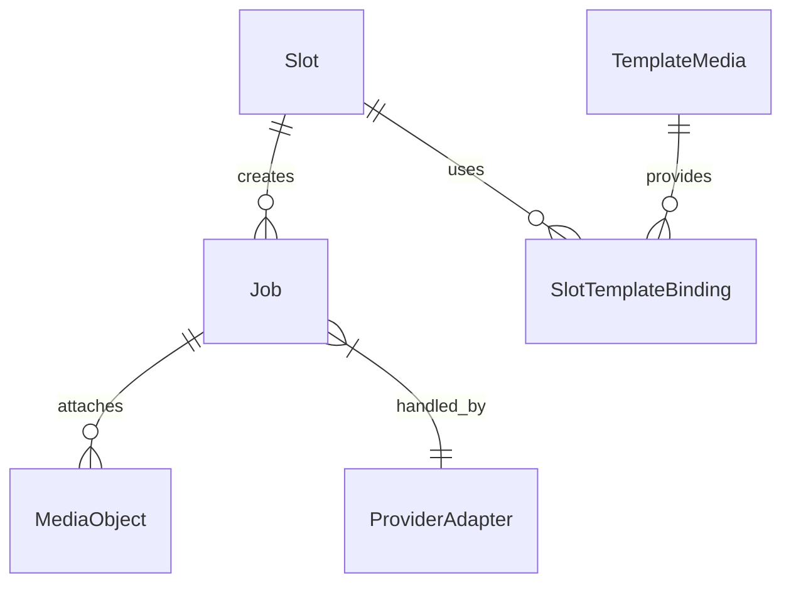

# Доменная модель PhotoChanger

## Основные сущности

### Slot
- `id` (`string`) — статический идентификатор слота (`slot-001` … `slot-015`), создаётся миграцией и не меняется.
- `name` — отображается в UI, помогает операторам выбирать слот.
- `provider` — ключ провайдера (`gemini`, `turbotext`, ...).
- `operation` — выбранная операция провайдера (например, `style_transfer`).
- `settings_json` — параметры операции, включая промпты, ссылки на `template_media` и конфигурацию ретраев.
- `updated_at`, `created_at` — аудит изменений.
- `recent_results` — виртуальное поле (не хранится в таблице), формируется API из последних финализированных `Job` со статусом успеха и содержит ссылки на итоговые файлы для UI галереи.
- Глобальный ingest-пароль хранится отдельно в `app_settings` и не является полем Slot; ingest-URL вычисляется по шаблону `<BASE_URL>/ingest/{id}` без сохранения в таблице.

### Job
- `id` (`UUID`).
- `slot_id` — связь с `Slot`.
- `status` — рабочие состояния `pending` → `processing`; финализация описывается отдельными полями `is_finalized` и `failure_reason`.
- Ingest API во время ожидания синхронного ответа использует эту запись как единственный источник истины: цикл polling раз в секунду проверяет `is_finalized`, `failure_reason` и `finalized_at`, дополнительных брокеров уведомлений не предусмотрено.
- `expires_at` — фиксированный дедлайн задачи; вычисляется при создании записи как `created_at + T_sync_response`. Общее окно совпадает с TTL временных ссылок и служит единым ориентиром для API, воркеров и механизмов очистки. Для итоговых файлов дополнительно рассчитывается самостоятельный TTL `T_result_retention = 72h` и поле `result_expires_at`.【F:Docs/brief.md†L20-L53】
- `result_file_path` — относительный путь к файлу последнего успешного изображения в `MEDIA_ROOT/results`, доступному по публичной ссылке до `result_expires_at`.
- `result_inline_base64` — временная base64-строка результата, доступна только пока ingest ждёт синхронный ответ.
- `result_mime_type`, `result_size_bytes`, `result_checksum`, `result_expires_at` — метаданные результата и рассчитанный момент автоочистки файла.
- `provider_job_reference` — опциональное поле для идентификаторов очередей провайдеров (например, `queueid` Turbotext, используемый для polling).
- `payload_path` — ссылка на исходный файл во временном хранилище (опционально).
- `finalized_at`, `created_at`, `updated_at` — аудит жизненного цикла записи.

### MediaObject (временные ссылки)
- `id` (`UUID`).
- `path` — расположение файла в `MEDIA_ROOT`.
- `mime`, `size_bytes`.
- `expires_at` — фиксированный TTL `T_public_link_ttl = T_sync_response` для публичных ссылок (`MEDIA_PUBLIC_LINK_TTL_SEC`).
- `job_id` — связь для автоматической очистки.

### TemplateMedia (постоянные шаблоны)
- `id` (`UUID`).
- `path`, `mime`, `size_bytes`, `checksum`.
- `label`, `uploaded_by`, `created_at`.

### ProviderAdapter
- Абстракция над внешним API.
- Связывает `Job` c конкретной реализацией (Gemini через `models.generateContent`, Turbotext через `api_ai`).
- Хранит лимиты: допустимые MIME, размер, количество одновременных задач.

## Связи
- `Slot 1 - N Job`: каждый запуск ingest создаёт новую `Job` по настройкам слота.
- `Job` хранит последний успешный результат в собственных полях `result_*`, отдельной таблицы нет.
- `Job 1 - N MediaObject`: временные файлы (исходники, промежуточные) привязаны к задаче для очистки.
- `Slot N - M TemplateMedia`: через `slot_template_binding` слот может ссылаться на несколько шаблонных файлов.
- `Job 1 - 1 ProviderAdapter`: определяется `slot.provider` и выбирается при запуске задачи.

## Инварианты

### Контур дедлайнов ingest-задач
- Единый дедлайн задачи и все связанные TTL рассчитываются непосредственно в момент создания `Job`; централизованный «deadline service» не требуется — API, воркеры и очистка используют общий набор функций доменного слоя и читают значения прямо из записи задачи.【F:Docs/brief.md†L20-L53】
- Источником правды выступают настройки приложения; параметры и их вычисления фиксированы:

  | Параметр | Источник | Назначение |
  |---|---|---|
  | `T_sync_response` | `app_settings["ingest.sync_response_timeout_sec"]` (по умолчанию 48 с, диапазон 45–60 с) | Верхняя граница ожидания HTTP-ответа ingest API и минимальная составляющая `T_job_deadline`. |
  | `T_public_link_ttl` | `app_settings["media.public_link_ttl_sec"] = T_sync_response` | Жёсткий лимит жизни публичных ссылок и других временных артефактов. |
  | `T_ingest_ttl` | `app_settings["media.ingest_ttl_sec"] = T_sync_response` | TTL исходных файлов во временном хранилище `payload`. |
  | `T_result_retention` | `app_settings["media.result_retention_sec"] = 72h` | TTL итоговых файлов (`Job.result_file_path`) до очистки и инвалидции публичной ссылки. |

  Новые задачи автоматически используют актуальные конфигурационные значения; дополнительных миграций или вспомогательных таблиц не требуется.【F:Docs/brief.md†L20-L53】
- Формула дедлайна фиксирована: `job.expires_at = job.created_at + T_sync_response`. Значение хранится в БД, не изменяется и служит верхней границей для всех связанных TTL артефактов, которые живут только до финализации (`payload_path`, публичные ссылки, промежуточные файлы).【F:Docs/brief.md†L20-L53】
- Ingest API во время удержания HTTP-соединения опирается исключительно на запись `Job`: polling с шагом ≈1 с читает текущие значения `is_finalized`, `failure_reason` и `finalized_at`, что гарантирует доставку результата без дополнительных механизмов уведомлений.
- Для таких временных артефактов действует правило:

  ```
  artifact_expires_at = min(job.expires_at, created_at + T_media_limit)
  ```

-  где `T_media_limit` — конкретный лимит временного артефакта (`T_ingest_ttl`, `T_public_link_ttl` и т.д.). Для ingest-файлов и публичных ссылок `T_media_limit = T_sync_response`, поэтому они не живут дольше общего дедлайна. Нарушение TTL ведёт к `failure_reason = 'timeout'` и немедленной очистке временных данных.【F:Docs/brief.md†L20-L53】
- Итоговые файлы используют независимый лимит 72 часа (`T_result_retention`). После финализации `result_expires_at = finalized_at + T_result_retention`, независимо от величины `job.expires_at`; очиститель ориентируется на это значение и не сокращает TTL итогового файла. По наступлении срока файл удаляется, `result_file_path` очищается, а публичный endpoint начинает возвращать `410 Gone`.【F:Docs/brief.md†L41-L57】
- Доменные функции обеспечивают единый расчёт дедлайнов и TTL: `calculate_job_expires_at(created_at, sync_timeout, public_link_ttl)`, `calculate_deadline_info(expires_at, *, now)`, `calculate_artifact_expiry(created_at, job_expires_at, limit_seconds)` для временных артефактов и `calculate_result_expires_at(finalized_at, result_retention)` для итоговых файлов. Все компоненты обязаны использовать их напрямую вместо дублирования логики.
- Интеграция компонентов подчиняется дедлайну: Ingest API фиксирует `expires_at` и завершает запрос по достижении `min(now, expires_at)`, воркер отменяет обращение к провайдеру при истечении окна, а механизмы очистки удаляют payload и публичные ссылки сразу после наступления соответствующего `artifact_expires_at`. Продление TTL не допускается; повторная обработка требует нового ingest.【F:Docs/brief.md†L20-L78】

### Жизненный цикл данных задачи
- Исходный ingest-пейлоад (`Job.payload_path`) очищается по формуле `min(job.expires_at, created_at + T_ingest_ttl)`; так как `T_ingest_ttl = T_sync_response`, файл не живёт дольше синхронного окна ожидания и удаляется сразу после финализации задачи.【F:Docs/brief.md†L20-L53】
- Временная публичная ссылка (`MediaObject`) живёт `min(job.expires_at, created_at + T_public_link_ttl)`; поскольку `T_public_link_ttl = T_sync_response`, фактический TTL совпадает с общим дедлайном, после чего ссылка удаляется, а `Job` помечается `failure_reason = 'timeout'`.【F:Docs/brief.md†L45-L53】
- После `is_finalized = true` задача не возвращается в активное состояние; повторная обработка требует нового ingest.【F:Docs/brief.md†L83-L96】
- В Job хранится только последний успешный результат (`result_*`); при новом запуске поля перезаписываются. `result_inline_base64` очищается сразу после отправки HTTP 200/504 и не переживает финализацию.【F:Docs/brief.md†L20-L53】【F:Docs/brief.md†L83-L95】
- Итоговый файл (`result_file_path`) доступен по публичной ссылке `GET /public/results/{job_id}` до `result_expires_at = finalized_at + T_result_retention`. Очиститель удаляет файл и обнуляет путь после наступления TTL, а endpoint возвращает `410 Gone`.【F:Docs/brief.md†L41-L57】
- Временные ссылки не продлеваются: по истечении `T_public_link_ttl` запись удаляется, а связанную `Job` помечают `failure_reason = 'timeout'`.【F:Docs/brief.md†L45-L53】
- `Slot` не может быть активирован без валидных параметров провайдера (минимально необходимые поля определяются провайдером).【F:Docs/brief.md†L9-L87】
- При выдаче ingest 504 задача немедленно финализируется: воркер прекращает обращения к провайдеру, очищает ресурсы и фиксирует `failure_reason = 'timeout'`. Повторная обработка требует нового ingest.【F:Docs/brief.md†L20-L29】【F:Docs/brief.md†L91-L95】
- `provider_job_reference` заполняется при асинхронных сценариях и хранит `queueid` для polling в пределах `T_sync_response`; поле остаётся пустым для полностью синхронных провайдеров.【F:Docs/brief.md†L37-L40】【F:Docs/brief.md†L91-L95】

## Диаграмма сущностей (Mermaid)

