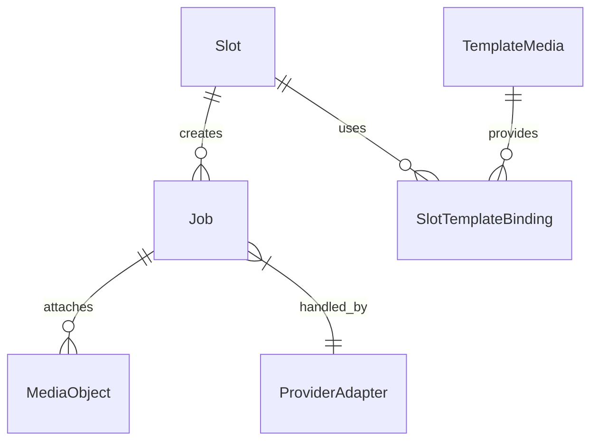

# Доменная модель PhotoChanger

## Основные сущности

### Slot
- `id` (`string`) — статический идентификатор слота (`slot-001` … `slot-015`), создаётся миграцией и не меняется.
- `name` — отображается в UI, помогает операторам выбирать слот.
- `provider` — ключ провайдера (`gemini`, `turbotext`, ...).
- `operation` — выбранная операция провайдера (например, `style_transfer`).
- `settings_json` — параметры операции, включая промпты, ссылки на `template_media` и конфигурацию ретраев.
- `updated_at`, `created_at` — аудит изменений.
- Глобальный ingest-пароль хранится отдельно в `app_settings` и не является полем Slot; ingest-URL вычисляется по шаблону `<BASE_URL>/ingest/{id}` без сохранения в таблице.

### Job
- `id` (`UUID`).
- `slot_id` — связь с `Slot`.
- `status` — рабочие состояния `pending` → `processing`; финализация описывается отдельными полями `is_finalized` и `failure_reason`.
- `expires_at` — фиксированный дедлайн задачи (`created_at + T_sync_response`), используется API и воркерами как единая точка отмены.【F:Docs/brief.md†L33-L48】
- `result_inline_base64` / `result_file_path` — данные последнего успешного изображения (inline или путь на диске).
- `result_mime_type`, `result_size_bytes`, `result_checksum` — метаданные результата.
- `provider_job_reference` — единое опциональное поле для async/webhook идентификаторов провайдера.
- `payload_path` — ссылка на исходный файл во временном хранилище (опционально).
- `finalized_at`, `created_at`, `updated_at` — аудит жизненного цикла записи.

### MediaObject (временные ссылки)
- `id` (`UUID`).
- `path` — расположение файла в `MEDIA_ROOT`.
- `mime`, `size_bytes`.
- `expires_at` — фиксированный TTL 60 секунд (`MEDIA_PUBLIC_LINK_TTL_SEC`).
- `job_id` — связь для автоматической очистки.
- `download_quota` — лимиты на скачивания.

### TemplateMedia (постоянные шаблоны)
- `id` (`UUID`).
- `path`, `mime`, `size_bytes`, `checksum`.
- `label`, `uploaded_by`, `created_at`.

### ProviderAdapter
- Абстракция над внешним API.
- Связывает `Job` c конкретной реализацией (Gemini через `models.generateContent`, Turbotext через `api_ai`).
- Хранит лимиты: допустимые MIME, размер, количество одновременных задач.

## Связи
- `Slot 1 - N Job`: каждый запуск ingest создаёт новую `Job` по настройкам слота.
- `Job` хранит последний успешный результат в собственных полях `result_*`, отдельной таблицы нет.
- `Job 1 - N MediaObject`: временные файлы (исходники, промежуточные) привязаны к задаче для очистки.
- `Slot N - M TemplateMedia`: через `slot_template_binding` слот может ссылаться на несколько шаблонных файлов.
- `Job 1 - 1 ProviderAdapter`: определяется `slot.provider` и выбирается при запуске задачи.

## Инварианты
- Временный файл (`MediaObject`) не живёт дольше `T_sync_response` и автоматически удаляется после финализации Job.
- Для каждого временного артефакта применяется единая формула TTL: `artifact_expires_at = min(job.expires_at, created_at + T_media_limit)` (где `T_media_limit` задаётся конкретным механизмом хранения: `T_ingest_ttl`, `MEDIA_PUBLIC_LINK_TTL_SEC` и т.д.).【F:Docs/brief.md†L56-L69】
- `Job.expires_at` не меняется после создания записи и служит верхней границей для всех связанных TTL (`payload_path`, публичные ссылки, промежуточные файлы).【F:Docs/brief.md†L56-L69】
- После `is_finalized = true` задача не возвращается в активное состояние; повторная обработка требует нового ingest.
- В Job хранится только последний успешный результат (`result_*`); при новом запуске поля перезаписываются.
- `Slot` не может быть активирован без валидных параметров провайдера (минимально необходимые поля определяются провайдером).
- `provider_job_reference` заполняется при асинхронных сценариях и может быть пустым для синхронных провайдеров.
- Временные ссылки не продлеваются: по истечении 60 секунд запись удаляется, а связанную `Job` помечают `failure_reason = 'timeout'`.

## Диаграмма сущностей (Mermaid)

