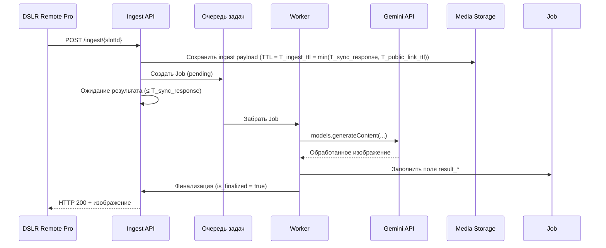
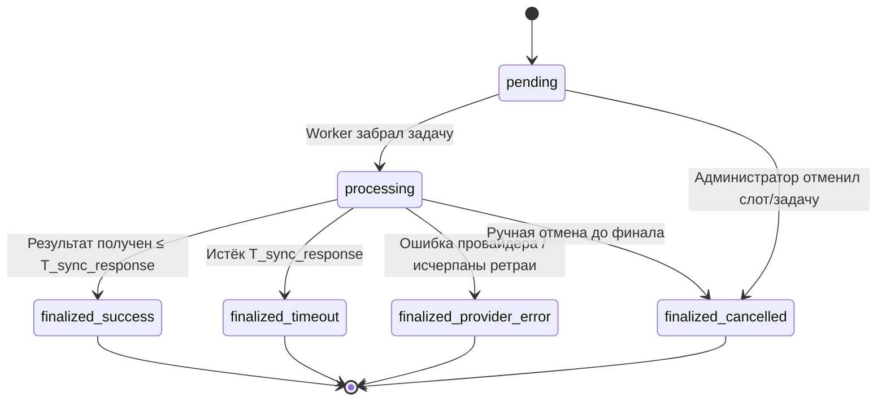

# Use-cases и сценарии PhotoChanger

## UC0. Вход администратора и ротация ingest-пароля
- **Акторы:** Администратор, Auth API, Settings API.
- **Предусловия:** Созданы статические учётные записи `serg` и `igor`, секреты развернуты в `secrets/runtime_credentials.json`.
- **Основной поток:**
  1. Администратор отправляет `POST /api/login` с валидными логином и паролем.
  2. Auth API возвращает JWT с `permissions`, включающим `settings:write`.
  3. Администратор вызывает `PUT /api/settings`, передавая новый ingest-пароль; API сохраняет хэш в `app_settings` и обновляет `updated_by`/`updated_at`.
  4. В ответе `GET /api/settings` отображаются только метаданные (дата обновления, автор), без plaintext пароля.
- **Ошибки:**
  - Неверные учётные данные → `401`.
  - Частые попытки входа → `429`.
  - Запрос `PUT /api/settings` без права `settings:write` → `403`.

## UC1. Настройка слота администратором
- **Акторы:** Администратор, Slot Management UI, Admin API.
- **Предусловия:** Администратор авторизован через JWT с правами `slots:write`.
- **Основной поток:**
  1. Администратор открывает список статических слотов (`slot-001` … `slot-015`) и выбирает один из них для редактирования.
  2. UI запрашивает список доступных провайдеров и операций.
  3. Администратор выбирает провайдера (например, Gemini) и операцию (`style_transfer`).
  4. UI показывает форму параметров (промпт, template_media и т.д.), администратор заполняет значения.
  5. Администратор сохраняет слот; API валидирует параметры, обновляет запись и возвращает актуальную конфигурацию. Ingest-ссылка формируется на клиенте по шаблону `<BASE_URL>/ingest/{slot_id}` с использованием глобального пароля.
- **Альтернативы/ошибки:**
  - Некорректные параметры → `422` с описанием полей.
  - Попытка редактировать неизвестный слот → `404`.

## UC2. Ingest с успешной обработкой
- **Акторы:** DSLR Remote Pro, Ingest API, Очередь, Worker, AI-провайдер (Gemini).
- **Предусловия:** Slot активен, ссылка и пароль валидны.
- **Основной поток:**
  1. DSLR Remote Pro отправляет `POST /ingest/{slotId}` с фото и паролем.
  2. Ingest API валидирует вход, создаёт `Job` со статусом `pending`, сохраняет исходный файл (`media_object`).
  3. Job ставится в очередь и выбирается воркером, статус `processing`.
  4. Воркер вызывает провайдера Gemini (`models.generateContent`), передавая параметры слота и изображение.
  5. Провайдер возвращает обработанное изображение до наступления `T_sync_response`.
  6. Воркер заполняет поля `Job.result_*`, очищает исходный `media_object`, выставляет `is_finalized = true`.
  7. Ingest API возвращает 200 OK с обработанным изображением, job закрывается.

### Диаграмма последовательности (успех)

## UC3. Ingest с таймаутом 504
- **Различия с UC2:**
  - На шаге вызова провайдера ответ не приходит до `T_sync_response`.
  - API завершает ожидание с 504 и фиксирует у Job `failure_reason = 'timeout'`.
  - Воркер получает сигнал отмены, прекращает операции и удаляет временные файлы.
  - Провайдерские ответы, пришедшие позже, игнорируются.

### Диаграмма состояний Job

## UC4. Истечение временной ссылки
- **Акторы:** Администратор/UI, Admin API, Media Storage.
- **Предусловия:** Существующий `media_object`, связанный с Job в статусе `pending`.
- **Основной поток:**
  1. Администратор регистрирует файл через `POST /api/media/register` и получает `expires_at = now + T_public_link_ttl` (`T_public_link_ttl = clamp(T_sync_response, 45, 60)`).
  2. Провайдер не скачивает файл в течение рассчитанного TTL; срок истекает автоматически.
  3. Очиститель помечает запись `media_object` как удалённую и ставит Job `failure_reason = 'timeout'`.
- **Ошибки:**
  - Попытка обратиться к истекшей ссылке → `410 Gone`.
  - Попытка продлить TTL через несуществующий эндпоинт → `404 Not Found`.

## UC5. Управление шаблонными медиа
- **Акторы:** Администратор, Admin API, Storage.
- **Сценарий:** загрузка `template_media` через `POST /api/template-media/register`, привязка к слоту, удаление через `DELETE /api/template-media/{id}`.
- **Особенности:** Файлы не имеют публичных ссылок, доступны только воркерам по идентификатору; удаление требует проверки, что слот обновлён.
