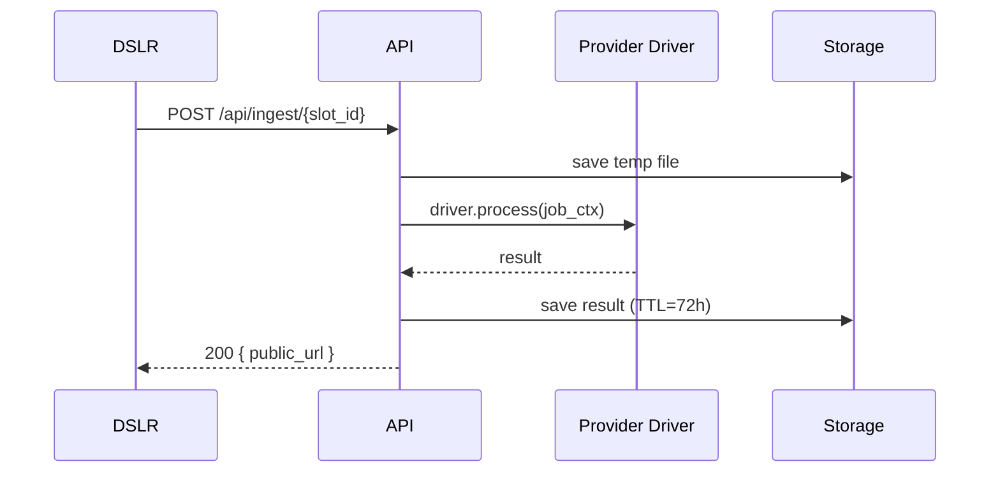
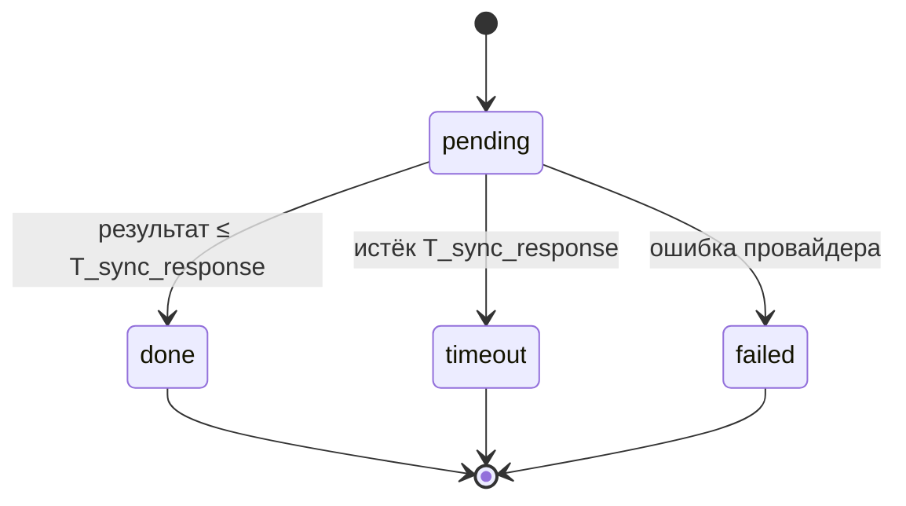

# Use-cases и сценарии PhotoChanger

## UC0. Вход администратора и ротация ingest-пароля
- **Акторы:** Администратор, Auth API, Settings API.
- **Предусловия:** Созданы статические учётные записи `serg` и `igor`
- **Основной поток:**
  1. Администратор отправляет `POST /api/login` с валидными логином и паролем.
  2. Auth API возвращает JWT с `permissions`, включающим `settings:write`.
  3. Администратор вызывает `PUT /api/settings`, передавая новый ingest-пароль; API сохраняет хэш в `app_settings` и обновляет `updated_by`/`updated_at`.
  4. В ответе `GET /api/settings` отображаются только метаданные (дата обновления, автор), без plaintext пароля.
 
- **Ошибки:**
  - Неверные учётные данные → `401`.
  - Частые попытки входа → `429`.
  - Запрос `PUT /api/settings` без права `settings:write` → `403`.

---

## UC1. Настройка слота администратором
- **Акторы:** Администратор, Slot Management UI, Admin API.
- **Предусловия:** Администратор авторизован через JWT с правами `slots:write`.
- **Основной поток:**
  1. Администратор открывает список статических слотов (`slot-001` … `slot-015`) и выбирает один из них для редактирования.
  2. UI запрашивает список доступных провайдеров и операций.
  3. Администратор выбирает провайдера (например, Gemini) и операцию (`style_transfer`).
  4. UI показывает форму параметров (промпт, template_media и т.д.), администратор заполняет значения.
  5. Администратор сохраняет слот; API валидирует параметры, обновляет запись и возвращает актуальную конфигурацию. Ingest-ссылка формируется на клиенте по шаблону `<BASE_URL>/ingest/{slot_id}` с использованием глобального пароля.
- **Альтернативы/ошибки:**
  - Некорректные параметры → `422` с описанием полей.
  - Попытка редактировать неизвестный слот → `404`.

---

## UC2. Ingest с успешной обработкой

**Акторы:** DSLR Remote Pro, FastAPI Ingest API, Provider Driver (Gemini/Turbotext), Media Storage, PostgreSQL
**Предусловия:** слот активен; пароль ingest валиден; лимиты не превышены.

**Основной поток:**

1. Клиент выполняет `POST /api/ingest/{slot_id}` (multipart: файл + пароль).
2. Ingest API валидирует вход, сохраняет файл во `media/temp/{slot_id}/{job_id}`; создаёт запись в `job_history(status=pending)`.
3. `IngestService` строит `job_ctx` и вызывает драйвер: `await asyncio.wait_for(driver.process(job_ctx), timeout=T_sync_response)`.
4. Драйвер возвращает результат до таймаута.
5. Сервис сохраняет итог в `media/results/{job_id}.{ext}`, обновляет `job_history(status='done', result_expires_at=now+72h)` и отвечает `200` с `public_url=/public/results/{job_id}`.
6. Cron `scripts/cleanup_media.py` раз в 15 минут удаляет истёкшие файлы и помечает записи.

**Диаграмма (успех)**

---

## UC3. Ingest с таймаутом 504

**Различия с UC2:**

* Провайдер не успевает в `T_sync_response`; `asyncio.wait_for` поднимает `TimeoutError`.
* Сервис фиксирует `job_history(status='timeout', failure_reason='T_sync_response_exceeded')`, удаляет temp-файл и возвращает `504 Gateway Timeout`.
* Поздние ответы провайдера игнорируются; клиент может запустить новый ingest.

**Диаграмма состояний**

---

## UC4. Истечение TTL результата

**Акторы:** Публичный пользователь, Public API, Storage
**Предусловия:** существует `job_history` со `status='done'` и `result_expires_at`.

**Основной поток:**

1. Клиент запрашивает `GET /public/results/{job_id}`.
2. API проверяет TTL:
   — если `now ≤ result_expires_at` → `200` (файл) с `Content-Disposition: attachment`;
   — иначе → `410 Gone`.
3. Cron удаляет просроченные файлы и помечает записи очищенными.

---

## UC5. Управление шаблонными медиа

**Акторы:** Администратор, Admin API, Storage
**Сценарий:**

1. `POST /api/template-media/register` — загрузка и регистрация файла (без публичного доступа).
2. Привязка файла к слоту через настройки слота.
3. `DELETE /api/template-media/{id}` — удаление после проверки, что слот обновлён.

**Особенности:** файлы хранятся в `media/templates`, доступны драйверам по ID, не имеют публичных URL.

---

## UC6. Просмотр результатов слота и скачивание из UI

**Акторы:** Администратор/UI, Admin API, Public API
**Предусловия:** у слота есть завершённые задачи (`status='done'`) с актуальным TTL.

**Основной поток:**

1. UI вызывает `GET /api/slots/{slot_id}` — возвращаются настройки и `recent_results` (по умолчанию 10).
2. UI рендерит галерею превью (например, 160×160 px) и кнопки «Скачать».
3. Нажатие «Скачать» выполняет `GET /public/results/{job_id}` → `200` (файл) или `410` (TTL истёк); UI помечает карточку как недоступную при следующем опросе.

---

### Примечания

* Идемпотентность ingest по `Idempotency-Key` и/или хэшу файла — опционально; источник истины в PRD.
* Rate limit и пер-слот/пер-провайдер конкурентность — реализуются Nginx + `asyncio.Semaphore`, см. ARCHITECTURE.md.
