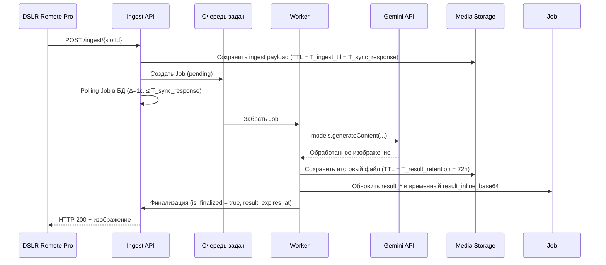
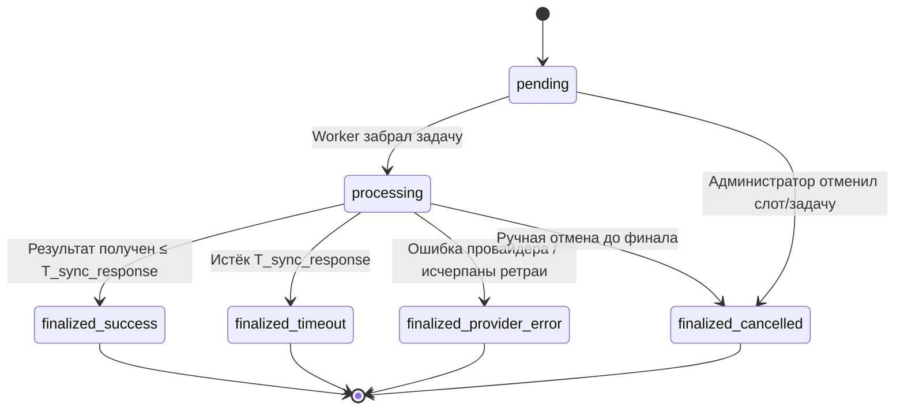

# Use-cases и сценарии PhotoChanger

## UC0. Вход администратора и ротация ingest-пароля
- **Акторы:** Администратор, Auth API, Settings API.
- **Предусловия:** Созданы статические учётные записи `serg` и `igor`, секреты развернуты в `secrets/runtime_credentials.json`.
- **Основной поток:**
  1. Администратор отправляет `POST /api/login` с валидными логином и паролем.
  2. Auth API возвращает JWT с `permissions`, включающим `settings:write`.
  3. Администратор вызывает `PUT /api/settings`, передавая новый ingest-пароль; API сохраняет хэш в `app_settings` и обновляет `updated_by`/`updated_at`.
  4. В ответе `GET /api/settings` отображаются только метаданные (дата обновления, автор), без plaintext пароля.
- **Ошибки:**
  - Неверные учётные данные → `401`.
  - Частые попытки входа → `429`.
  - Запрос `PUT /api/settings` без права `settings:write` → `403`.

## UC1. Настройка слота администратором
- **Акторы:** Администратор, Slot Management UI, Admin API.
- **Предусловия:** Администратор авторизован через JWT с правами `slots:write`.
- **Основной поток:**
  1. Администратор открывает список статических слотов (`slot-001` … `slot-015`) и выбирает один из них для редактирования.
  2. UI запрашивает список доступных провайдеров и операций.
  3. Администратор выбирает провайдера (например, Gemini) и операцию (`style_transfer`).
  4. UI показывает форму параметров (промпт, template_media и т.д.), администратор заполняет значения.
  5. Администратор сохраняет слот; API валидирует параметры, обновляет запись и возвращает актуальную конфигурацию. Ingest-ссылка формируется на клиенте по шаблону `<BASE_URL>/ingest/{slot_id}` с использованием глобального пароля.
- **Альтернативы/ошибки:**
  - Некорректные параметры → `422` с описанием полей.
  - Попытка редактировать неизвестный слот → `404`.

## UC2. Ingest с успешной обработкой
- **Акторы:** DSLR Remote Pro, Ingest API, Очередь, Worker, AI-провайдер (Gemini).
- **Предусловия:** Slot активен, ссылка и пароль валидны.
- **Основной поток:**
  1. DSLR Remote Pro отправляет `POST /ingest/{slotId}` с фото и паролем.
  2. Ingest API валидирует вход, создаёт `Job` со статусом `pending`, сохраняет исходный файл (`media_object`).
  3. Job ставится в очередь и выбирается воркером, статус `processing`.
  4. Ingest API удерживает HTTP-соединение и раз в секунду читает запись `Job` из БД, ожидая появления `is_finalized = true` или наступления дедлайна `T_sync_response`; дополнительных уведомлений не используется.
  5. Воркер вызывает провайдера Gemini (`models.generateContent`), передавая параметры слота и изображение.
  6. Провайдер возвращает обработанное изображение до наступления `T_sync_response`.
  7. Воркер сохраняет итоговый файл в `MEDIA_ROOT/results`, обновляет `Job.result_file_path`, `result_mime_type`, `result_size_bytes`, `result_checksum`, рассчитывает `result_expires_at = finalized_at + 72h`, заполняет временный `result_inline_base64`, очищает исходный `media_object`, выставляет `is_finalized = true`. С учётом финального решения **Issue 2** файл получает имя `<job_id>.<ext>` (ext определяется по MIME), контрольная сумма (`result_checksum`) фиксируется по финальному решению **Issue 3**.
  8. На ближайшей итерации polling Ingest API обнаруживает финализацию, собирает ответ и возвращает 200 OK с обработанным изображением. После отправки `result_inline_base64` обнуляется, а файл остаётся доступным по `GET /public/results/{job_id}` до наступления `result_expires_at`.
  9. Согласно финальному решению **Issue 4**, фоновой процесс `photochanger-media-cleanup` раз в 15 минут проверяет `result_expires_at` и удаляет просроченные артефакты через `JobService.purge_expired_results`/`MediaService.purge_expired_media`.

### Диаграмма последовательности (успех)

## UC3. Ingest с таймаутом 504
- **Различия с UC2:**
  - На шаге вызова провайдера ответ не приходит до `T_sync_response`; повторные проверки Ingest API (`SELECT` раз в секунду) не видят финализацию.
  - По достижении дедлайна Ingest API завершает ожидание с 504, фиксирует у Job `failure_reason = 'timeout'`, выставляет `is_finalized = true` и записывает `finalized_at`.
  - Воркер, обнаружив финализированную запись, прекращает операции, очищает `result_inline_base64` (если поле было заполнено для синхронного ответа) и удаляет временные файлы.
  - Провайдерские ответы, пришедшие позже, игнорируются: состояние остаётся `finalized_timeout`, поля `result_*` не перезаписываются, клиент должен инициировать новый ingest.
  - Ответ `GatewayTimeout` описан в OpenAPI (`components.responses.GatewayTimeout`) и информирует клиента, что задача финализирована и повторный запуск возможен только новым ingest-запросом.

### Диаграмма состояний Job

## UC4. Истечение временной ссылки
- **Акторы:** Администратор/UI, Admin API, Media Storage.
- **Предусловия:** Существующий `media_object`, связанный с Job в статусе `pending`.
- **Основной поток:**
  1. Администратор регистрирует файл через `POST /api/media/register` и получает `expires_at = now + T_public_link_ttl` (`T_public_link_ttl = T_sync_response`).
  2. Провайдер не скачивает файл в течение рассчитанного TTL; срок истекает автоматически.
  3. Очиститель помечает запись `media_object` как удалённую и ставит Job `failure_reason = 'timeout'`.
- **Ошибки:**
  - Попытка обратиться к истекшей ссылке → `410 Gone`.
  - Попытка продлить TTL через несуществующий эндпоинт → `404 Not Found`.

## UC5. Управление шаблонными медиа
- **Акторы:** Администратор, Admin API, Storage.
- **Сценарий:** загрузка `template_media` через `POST /api/template-media/register`, привязка к слоту, удаление через `DELETE /api/template-media/{id}`.
- **Особенности:** Файлы не имеют публичных ссылок, доступны только воркерам по идентификатору; удаление требует проверки, что слот обновлён.

## UC6. Просмотр результатов слота и скачивание из UI
- **Акторы:** Администратор/UI, Admin API, Public API.
- **Предусловия:** Слот имеет завершённые `Job` с `result_file_path` и не истёкшим `result_expires_at`.
- **Основной поток:**
  1. Администратор открывает страницу слота; UI вызывает `GET /api/slots/{slot_id}`.
  2. Admin API возвращает конфигурацию слота и массив `recent_results` (по умолчанию последние 10 записей) с полями `job_id`, `thumbnail_url`, `download_url`, `completed_at`, `result_expires_at`, `mime`.
  3. UI отображает галерею превью, используя `thumbnail_url` (изображение оптимизируется клиентом до 160×160 px) и рядом размещает кнопку «Скачать», ссылающуюся на `download_url`.
  4. При нажатии кнопки браузер инициирует `GET /public/results/{job_id}`. Public API проверяет `result_expires_at` и отдаёт файл с `Content-Disposition: attachment` при статусе 200.
  5. UI отображает статус скачивания; по истечении TTL карточка помечается как недоступная при следующем опросе.
- **Альтернативы/ошибки:**
  - `GET /public/results/{job_id}` → `410 Gone`, если `result_expires_at` в прошлом; UI показывает подсказку «Срок действия ссылки истёк».
  - Отсутствуют результаты — `recent_results` пуст; UI показывает состояние «Нет обработанных изображений».
